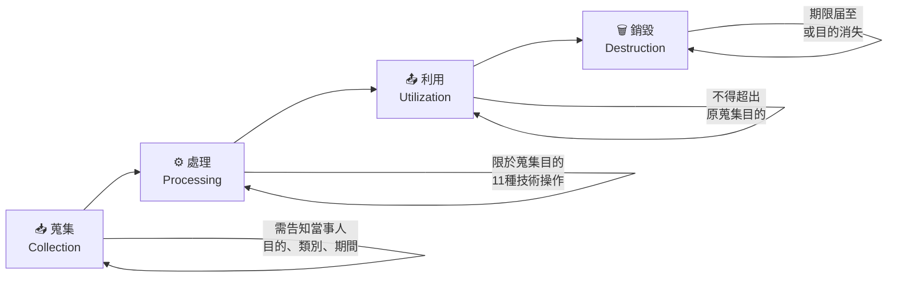

# V1 — 個資法資料生命週期

```mermaid
flowchart LR
    A[📥 蒐集\nCollection] --> B[⚙️ 處理\nProcessing]
    B --> C[📤 利用\nUtilization]
    C --> D[🗑️ 銷毀\nDestruction]
    
    A --> |"需告知當事人\n目的、類別、期間"| A
    B --> |"限於蒐集目的\n11種技術操作"| B
    C --> |"不得超出\n原蒐集目的"| C
    D --> |"期限届至\n或目的消失"| D
```

🔥 考點：三階段定義不可混淆。「利用」= 所有非「處理」的使用行為。
