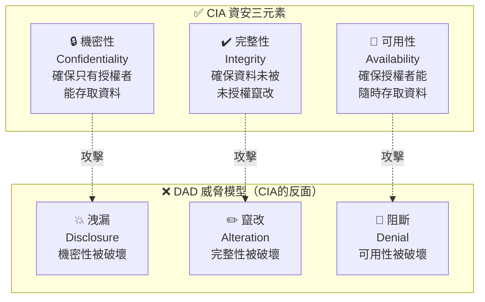

# V2 — CIA三元素與DAD威脅模型

```mermaid
graph TD
    subgraph CIA["✅ CIA 資安三元素"]
        C["🔒 機密性\nConfidentiality\n確保只有授權者\n能存取資料"]
        I["✔️ 完整性\nIntegrity\n確保資料未被\n未授權竄改"]
        A["📡 可用性\nAvailability\n確保授權者能\n隨時存取資料"]
    end
    
    subgraph DAD["❌ DAD 威脅模型（CIA的反面）"]
        D1["💥 洩漏\nDisclosure\n機密性被破壞"]
        D2["✏️ 竄改\nAlteration\n完整性被破壞"]
        D3["🚫 阻斷\nDenial\n可用性被破壞"]
    end
    
    C -.->|攻擊| D1
    I -.->|攻擊| D2
    A -.->|攻擊| D3
```
