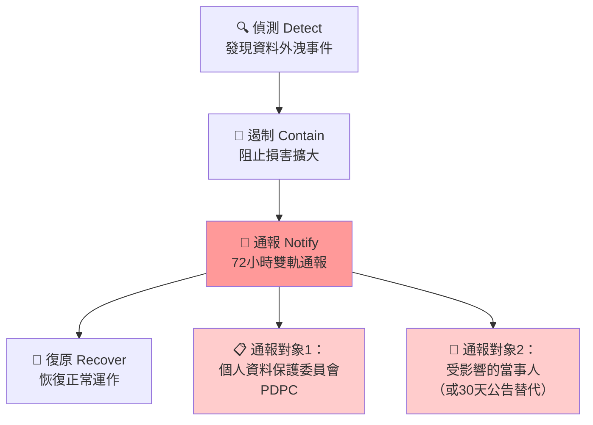

# V3 — 資料外洩應變流程

```mermaid
flowchart TD
    A["🔍 偵測 Detect\n發現資料外洩事件"] --> B["🛑 遏制 Contain\n阻止損害擴大"]
    B --> C["📢 通報 Notify\n72小時雙軌通報"]
    C --> D["🔄 復原 Recover\n恢復正常運作"]
    
    C --> C1["📋 通報對象1：\n個人資料保護委員會\nPDPC"]
    C --> C2["📨 通報對象2：\n受影響的當事人\n（或30天公告替代）"]
    
    style C fill:#ff9999
    style C1 fill:#ffcccc
    style C2 fill:#ffcccc
```

🔥 考點：2025年修法新增72小時雙軌通報義務，時限自「知悉」起算。
