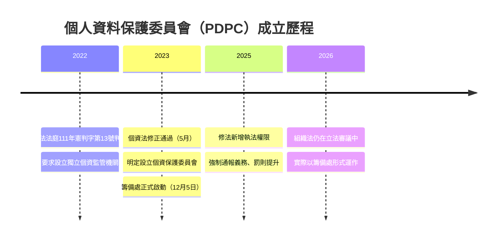

# V4 — 個資保護委員會成立時間軸

```mermaid
timeline
    title 個人資料保護委員會（PDPC）成立歷程
    2022 : 憲法法庭111年憲判字第13號判決
         : 要求設立獨立個資監管機關
    2023 : 個資法修正通過（5月）
         : 明定設立個資保護委員會
         : 籌備處正式啟動（12月5日）
    2025 : 修法新增執法權限
         : 強制通報義務、罰則提升
    2026 : 組織法仍在立法審議中
         : 實際以籌備處形式運作
```

🔥 考點：觸發設立的是「憲法法庭判決」，不是主動修法。監管機關從國發會協調改為獨立機關。
