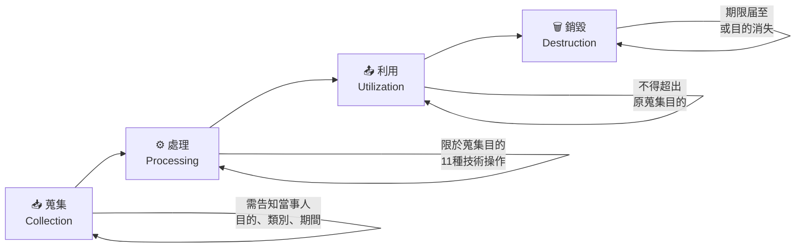
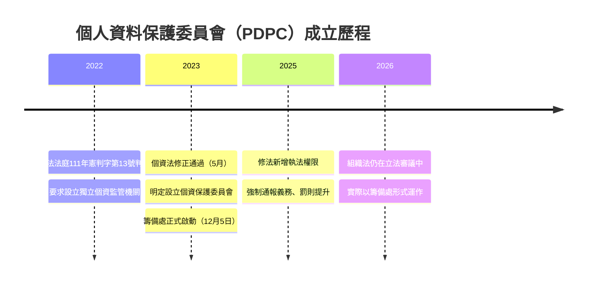
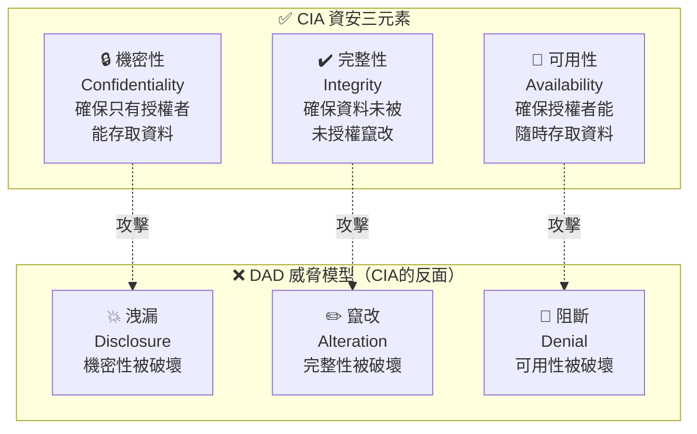
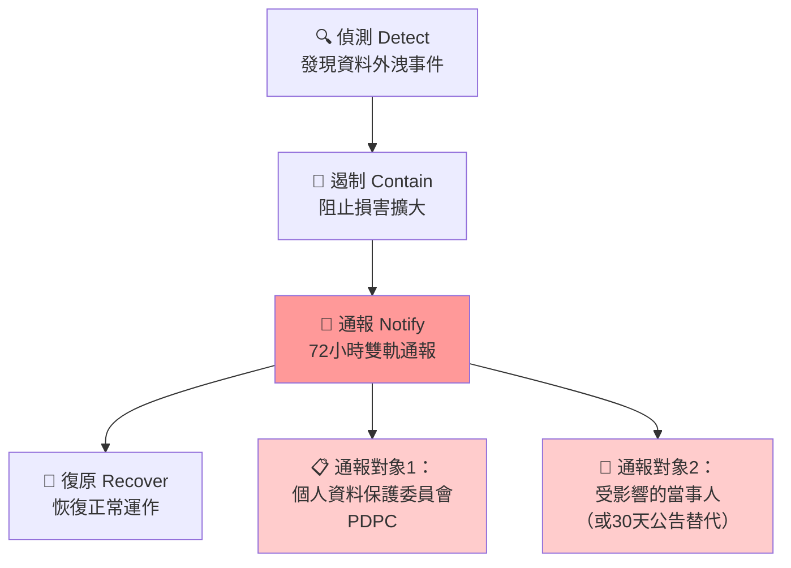

# L11203 資料隱私與安全 — 讀書指南

---

## 1. 考試對應範圍

> 對應評鑑範圍：**L11203 資料隱私與安全（Data Privacy and Security）**
>
> 所屬主題：L112 資料處理與分析概念 → L11203 資料隱私與安全
>
> 關鍵字：個人資料保護法（PDPA）、個人資料（Personal Data）、特種個資（Sensitive Personal Data）、CIA三元素（CIA Triad）、去識別化（De-identification）、假名化（Pseudonymization）、資料外洩通報（Data Breach Notification）、當事人權利（Data Subject Rights）、OECD隱私原則
>
> 預估出題數：**4–6 題**（法規概念題為主，部分情境判斷題——給定一個行為問你違反哪條原則或觸犯哪個法律義務）

---

## 2. 知識樹（Knowledge Tree）

```
L11203 資料隱私與安全
|
+-- 資料隱私（Data Privacy）
|   |
|   +-- 個資法架構（PDPA Framework）
|   |   +-- 個人資料定義（Article 2）
|   |   +-- 蒐集 -> 處理 -> 利用 三階段
|   |   +-- 個資保護委員會 PDPC（2023/2025 成立）
|   |
|   +-- 隱私保護原則
|   |   +-- OECD 8 原則（1980，修訂 2013）
|   |   +-- GDPR 7 原則（EU，2018）
|   |   +-- 台灣個資法對應條文
|   |
|   +-- 特種個資（Article 6）
|   |   +-- 6 大類：病歷 / 醫療 / 基因 / 性生活 / 健康檢查 / 犯罪前科
|   |   +-- 例外蒐集 6 種情況
|   |
|   +-- 當事人權利（Article 3）
|       +-- 查詢或請求閱覽
|       +-- 請求製給複製本
|       +-- 請求補充或更正
|       +-- 請求停止蒐集、處理或利用
|       +-- 請求刪除
|
+-- 資料安全（Data Security）
|   |
|   +-- CIA 三元素（CIA Triad）
|   |   +-- 機密性（Confidentiality）
|   |   +-- 完整性（Integrity）
|   |   +-- 可用性（Availability）
|   |
|   +-- DAD 威脅模型（DAD Threat Model）
|   |   +-- 洩漏（Disclosure）<-> 機密性
|   |   +-- 竄改（Alteration）<-> 完整性
|   |   +-- 阻斷（Denial）   <-> 可用性
|   |
|   +-- 存取控制（Access Control）
|   |   +-- 最小權限原則（Principle of Least Privilege）
|   |   +-- 身分驗證（Authentication）
|   |
|   +-- 加密概念（Encryption Concept）
|   |   +-- 靜態資料加密（Data at Rest）
|   |   +-- 傳輸中加密（Data in Transit）
|   |
|   +-- 資料外洩應變（Data Breach Response）
|       +-- 偵測 -> 遏制 -> 通報 -> 復原
|       +-- 72 小時雙軌通報（2025 修法）
|
+-- AI 隱私風險（AI Privacy Risks）
    +-- 模型記憶（Model Memorization）
    +-- 提示詞外洩（Prompt Leakage）
    +-- 使用者輸入被納入訓練
    +-- 個資法第 27 條安全維護義務
```

---

## 3. 核心概念（Core Concepts）

### 3.1 隱私與安全的區別

很多人把「隱私」和「安全」混為一談，但這兩個詞在法律和資訊領域有清楚的區別：

**隱私（Privacy）** 是一種**目的**——保護個人有權決定自己的資料如何被蒐集、使用和分享，不被未經授權的人窺探或濫用。隱私著眼於「人」的權利。

**安全（Security）** 是一種**手段**——用技術和管理措施防止資料被竊取、竄改或破壞。安全著眼於「資料」的保護機制。

關係公式很簡單：
```
安全是實現隱私的工具，但安全不等於隱私。
你可以有很安全的系統，卻仍然侵犯隱私。
（例如：公司加密了員工薪資資料，但在沒有業務必要的情況下分享給其他部門）
```

🗣️ **白話說明：** 想像你有一本日記。

- **隱私**是你有權決定「這本日記誰能看、看什麼、什麼時候看」——這是你身為人的權利。
- **安全**是你把日記鎖進保險箱、設了密碼、不讓外人碰——這是保護日記的**方法**。

就算保險箱鎖得再牢，如果你的公司規定「員工日記必須交給人資部門審查」，這依然是**侵犯隱私**。安全措施做到位，不代表隱私受到保障。

---

### 🔥 3.2 個人資料保護法（PDPA）架構

台灣的隱私法律主架構是《個人資料保護法》（`個人資料保護法, Personal Data Protection Act, PDPA`），簡稱「個資法」。這是這堂課最重要的法律文件。

#### 個人資料的定義（第 2 條）

個資法第 2 條第 1 項定義：

> 個人資料（Personal Data）：指**自然人**之姓名、出生年月日、國民身分證統一編號、護照號碼、特徵、指紋、婚姻、家庭、教育、職業、病歷、醫療、基因、性生活、健康檢查、犯罪前科、聯絡方式、財務情況、社會活動，**及其他得以直接或間接方式識別該個人之資料**。

幾個關鍵點：

- 這個清單**不是窮盡的**。最後一句「得以直接或間接方式識別該個人之資料」才是核心——只要能辨識出你是誰，就是個資。
- 個資法保護的是**自然人**（真實存在的人）。公司、機構等法人的資料**不受**個資法保護。🔥
- 「直接識別」：一看就知道是誰（如姓名、身分證號）
- 「間接識別」：單一資料看起來無害，但交叉比對後能識別個人（如IP位址 + 上網時間 + 瀏覽習慣）

🗣️ **白話說明：** 你在 IG 上的暱稱「@小熊維尼粉絲2001」本身可能不是個資——但如果搭配你公開的大學、系所和指導教授，大家就能 Google 到你是誰。這個組合就構成能「間接識別個人」的個資。

#### 個資法三階段：蒐集、處理、利用

個資法把所有涉及個資的行為分成三個階段：

```
  [取得個資]           [管理個資]           [使用個資]
  +----------+        +----------+        +----------+
  | 蒐集     |   -->  | 處理     |   -->  | 利用     |
  | 蒐集     |        | 處理     |        | 利用     |
  | (Collect)|        | (Process)|        |  (Use)   |
  +----------+        +----------+        +----------+
  以任何方式           記錄/輸入/儲存        處理以外的
  取得個資             /編輯/更正/複製       所有使用方式
                       /檢索/刪除/輸出
                       /連結/內部傳送
```

| 階段 | 法律定義（第 2 條） | 日常例子 |
|------|-------------------|---------|
| 蒐集（Collect） | 以任何方式取得個人資料 | 填入會員表單、客服記錄你的電話 |
| 處理（Process） | 為建立或利用個資檔案所為的記錄、儲存、編輯、複製等 | 把客戶資料存入資料庫、更新地址欄位 |
| 利用（Use） | 將蒐集之個資為處理以外之使用 | 寄行銷郵件、提供給合作廠商、在App中顯示 |

📊 **圖示：個資法資料生命週期**



🔥 考點：三階段定義不可混淆。「利用」= 所有非「處理」的使用行為。

🔥 **考試重點：** 三個階段都必須符合「特定目的」（蒐集時已說明的目的）和「必要範圍」（不超過必要的使用）。

🗣️ **白話說明：** 你在全聯辦會員卡，填了姓名電話——這是**蒐集**。全聯把你的資料存進資料庫、更新你的點數紀錄——這是**處理**。全聯用你的手機號碼寄優惠簡訊給你——這是**利用**。如果全聯把你的資料賣給其他廠商，卻沒有在辦卡時告知，就超出了原始特定目的，違反個資法。

#### 🔥 個人資料保護委員會（PDPC）

`個人資料保護委員會（Personal Data Protection Commission, PDPC）`，俗稱「個資會」，是台灣個資法的統一主管機關。

**重要時間線：**
- **2022 年：** 憲法法庭**111年憲判字第13號**判決要求設立獨立監管機構
- **2023 年 5 月：** 立法院通過修法，確立個資會設立依據
- **2023 年 12 月 5 日：** 個資保護委員會籌備處正式揭牌
- **2025 年：** 相關組織法及修法陸續通過，個資會獲得實質執法權（截至2026年，組織法仍在立法審議中，實際以籌備處形式運作）

**個資會的性質：**
- 相當中央三級獨立機關（不隸屬任何部會）
- 合議制運作（委員共同決議，防止個人獨斷）

**個資會的核心功能：**
- 接受個資外洩通報（資料外洩時機構要向個資會報告）
- 制定安全維護管理標準
- 對機構進行行政調查
- 受理民眾個資申訴

📊 **圖示：個資保護委員會成立時間軸**



🔥 考點：觸發設立的是「憲法法庭判決」，不是主動修法。監管機關從國發會協調改為獨立機關。

🔥 **考試陷阱：** 過去是「國發會（National Development Council, NDC）」在協調個資法政策，但現在**已經由個資會接手**。考題如果問「個資法的主管機關是哪個單位」，答案是**個資保護委員會**，不是國發會。

---

### 3.3 隱私保護原則

#### 🔥 OECD 8 項原則 vs GDPR 7 項原則 — 數字陷阱！

兩套框架都是全球隱私保護的重要基石，但數量不同，考試很愛考這個數字。

**OECD 8 項隱私原則（1980 年制定，2013 年修訂）：**

台灣個資法的制定深受 OECD 原則影響：

| # | 原則名稱 | 白話說明 | 對應個資法條文 |
|---|----------|---------|--------------|
| 1 | 限制蒐集原則（Collection Limitation） | 只收你真正需要的資料，不能什麼都收 | 第 5、15、19 條 |
| 2 | 資料品質原則（Data Quality） | 確保資料正確、完整、即時 | 第 11 條 |
| 3 | 目的明確化原則（Purpose Specification） | 蒐集前就要說清楚資料的用途 | 第 5、15、19 條 |
| 4 | 限制利用原則（Use Limitation） | 不能用於原始目的以外的用途 | 第 5、16、20 條 |
| 5 | 安全保護原則（Security Safeguards） | 採取合理措施防止未授權存取 | 第 27 條 |
| 6 | 公開原則（Openness） | 讓人知道你的資料蒐集政策 | 第 8 條 |
| 7 | 個人參加原則（Individual Participation） | 當事人有權查詢、更正自己的資料 | 第 3、10、11 條 |
| 8 | 責任原則（Accountability） | 資料控制者要為合規負責 | 第 27、47、48 條 |

🗣️ **白話說明（以「限制蒐集原則」為例）：** 你去診所看感冒，醫生只需要你的基本病史，不需要知道你的宗教信仰或婚姻狀況。限制蒐集原則就是「需要什麼才收什麼，不貪多」。

**GDPR 7 項原則（歐盟通用資料保護規則，2018 年生效）：**

| # | 原則名稱 | 核心概念 |
|---|----------|---------|
| 1 | 合法性、公平性與透明性（Lawfulness, Fairness, Transparency） | 蒐集要有法律依據，過程公平公開 |
| 2 | 目的限制（Purpose Limitation） | 不能用於原始目的以外 |
| 3 | 資料最小化（Data Minimisation） | 只收必要的資料 |
| 4 | 正確性（Accuracy） | 保持資料正確並及時更新 |
| 5 | 儲存期限限制（Storage Limitation） | 不再需要時應刪除資料 |
| 6 | 完整性與機密性（Integrity and Confidentiality） | 確保安全、防止洩漏 |
| 7 | 當責性（Accountability） | 能夠證明自己符合規定 |

🔥 **考試陷阱：OECD 是 8 個原則，GDPR 是 7 個原則。** 這個數字差異是考試常見陷阱。記憶口訣見第 5 節。

---

### 🔥 3.4 當事人權利（Data Subject Rights）

個資法第 3 條規定，當事人（也就是資料所描述的那個人）對自己的個資享有以下 **5 項權利**，且這些權利**不能事先以契約排除或限制**：

```
  +------------------------------------------------------------------------+
  |                  個資法第 3 條 — 當事人 5 大權利                         |
  +------------------------------------------------------------------------+
  |  1. 查詢或請求閱覽     | 我可以問你：「你有沒有我的資料？是什麼？」          |
  |  2. 請求製給複製本     | 我可以要一份我資料的複本帶走                        |
  |  3. 請求補充或更正 🔥  | 我發現資料有錯，可以要求你改正                      |
  |  4. 請求停止蒐集、     | 我不同意了，可以要求你停手                          |
  |     處理或利用 🔥      |                                                   |
  |  5. 請求刪除 🔥        | 我可以要求你把我的資料全部刪掉                      |
  +------------------------------------------------------------------------+
```

**回應期限：**

| 請求類型 | 回應期限 | 可延長 |
|---------|---------|-------|
| 查詢 / 閱覽 / 複製本（第 10 條） | **15 天**內回應 | 可再延 15 天（需書面通知） |
| 補充 / 更正 / 刪除 / 停止（第 11 條） | **30 天**內回應 | 可再延 30 天（需書面通知） |

🗣️ **白話說明：** 想像你去貸款被銀行拒絕了。你懷疑是聯徵資料有誤，所以你有權：
1. **查詢閱覽**——要求銀行讓你看你的資料
2. **製給複製本**——要求銀行給你一份你資料的影印本
3. **補充或更正**——如果資料有錯，要求銀行更正
4. **停止利用**——要求銀行不要再用這筆錯誤資料做信用評估
5. **刪除**——要求刪除特定不應保留的資料

🔥 **考試陷阱：** 台灣個資法的當事人權利是 **5 項**，沒有 GDPR 的「資料可攜權（Right to Data Portability）」。也沒有明確的「被遺忘權（Right to be Forgotten）」這個名詞——最接近的是第 3 條第 5 款的「請求刪除」。

---

### 🔥🔥 3.5 CIA 三元素（CIA Triad）

`CIA 三元素（CIA Triad）` 又稱「資訊安全三要素」，是資訊安全領域最核心的概念框架，描述一個系統必須同時保護的三個面向：

```
              機密性
             Confidentiality
              /\
             /  \
            /    \
           /      \
          /  CIA   \
         /  Triad   \
        /______________\
  完整性               可用性
  Integrity         Availability
```

#### 機密性（Confidentiality）

**定義：** 確保資料只讓有授權的人存取，不暴露給無權限的人或程式。

🗣️ **白話說明：** 你的 LINE 訊息只有你和對方看得到，連 LINE 的工程師也不應該在沒有法律授權的情況下讀取。這就是機密性——**只有該看的人才能看**。

#### 完整性（Integrity）

**定義：** 確保資料維持原始狀態，只允許有授權的使用者修改，防止未授權的竄改或損毀。

🗣️ **白話說明：** 你在 Google 文件上寫的報告，不應該被其他人偷偷改掉字。版本控制、電子簽名都是保護完整性的方式——**確保資料沒有被偷改**。

#### 可用性（Availability）

**定義：** 確保授權使用者在需要時，能夠正常存取和使用資訊與系統。

🗣️ **白話說明：** 你要在截止日前繳交報告，結果學校的系統當機進不去——這就是可用性被破壞了。無論系統多安全、資料多正確，**你必須要能用得到它**，才有意義。

📊 **圖示：CIA三元素與DAD威脅模型**



#### DAD 威脅模型——CIA 的邪惡雙胞胎

`DAD 威脅模型（DAD Threat Model）` 描述三種對應的威脅：

```
  CIA (保護目標)        <-->      DAD (威脅類型)
  +-----------------+            +-----------------+
  | C 機密性         | 受到攻擊 → | D 洩漏 Disclosure|
  | I 完整性         | 受到攻擊 → | A 竄改 Alteration|
  | A 可用性         | 受到攻擊 → | D 阻斷 Denial    |
  +-----------------+            +-----------------+
```

**情境題應用：**
- 駭客竊取客戶資料洩漏到網路 → **機密性（C）** 被破壞
- 系統資料庫紀錄遭人惡意竄改 → **完整性（I）** 被破壞
- 遭受 DDoS 攻擊導致網站無法存取 → **可用性（A）** 被破壞

🔥 **考試重點：** 給你一個攻擊情境，問你破壞了 CIA 中的哪一個元素，這是高頻考法。

---

### 🔥🔥 3.6 去識別化 vs 假名化

這組概念是本課最重要的比較題，也是考試陷阱最多的區域。

#### 去識別化（De-identification）

台灣個資法使用「`去識別化（De-identification）`」作為**廣義的傘狀術語**，指對個資進行處理，使其無法識別特定個人。去識別化是一個廣義概念，涵蓋可逆的**假名化**（Pseudonymization）與不可逆的**匿名化**（Anonymization）兩種子類型。

去識別化之後，如果資料**真的無法再識別特定個人**，就超出個資法的規範範圍——不再被視為個人資料。

🗣️ **白話說明：** 想像你把身分證上的照片、姓名、身分證號全部遮住，只留下「血型 B、1998 年生、居住台北」——如果光看這些資訊，你完全無法知道這是誰，這就是去識別化。

#### 假名化（Pseudonymization）

`假名化（Pseudonymization）` 是 GDPR 定義的術語——把個資中可識別個人的部分替換成假名或代號，但**保留一把可以還原的鑰匙**（另外存放）。

關鍵特點：
- 有鑰匙的人可以「還原」出原始身分
- 連結被暫停，但**沒有被切斷**
- **GDPR 下：假名化資料仍然是個人資料**（規範仍然適用）
- **台灣個資法：沒有明確定義「假名化」這個詞**

🗣️ **白話說明：** 醫院把病患的姓名換成「患者 A00123」，然後把「A00123 = 陳大明」的對照表鎖在保險箱裡。這就是假名化——外面的人看不出誰是誰，但院長拿到鑰匙就能查出來。

#### 兩者的核心差異

```
  去識別化（台灣個資法用語）
  +------------------------------------------+
  |  廣義術語，包含：                           |
  |                                           |
  |  匿名化（Anonymization）                   |
  |  +------------------------------------+   |
  |  | 連結永久切斷                          |   |
  |  | 任何人都無法還原                       |   |
  |  | 脫離個資法保護範圍                      |   |
  |  +------------------------------------+   |
  |                                           |
  |  假名化（Pseudonymization）               |
  |  +------------------------------------+   |
  |  | 連結被暫停，但鑰匙存在                   |   |
  |  | 持有鑰匙的人可以還原                     |   |
  |  | GDPR 下：仍是個資（仍受規範）            |   |
  |  | 台灣個資法：未明確定義此術語              |   |
  |  +------------------------------------+   |
  +------------------------------------------+
```

🔥 **考試陷阱：假名化後的資料，在 GDPR 下依然是個人資料，依然受到法律保護！** 許多人以為換了代號就不是個資了，這是錯誤的。

---

### 3.7 資料外洩應變（Data Breach Response）

當組織發現個資外洩（資料被竊取、洩漏、遭未授權存取），必須按照以下四個階段回應：

```
偵測         遏制          通報              復原
(Detect) --> (Contain) --> (Notify/Report)--> (Recover)
發現外洩      阻止損害擴大    72小時雙軌通報     恢復正常運作
```

📊 **圖示：資料外洩應變流程**



🔥 考點：2025年修法新增72小時雙軌通報義務，時限自「知悉」起算。

#### 🔥 2025 修法重點：72 小時雙軌通報義務

2025 年修法（2025 年 11 月 11 日公布）新增了一個重要規定：

📌 **大量通報替代方式：** 若個別通知當事人不切實際（如受影響人數過多），可改以連續**30天**在官網或媒體公告取代個別通知。

```
  個資外洩事件發生後
          |
          v
      知悉後 72 小時內
          |
          +---> [1] 通知受影響的當事人（通知義務）
          |         個別通知：電話、SMS、Email、書面等
          |         大量通知困難時：網站或媒體公告至少 30 天
          |
          +---> [2] 向個資保護委員會（PDPC）報告（通報義務）
                    達到通報門檻時強制執行
```

**關鍵細節：**
- ⏰ 時限自**知悉**起算（非事件發生時），假日不暫停
- 2025 年前：個資法第 12 條只要求通知當事人，無固定期限，也**不需要向主管機關報告**

🗣️ **白話說明：** 就像餐廳食物中毒事件——過去規定「發現有人生病就通知顧客」，但沒規定幾天內要告知衛生局。2025 年修法就像升級規定：「72 小時內，同時要通知你的客人，也要通報衛生局，兩件事都不能漏。」

---

### 3.8 AI 特有隱私風險

AI 工具的普及帶來了傳統個資保護沒有預期到的新型隱私風險。以下是 IPAS 初級考試範圍內需要了解的概念：

#### 模型記憶（Model Memorization）

AI 大型語言模型在訓練過程中，可能將訓練資料中的個人資訊「記憶」下來，並在使用者提問時意外重現這些資訊。

例如：如果訓練資料中包含某人的電話號碼和姓名，模型有可能在某些特定提問下把這些個資說出來。

#### 提示詞外洩（Prompt Leakage）

企業在使用 AI 服務時，往往在「系統提示詞（System Prompt）」中嵌入商業邏輯、客戶資料或內部規則。這些內容有可能被惡意使用者誘導出來。

此外，有記錄的案例顯示，部分 AI 聊天服務因快取或索引問題，將一個使用者的對話內容意外顯示給另一個使用者。

#### 使用者輸入被納入訓練

許多 AI 服務（尤其是免費版本）的服務條款允許將使用者的輸入用於模型訓練。

企業員工如果將客戶個資、合約內容或商業機密輸入 AI 工具，可能在不知情的情況下讓這些資料進入服務商的訓練資料庫。這在台灣可能構成個資法上未經授權的「蒐集、處理、利用」。

#### 個資法第 27 條的適用

個資法第 27 條規定，非公務機關持有個人資料，必須採取「適當的安全措施」防止個資遭未授權存取、竄改、滅失或洩漏。使用 AI 工具時如何保護個資，屬於此條文的安全維護義務範圍。

🗣️ **白話說明：** 想像你把公司客戶名單丟進 ChatGPT 問它「幫我寫這 100 位客戶的個別化行銷郵件」——你等於是把客戶個資送進了一個你不完全掌控的外部系統。如果這份資料後來出現在其他人的對話中，或者被用來訓練模型，你的公司就可能違反了個資法對資料安全的要求。

> 注意：AI 隱私風險的深度討論（如聯邦學習、差分隱私等技術），屬於 L12303 生成式AI風險管理 或中級的範疇。本節只需掌握概念層次。

---

## 4. 比較表（Comparison Tables）

### 表一：一般個資 vs 特種個資

| 比較面向 | 一般個資（General Personal Data） | 特種個資（Sensitive Personal Data） |
|---------|--------------------------------|----------------------------------|
| 定義 | 可直接或間接識別特定自然人的資料 | 個資法第 6 條明定的 6 類高敏感性個資 |
| 包含類別 | 姓名、電話、地址、Email、職業、財務等 | 病歷、醫療、基因、性生活、健康檢查、犯罪前科 |
| 法律標準 | 蒐集需告知目的、有合法依據 | **原則禁止蒐集**，除非符合 6 種例外情況 |
| 例外蒐集條件 | 不需特別條件（符合蒐集要件即可） | 需法律明定 / 書面同意 / 公開披露 / 學術研究等之一 |
| 罰則差異 | 一般違規罰則 | 違反特種個資規定可能加重處罰 |

**特種個資 6 大類（記憶口訣見第 5 節）：**

| 類別 | 例子 |
|------|------|
| 病歷（Medical Records） | 門診紀錄、住院病歷 |
| 醫療（Medical Treatment） | 手術紀錄、診斷結果 |
| 基因（Genetic Data） | 基因檢測報告、DNA 資料 |
| 性生活（Sexual Life） | 性傾向、性行為資訊 |
| 健康檢查（Health Examination） | 健檢報告、血壓血糖紀錄 |
| 犯罪前科（Criminal Record） | 犯罪紀錄、刑事案件前科 |

🔥 **考試陷阱：** GDPR 的特殊類別個資還包含種族、民族、政治見解、宗教信仰、工會成員，但台灣個資法的特種個資**只有以上 6 類**，不包含種族、宗教、政治傾向等。

---

### 表二：去識別化 vs 假名化

| 比較面向 | 去識別化（De-identification） | 假名化（Pseudonymization） |
|---------|---------------------------|--------------------------|
| 定義 | 移除或遮蔽個資，使無法識別特定個人 | 將識別符替換成假名，鑰匙另存 |
| 可逆性 | **視情況而定（包含可逆的假名化與不可逆的匿名化）** | **可逆**（持有鑰匙者可還原） |
| 台灣個資法地位 | 法律明定的術語，**匿名化（真正不可逆）= 脫離個資法保護** | 個資法**未明確定義此術語** |
| GDPR 地位 | 匿名化後脫離 GDPR 範圍 | **仍屬個人資料，GDPR 仍適用** |
| 實際用例 | 研究資料公開發表（真正匿名化後） | 醫療研究資料（代號給研究者，對照表醫院保管） |
| 風險 | 理論上「完全去識別」難度很高，仍有交叉比對風險 | 鑰匙若被竊取，等同洩漏個資 |

---

### 表三：隱私 vs 安全

| 比較面向 | 隱私（Privacy） | 安全（Security） |
|---------|--------------|----------------|
| 本質 | **目的**——個人控制自身資料的權利 | **手段**——保護資料的技術與管理措施 |
| 核心問題 | 「資料應不應該被蒐集、怎麼用？」 | 「資料有沒有被好好保護？」 |
| 規範重點 | 個人自主、告知同意、目的限制 | 機密性、完整性、可用性 |
| 主要工具 | 法律（個資法、GDPR）、政策（隱私政策） | 加密、存取控制、防火牆、備份 |
| 責任歸屬 | 資料蒐集者的法律義務、個人的知情同意 | IT 部門、資安工程師、管理層 |
| 例子 | 「公司有沒有權利蒐集員工的個人手機位置資料？」 | 「員工的薪資資料有沒有加密儲存？」 |
| 關係 | 安全是隱私的必要條件，但安全不等於隱私 | 安全措施再完善，若蒐集行為不合法，隱私依然被侵犯 |

---

### 表四：蒐集 vs 處理 vs 利用

| 比較面向 | 蒐集（Collection） | 處理（Processing） | 利用（Use） |
|---------|------------------|-------------------|-----------|
| 法律定義（第 2 條） | 以任何方式取得個人資料 | 為建立或利用個資檔案所為之記錄、輸入、儲存、編輯、更正、複製、檢索、刪除、輸出、連結或內部傳送 | 將蒐集之個資為處理以外之使用 |
| 日常例子 | 會員填寫報名表單、客服記錄來電者資訊 | 將資料存入 CRM 系統、更新客戶地址欄位、查詢報表 | 寄行銷郵件、提供給第三方廠商、在平台上顯示用戶名稱 |
| 方向 | 外部 → 內部（取得） | 內部操作（管理） | 內部 → 外部或應用（使用） |
| 關鍵合規要求 | 需有特定目的、告知當事人 | 不得超過特定目的必要範圍 | 需符合原始蒐集目的，或另取得同意 |
| 常見違法情境 | 未告知目的蒐集個資 | 保留超出需要的個資超過必要期限 | 將個資提供給無關第三方或用於廣告目的（未經同意） |

---

## 5. 記憶口訣（Mnemonics）

### 特種個資 6 大類 — 「病醫基性健犯」

```
  口訣：病醫基性健犯

  病 = 病歷（醫療紀錄）
  醫 = 醫療（診斷治療）
  基 = 基因（DNA）
  性 = 性生活（性傾向）
  健 = 健康檢查（健檢報告）
  犯 = 犯罪前科
```

聯想句：「**病**人去看**醫**生，照了**基**因報告，發現**性**功能有問題，要做**健**康檢查，結果警察來說他有**犯**罪前科。」

---

### CIA 三元素 — 「機完可」

```
  CIA Triad 中文記憶：

  機 = 機密性 C = Confidentiality（不讓無關的人看）
  完 = 完整性 I = Integrity（資料不被偷改）
  可 = 可用性 A = Availability（需要時用得到）

  正念：「機完可」（CIA 是好的，要守護它）
  邪念：「洩竄斷」（DAD 是壞的，要防禦它）

  洩 = 洩漏 D = Disclosure（攻擊機密性）
  竄 = 竄改 A = Alteration（攻擊完整性）
  斷 = 阻斷 D = Denial（攻擊可用性）
```

---

### 當事人 5 大權利 — 「查複補停刪」

```
  口訣：查複補停刪

  查 = 查詢或請求閱覽
  複 = 請求製給複製本
  補 = 請求補充或更正
  停 = 請求停止蒐集、處理或利用
  刪 = 請求刪除
```

聯想句：「我要**查**你有什麼我的資料，要你給我一份**複**本，如果有錯要幫我**補**正，不然就**停**止使用，最後叫你**刪**掉。」

---

### 個資法三階段 — 「收管用」

```
  蒐集（收進來）→ 處理（在裡面管）→ 利用（拿出來用）

  收：收進倉庫（蒐集）
  管：在倉庫內部整理、分類、貼標（處理）
  用：從倉庫取出，對外銷售或使用（利用）
```

---

### 🔥 OECD 8 原則 vs GDPR 7 原則 — 「8 比 7，OECD 比 GDPR 多一個」

```
  記憶框架：GDPR 把 OECD 8 個原則「合併濃縮」成 7 個

  OECD = 1980 年制定的老規矩，有 8 條
  GDPR = G = 7 (lucky seven) → 「歐盟現代版，精煉成 7 條」

  數字口訣：「OECD 8，GDPR 7，老多新少」
```

---

## 6. 考試陷阱（Exam Traps）

### 陷阱 1：假名化 ≠ 完全匿名

❌ 常見錯誤：「把姓名換成代號之後，這份資料就不是個人資料了。」

✅ 正確觀念：假名化只是把識別符替換成假名，只要**對照表還存在**，資料就能被還原。在 GDPR 下，假名化後的資料**仍然是個人資料**，GDPR 依然適用。台灣個資法雖未明確定義假名化，但若資料仍能被識別，就仍在個資法保護範圍。

---

### 陷阱 2：個資法特種個資只有 6 類（不含種族、宗教、政治）

❌ 常見錯誤：「種族、宗教信仰、政治見解也是特種個資。」（因為 GDPR 是這樣規定的）

✅ 正確觀念：台灣個資法第 6 條的特種個資只有**病歷、醫療、基因、性生活、健康檢查、犯罪前科** 6 類。GDPR 另外涵蓋種族、民族、政治見解、宗教、工會成員，但台灣法律**不包含這些**。

---

### 陷阱 3：個資法保護自然人，不保護法人

❌ 常見錯誤：「公司的商業機密和財務資料也受個資法保護。」

✅ 正確觀念：個資法保護的是**自然人**（真實的人）的個資。法人（公司、機構、社團）的相關資料**不在個資法保護範圍**。公司財務資料有其他法律保護（如公司法、商業秘密法），但不是個資法。

---

### 陷阱 4：個資保護委員會（PDPC）2023 年設立，不是國發會管

❌ 常見錯誤：「台灣個資法的主管機關是國家發展委員會（國發會）。」

✅ 正確觀念：過去確實是由國發會在協調個資法相關政策，但 2023 年修法後，**個人資料保護委員會（PDPC / 個資會）** 已成為統一的專責監管機關。籌備處於 2023 年 12 月 5 日成立，2025 年正式獲得執法權。

---

### 陷阱 5：OECD 有 8 個原則，GDPR 有 7 個原則

❌ 常見錯誤：「OECD 和 GDPR 都有 8 個隱私原則。」或「GDPR 的原則比 OECD 多。」

✅ 正確觀念：**OECD = 8 原則，GDPR = 7 原則**。OECD（1980/2013）比 GDPR（2018）早，但數量比 GDPR 多一個。這個數字差異是考試直接測驗的知識點。

---

### 陷阱 6：72 小時通報是 2025 修法新增的，不是原本個資法的規定

❌ 常見錯誤：「個資法一直都規定外洩後要在 72 小時內通報。」

✅ 正確觀念：**72 小時通報義務是 2025 年修法（2025 年 11 月 11 日公布）才新增的規定**。修法前，個資法第 12 條只要求「應通知當事人」，沒有固定時限，也沒有強制向主管機關報告的要求。

---

### 陷阱 7：安全 ≠ 隱私（安全是手段，隱私是目的）

❌ 常見錯誤：「只要系統安全，就代表個資隱私受到保護了。」

✅ 正確觀念：安全是**實現**隱私保護的手段，但安全做到位，不等於隱私得到保障。即便系統完全加密，如果組織蒐集了不應蒐集的資料，或在未告知當事人的情況下利用資料，都是侵犯隱私的行為。

---

### 陷阱 8：去識別化後資料脫離個資法管轄；假名化後資料仍受管

❌ 常見錯誤：「去識別化和假名化後，資料都不是個資了，個資法都不管。」

✅ 正確觀念：
- **去識別化（真正匿名化）** → 資料無法再識別個人 → **脫離個資法保護範圍**
- **假名化** → 資料仍可被還原 → **仍受個資法（和 GDPR）管轄**

兩者的差別在於**可逆性**：能還原的不算真正的去識別化。

---

## 7. 情境判斷快查（Scenario Quick-Judge）

遇到考題情境，找關鍵字，對應答案：

| 關鍵情境描述 | 判斷答案 |
|------------|---------|
| 公司個資外洩，得知後 → 下一步？ | 72 小時內通知當事人 + 向個資保護委員會報告（2025 修法雙軌通報義務） |
| 員工入職填寫個人資料 → 公司的義務？ | 蒐集時必須告知當事人（蒐集目的、利用範圍、當事人權利） |
| 公司用客戶個資訓練 AI 模型 → 合法嗎？ | 需符合原始蒐集目的（利用目的一致），否則需重新取得同意 |
| 資料去識別化後提供給研究機構 → 個資法是否適用？ | 若真正去識別化（無法再識別個人），脫離個資法保護範圍 |
| 資料假名化後 → 個資法是否適用？ | 假名化後資料仍受個資法保護（對照表存在，仍可還原） |
| 客戶要求查看公司持有的自己個資 → 期限？ | 15 天內回應（查詢/閱覽/複製本），可延長 15 天 |
| 客戶要求更正錯誤個資 → 期限？ | 30 天內回應（補充/更正/刪除/停止），可延長 30 天 |
| 病歷資料 → 屬於哪種個資？ | 特種個資（第 6 條），原則禁止蒐集，除非有書面同意等例外 |
| 系統遭 DDoS 攻擊導致服務中斷 → CIA 哪個元素受損？ | 可用性（Availability）受損，對應 DAD 中的「阻斷（Denial）」 |
| 資料庫紀錄被駭客竄改 → CIA 哪個元素受損？ | 完整性（Integrity）受損，對應 DAD 中的「竄改（Alteration）」 |
| 客戶資料被未授權人員查閱 → CIA 哪個元素受損？ | 機密性（Confidentiality）受損，對應 DAD 中的「洩漏（Disclosure）」 |
| 員工把客戶名單輸入 AI 工具 → 個資法疑慮？ | 可能違反個資法第 27 條安全維護義務；需確認 AI 服務商不會用於訓練或外洩 |
| 台灣個資法主管機關是哪個單位？ | 個人資料保護委員會（PDPC / 個資會），非國發會 |
| OECD 隱私原則有幾個？GDPR 有幾個？ | OECD 8 個；GDPR 7 個 |
| 種族、宗教是台灣個資法的特種個資嗎？ | 不是。台灣個資法特種個資只有病歷/醫療/基因/性生活/健康檢查/犯罪前科 6 類 |
| 公司的財務資料受個資法保護嗎？ | 不受個資法保護（個資法只保護自然人，不保護法人） |
| 個資法的當事人權利可以用合約事先排除嗎？ | 不行。第 3 條明定這些權利不得事先以契約限制或排除 |
| 使用者把個資輸入 GenAI → 可能違反什麼法？ | 個資法（蒐集/處理/利用規定），尤其涉及第三方個資時 |
| 醫療 AI 系統要蒐集病歷訓練模型 → 需要什麼？ | 特種個資需要書面同意（或其他第 6 條例外），且必須符合特定目的 |

---

*讀書指南到此結束。記得搭配練習題庫反覆驗證——特別是「情境判斷快查」和「考試陷阱」這兩個區塊，是 L11203 拿分的關鍵！*
