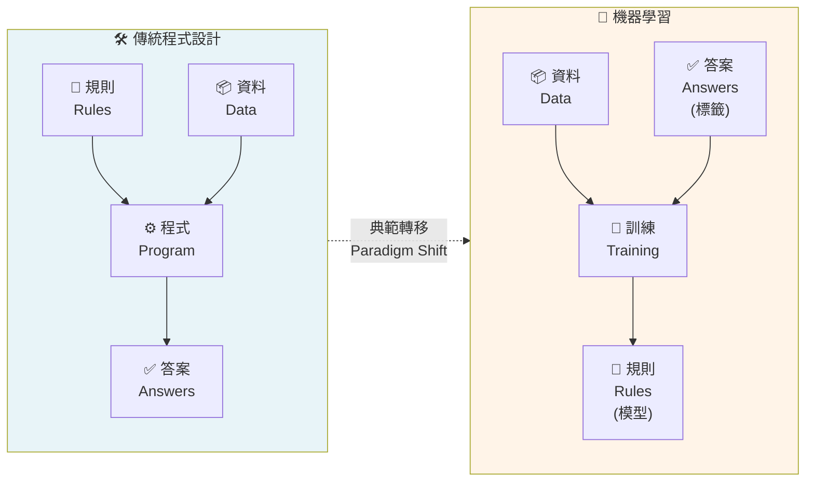

# V1 — 傳統程式設計 vs 機器學習 典範轉移

```mermaid
flowchart LR
    subgraph T["🛠️ 傳統程式設計"]
        T1["📜 規則\nRules"] --> TO["⚙️ 程式\nProgram"]
        T2["📦 資料\nData"] --> TO
        TO --> T3["✅ 答案\nAnswers"]
    end

    subgraph M["🤖 機器學習"]
        M1["📦 資料\nData"] --> MO["🧠 訓練\nTraining"]
        M2["✅ 答案\nAnswers\n(標籤)"] --> MO
        MO --> M3["📜 規則\nRules\n(模型)"]
    end

    T -.->|"典範轉移\nParadigm Shift"| M

    style T fill:#e8f4f8
    style M fill:#fff4e8
```

🔥 考點：傳統程式設計是「人寫規則」，機器學習是「從資料學規則」。垃圾郵件過濾器是經典例子 — 規則寫不完，但從歷史郵件學習就能自動分類。
