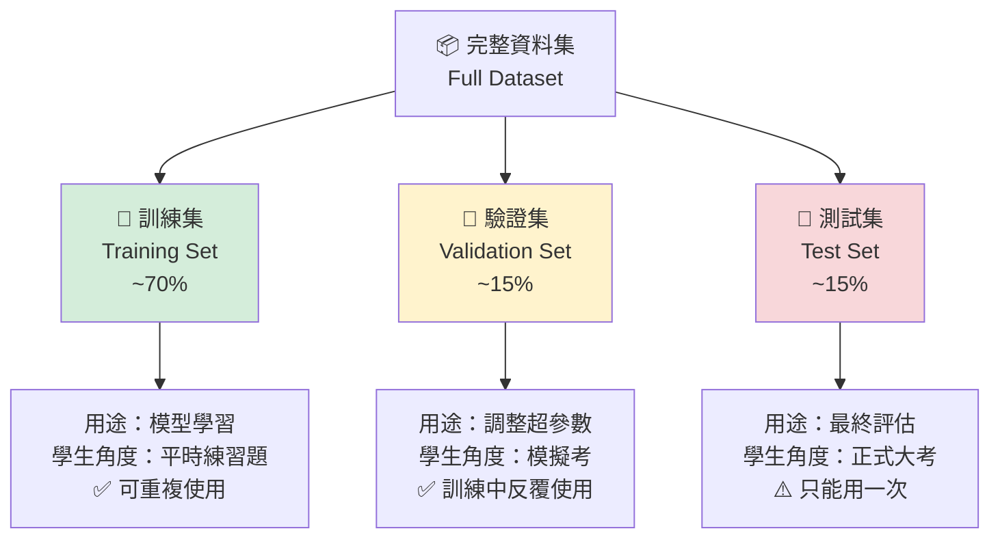

# V2 — 資料切分與學生考試對照

```mermaid
flowchart TD
    DATA["📦 完整資料集\nFull Dataset"]
    DATA --> TR["📘 訓練集\nTraining Set\n~70%"]
    DATA --> VAL["📝 驗證集\nValidation Set\n~15%"]
    DATA --> TEST["🎯 測試集\nTest Set\n~15%"]

    TR --> TR2["用途：模型學習\n學生角度：平時練習題\n✅ 可重複使用"]
    VAL --> VAL2["用途：調整超參數\n學生角度：模擬考\n✅ 訓練中反覆使用"]
    TEST --> TEST2["用途：最終評估\n學生角度：正式大考\n⚠️ 只能用一次"]

    style TR fill:#d4edda
    style VAL fill:#fff3cd
    style TEST fill:#f8d7da
```

🔥 考點：驗證集 ≠ 測試集！驗證集用來「訓練過程中」比較不同模型；測試集是「訓練完成後」最終一次性評估，用多次就失去公正性。70/15/15 只是常見範例，不是硬性規定。
