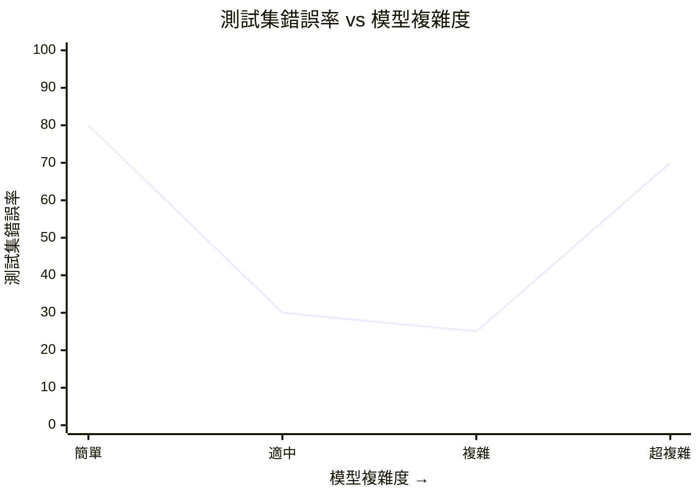

# V3 — 過度擬合與擬合不足 U 形曲線



ASCII 備用版（清楚標示三個區域）：

```
測試集錯誤率
    ↑
高  │ ╲               ╱
    │  ╲             ╱
    │   ╲           ╱
    │    ╲         ╱
    │     ╲___   ╱
    │         ‾‾
低  │
    └────────────────────→ 模型複雜度
     擬合不足   剛剛好   過度擬合
     (太簡單)   (理想)   (太複雜)
```

🔥 考點：這條曲線描述的是**測試集**錯誤率。訓練集錯誤率會隨複雜度持續下降 — 但那不代表模型變好！當測試集錯誤率開始上升，就是過度擬合的訊號。
