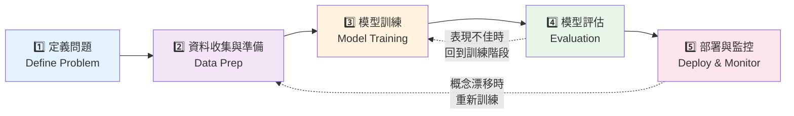

# V4 — 機器學習工作流程

```mermaid
flowchart LR
    S1["1️⃣ 定義問題\nDefine Problem"] --> S2["2️⃣ 資料收集與準備\nData Prep"]
    S2 --> S3["3️⃣ 模型訓練\nModel Training"]
    S3 --> S4["4️⃣ 模型評估\nEvaluation"]
    S4 --> S5["5️⃣ 部署與監控\nDeploy & Monitor"]
    S5 -.->|"概念漂移時\n重新訓練"| S2
    S4 -.->|"表現不佳時\n回到訓練階段"| S3

    style S1 fill:#e3f2fd
    style S2 fill:#f3e5f5
    style S3 fill:#fff3e0
    style S4 fill:#e8f5e9
    style S5 fill:#fce4ec
```

🔥 考點：機器學習工作流程是**迭代的**（有回饋迴圈），不是一次性的線性流程。模型部署後若發生概念漂移（資料分布改變），需要重新訓練。
