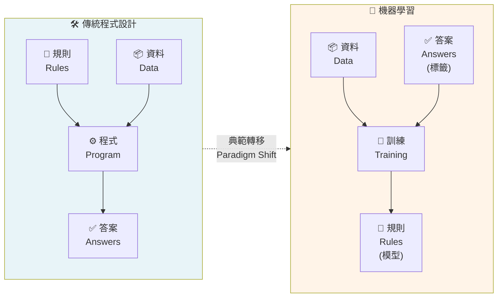
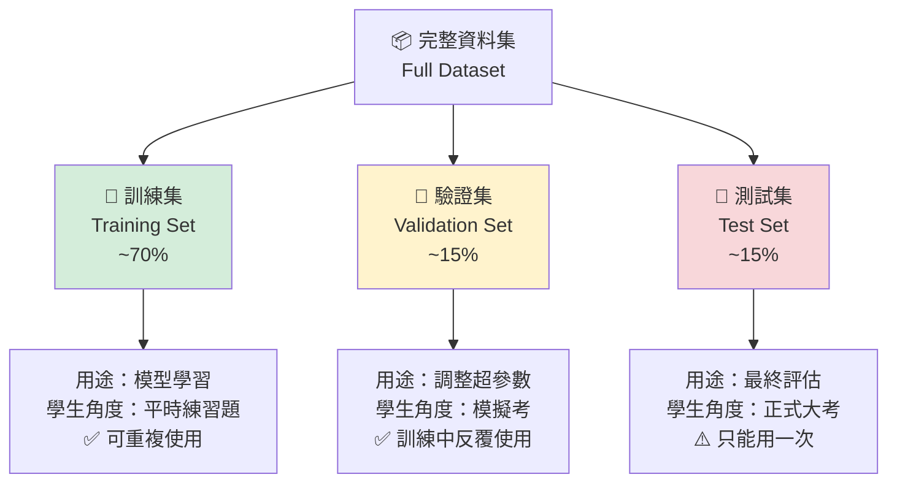
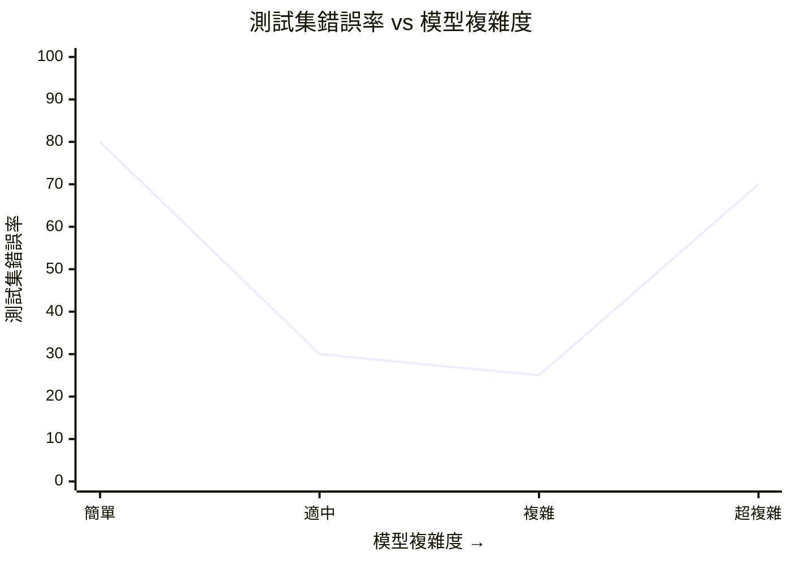
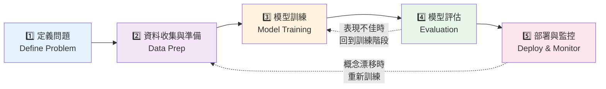

# L11301 機器學習基本原理 — 讀書指南

---

## 1. 考試對應範圍

> 對應評鑑範圍：**L11301 機器學習基本原理（Machine Learning Fundamentals）**
>
> 所屬主題：L113 機器學習概念 → L11301 機器學習基本原理
>
> 關鍵字：機器學習（Machine Learning, ML）、機器學習目的、模型訓練（Model Training）、泛化機制（Generalization）、訓練集/驗證集/測試集（Training/Validation/Test Set）、過度擬合（Overfitting）、擬合不足（Underfitting）、參數 vs 超參數（Parameters vs Hyperparameters）、機器學習工作流程（ML Workflow）、推論（Inference）
>
> 預估出題數：**3–5 題**（以情境辨識題為主——給一段「訓練 98%、測試 55%」的描述讓你判斷屬於過度擬合/擬合不足；另外會出傳統程式 vs ML 的比較、資料切分用途、工作流程順序）

這一課是 L113「機器學習概念」的地基。真的聽懂這堂課，L11302（常見機器學習模型）就會輕鬆很多——因為你已經知道「為什麼要切資料」「為什麼過度擬合是壞事」「為什麼我們要評估模型」，剩下的只是把名詞一個一個掛進這張地圖上。

---

## 2. 知識樹（Knowledge Tree）

```
L11301 機器學習基本原理
|
+-- 機器學習本質（What is ML?）
|   |
|   +-- 定義：從資料中自動學出規律的電腦程式
|   +-- 目的：處理規則太複雜、難以手寫的問題
|   +-- 典範轉移：規則驅動 -> 資料驅動
|   +-- Tom Mitchell T/E/P 定義（歷史脈絡）
|
+-- 傳統程式設計 vs 機器學習
|   |
|   +-- 傳統：規則 + 資料 -> 答案
|   +-- ML：資料 + 答案 -> 規則（模型）
|   +-- 經典案例：垃圾郵件過濾器
|
+-- 模型訓練概念（Model Training）
|   |
|   +-- 訓練：讓模型從範例中慢慢調整內部設定值
|   +-- 推論（Inference）：用訓練好的模型處理新資料
|   +-- 參數（Parameters）：模型自己學的
|   +-- 超參數（Hyperparameters）：人類事先設的
|
+-- 資料切分（Data Splitting）
|   |
|   +-- 訓練集（Training Set）= 平時練習題
|   +-- 驗證集（Validation Set）= 模擬考
|   +-- 測試集（Test Set）= 正式大考（只能用一次）
|   +-- 三者必須完全不重疊
|
+-- 泛化與失敗模式（Generalization & Failure Modes）
|   |
|   +-- 泛化（Generalization）= ML 的終極目標
|   +-- 過度擬合（Overfitting）= 死背答案
|   +-- 擬合不足（Underfitting）= 根本沒讀書
|   +-- 剛好（Good fit）= 真的學會規律
|
+-- 機器學習工作流程（ML Workflow）
|   |
|   +-- 1. 定義問題（Define the Problem）
|   +-- 2. 資料收集與準備（Data Collection & Preparation）
|   +-- 3. 模型訓練（Model Training）
|   +-- 4. 模型評估（Model Evaluation）
|   +-- 5. 部署與監控（Deployment & Monitoring）
|   +-- 特性：循環迭代，不是一次性直線
|   +-- CRISP-DM（業界替代流程，僅需認名）
|
+-- 適用場景判斷（When to Use ML）
    |
    +-- 適合：規則複雜、資料量大、可容忍不確定
    +-- 不適合：規則明確、需 100% 正確、資料太少
```

---

## 3. 核心概念（Core Concepts）

### 3.1 機器學習是什麼？為什麼重要？

`機器學習（Machine Learning, ML）` 是人工智慧（Artificial Intelligence, AI）的一個子領域，研究如何讓電腦程式**從資料或經驗中自動「學習」**，並用學到的規律對新資料做出預測或決策——**而不需要人類一條一條手寫規則**。

核心概念一句話：

> 機器學習 = 從資料中自動抽取模式（pattern），並用這些模式來處理未來的新資料。

#### 為什麼重要？傳統程式寫不完的時代

傳統程式設計（Traditional Programming）依賴工程師**親手把規則寫死**。可是真實世界的很多問題，規則根本寫不完、也寫不清楚：

- **垃圾郵件過濾**：新型詐騙信每天都在演化，規則寫到天荒地老
- **影像辨識**：「貓」的規則是什麼？四條腿有尾巴？那狗呢？
- **語音助理**：台灣國語混台語的「挖跟你共」，哪條 if/else 能處理？
- **詐騙偵測**：盜刷模式千變萬化，規則永遠追不上歹徒

當規則「寫不完、寫不清、會變動」的時候，就是機器學習上場的時刻。

🗣️ **白話說明：** 想像你在教一個外國朋友認台灣小吃。

你不可能寫一本「辨識珍珠奶茶規則書」——「杯子要透明、珍珠要黑色、液體要棕色、吸管要粗的⋯⋯」。這種規則寫到天亮都寫不完，而且手搖店每季推新品就全部要重寫。

比較有效的方法是：**給他看 500 張珍奶的照片，再看 500 張非珍奶的照片**，讓他自己從範例中「感覺出」珍奶長什麼樣。這就是機器學習的精神——**讓電腦從範例中學會規則，而不是你把規則塞進它腦袋**。

#### Tom Mitchell 的經典定義（歷史脈絡）

美國學者 Tom Mitchell 在 1997 年的經典教科書中給了機器學習一個到現在還在引用的定義，iPAS 材料也會提到：

> 「一個電腦程式被說成從**經驗（Experience, E）** 中針對某類**任務（Task, T）**、以**效能度量（Performance, P）** 進行學習——當它在 T 這類任務上的表現（以 P 衡量）會隨著經驗 E 累積而改善。」

拆成三個字母記就很好懂：

- **T（Task）**：要解決的任務（例：分類郵件是不是垃圾郵件）
- **E（Experience）**：餵給模型的資料或經驗（例：一萬封已標註好的歷史郵件）
- **P（Performance）**：怎麼衡量模型做得好不好（例：正確率）

一個機器學習系統 = 拿 E 去練 T、再用 P 打分數。考試若問到「機器學習和一般程式最大的差別」，T/E/P 這個框架是個安全的記法。

---

### 🔥 3.2 傳統程式設計 vs 機器學習（典範轉移）

這是 L11301 的**第一大考點**，幾乎每一梯次都會出。請把這張對照圖刻進腦袋：

```
  +----------------------------------------------------------------+
  |                     傳統程式設計（Rule-based）                    |
  |                                                                  |
  |     規則（Rules）   +---------------+                             |
  |        +   ----->  |   電腦程式     |  ----->   答案（Answers）    |
  |     資料（Data）    +---------------+                             |
  |                                                                  |
  |  -> 人類先想好規則，電腦照著跑                                       |
  +----------------------------------------------------------------+

  +----------------------------------------------------------------+
  |                       機器學習（Data-driven）                     |
  |                                                                  |
  |     資料（Data）   +----------------+                             |
  |        +   -----> | 訓練演算法      |  ----->  規則（= 模型）        |
  |     答案（Labels） +----------------+                             |
  |                                                                  |
  |  -> 給電腦大量「資料 + 正確答案」，電腦自己歸納出規則                   |
  +----------------------------------------------------------------+
```

一句話記：

> **傳統程式：規則 + 資料 → 答案。**
> **機器學習：資料 + 答案 → 規則（模型）。**

這個「輸入輸出角色對調」的觀念，台灣教材都稱為**典範轉移（Paradigm Shift）**——軟體開發從「規則驅動」進化為「資料驅動（Data-driven）」。

📊 **圖示：傳統程式設計 vs 機器學習 典範轉移**



🔥 考點：傳統程式設計是「人寫規則」，機器學習是「從資料學規則」。垃圾郵件過濾器是經典例子 — 規則寫不完，但從歷史郵件學習就能自動分類。

#### 經典案例：垃圾郵件過濾器（Spam Filter）

這是台灣所有 ML 教材都會拿出來用的「麥當勞套餐範例」：

**傳統程式做法：**
工程師手寫規則——「主旨包含『免費』『中獎』『點此』『發票對獎』就標為垃圾郵件」。

問題：
1. 規則永遠寫不完（垃圾郵件每天創造新詞）
2. 正常郵件誤判（真的中獎通知怎麼辦？）
3. 維護成本爆炸（每週都要有人盯著規則表更新）

**機器學習做法：**
工程師不寫規則，而是給模型「一大堆郵件 + 每封是否為垃圾郵件的標籤」，讓模型**自己去歸納「什麼樣的郵件像是垃圾郵件」**。當新的詐騙手法出現時，只要餵入新的標註資料重新訓練，模型就會自動學到新模式。

🗣️ **白話說明：** 傳統程式就像一本「垃圾郵件辨識手冊」，每多一種詐騙就要加新的條文，編到第 500 條還是會漏。機器學習則是「請一個看過十萬封垃圾信的老行家」，雖然他說不出他的判斷法則，但他一看就知道哪封是詐騙。

**一句金句抄起來：**

> 「機器學習讓電腦從『被告知該怎麼做』進化為『從範例中學會該怎麼做』。」

#### 什麼時候各自比較好？

| 問題特性 | 推薦方法 |
|---------|---------|
| 規則明確、邏輯清楚（如計算機、稅額計算） | 傳統程式 |
| 規則複雜、難以條列（如影像辨識、語意理解） | 機器學習 |
| 需要 100% 正確（如航太控制、會計帳務） | 傳統程式 |
| 可以容忍一點誤差、重點是大部分正確（如推薦系統、垃圾信過濾） | 機器學習 |

🔥 **考試重點：** 一看到「規則太複雜寫不完」「要從大量例子中學」就選**機器學習**；一看到「規則很明確」「不能有一點錯」就選**傳統程式**。

---

### 3.3 模型訓練（Model Training）的概念

#### 什麼是「模型」？什麼是「訓練」？

`模型（Model）` 可以想成一個「會做某件事的規則系統」，裡面有很多**可以調整的內部設定值**。

- **未訓練的模型**：像一個剛開學、什麼都還不懂的學生，內部設定值是隨便的，問它什麼都答不準。
- **訓練（Training）**：給模型看一大堆「範例資料 + 正確答案」，讓它**慢慢調整自己的內部設定值**，使得它回答的答案越來越接近正確答案。
- **訓練完成後的模型**：一套已經從資料中歸納好的規則系統，可以拿去處理新資料。

一句話記：

> 訓練 = 讓模型從範例中慢慢把內部設定值調好的過程。

#### 🔥 訓練 vs 推論（Training vs Inference）

這是一組超級常搞混的名詞，請一次分清楚：

`模型訓練（Model Training）` 是**學習階段**——用歷史資料「教」模型。發生在模型上線之前，耗時、耗算力，通常只做一次（或定期重做一次）。

`模型推論（Inference, 推論）` 是**使用階段**——模型已經訓練好了，拿它對新資料做預測。上線後每次使用者查詢都會發生，必須快、穩、便宜。

🗣️ **白話說明：**

- **訓練** = 學生在學校讀書、做練習題、被老師改考卷——耗時、需要老師、需要大量教材。
- **推論** = 學生畢業後去上班，用學到的知識處理每天遇到的新問題——快速、每天都在做、不需要老師在旁邊。

一句金句：

> 「訓練是讓模型學會；推論是讓模型實際做事。」

注意台灣術語：iPAS 和台灣業界一律用 **「推論」**。在機器學習脈絡下，「推論（inference）」有一個非常精準的意思——**用訓練好的模型對新資料做出預測**，也就是模型的「使用階段」。這和一般中文說的「推理（reasoning）」不完全一樣——推理在日常與哲學語境裡泛指各種邏輯思考與論證過程。

補充說明：近年 LLM（大型語言模型）領域開始出現「reasoning model」「reasoning-like」這類說法，指某些模型表現出類似推理的解題能力。這是一個活躍中的研究方向，但在**初級範圍**裡，只要把 **推論 = 模型使用階段（用訓練好的模型處理新資料）** 這個定義記起來就夠了。不要把它和日常中文的「推理」畫等號。

#### 🔥 參數（Parameters） vs 超參數（Hyperparameters）

這是另一個 L11301 常考的對比，但**只考概念，不考數值**。

`參數（Parameters）`：模型**在訓練過程中自己學到的**內部數值。**人類不手動設定**，是模型吸收訓練資料之後「自己長出來」的東西。

`超參數（Hyperparameters）`：**人類在訓練開始之前先決定好**的設定。模型自己不會改它，必須由人類工程師或研究者事先拍板。

🗣️ **白話說明（學生準備考試版）：**

- **超參數** = 老師幫學生安排的「讀書方法」：每天讀幾小時、讀幾遍、多久考一次小考。這些是**人類（老師）事先決定**的。
- **參數** = 學生自己腦袋裡「記下來的知識」：某個公式、某個定理、某個單字的意思。這些是**學生自己在讀的過程中長出來**的，老師不會一條一條幫他寫進腦袋。

另一個烤蛋糕的比喻也很經典：

- **超參數** = 烤箱溫度、烤多久、加多少糖——**廚師（人類）在開始烤之前決定**
- **參數** = 蛋糕烤好後的顏色、口感、組織——**烤的過程中自己形成**的結果

**一句鐵則：**

> 「如果是你（人類）必須手動決定的值，它就是**超參數**；如果是模型在訓練中自己調出來的，它就是**參數**。」

⚠️ 初級範圍到這裡就停。不用記具體的學習率數字、epoch 數、batch size 這些——那是中級領域。

---

### 🔥 3.4 資料切分：訓練集、驗證集、測試集

這是 L11301 的**第二大考點**，也是陷阱題最集中的區域。請用「學生準備考試」的比喻一次記清楚。

#### 三個資料集各自的角色

```
  +----------------------------------------------------------+
  |               全部可用的資料（Dataset）                    |
  +----------------------------------------------------------+
               |            |               |
               v            v               v
       +---------------+ +----------+ +------------+
       | 訓練集         | | 驗證集   | | 測試集      |
       | Training Set  | | Val Set  | | Test Set   |
       +---------------+ +----------+ +------------+
        ~70% (例示)      ~15%         ~15%
        模型拿來學習     調整超參數    最終成績單

        ||                ||            ||
        ||                ||            ||
        vv                vv            vv

       +---------------+ +----------+ +------------+
       | 平時練習題      | | 模擬考    | | 正式大考    |
       | (天天做)        | | (調整方法) | | (只能考一次)|
       +---------------+ +----------+ +------------+
```

**訓練集（Training Set）= 平時練習題**

- 用途：**讓模型實際學習、調整內部參數**。模型每天在這份資料上練習。
- 學生比喻：你平常寫的課本習題、講義題——每天反覆做，從錯誤中學會知識點。
- 模型在這份資料上「翻開答案對答案」、慢慢把參數調對。

**驗證集（Validation Set）= 模擬考**

- 用途：**訓練過程中評估模型**，用來**調整超參數**、比較不同模型、判斷是否開始過度擬合。
- 學生比喻：老師定期讓你考模擬考，不是為了打你的正式成績——而是要知道「你最近讀書的方法對不對」「要不要改變讀書策略」。
- 驗證集可以**反覆使用**，可以根據驗證集的結果回頭去改模型或超參數。

**測試集（Test Set）= 正式大考**

- 用途：**模型訓練全部結束後的最終評估**——看看它在完全沒見過的資料上到底表現如何，也就是衡量**泛化能力**。
- 學生比喻：學測／正式期末考——你不能考完回去改答案，不能考完之後回去重讀再考一次。這是你真實能力的成績單。
- 🔥 **測試集原則上只能用一次**，而且**絕對不能**拿測試集的結果回頭調整模型——那等於作弊（這種錯誤叫做「資料洩漏」）。

📊 **圖示：資料切分與學生考試對照**



🔥 考點：驗證集 ≠ 測試集！驗證集用來「訓練過程中」比較不同模型；測試集是「訓練完成後」最終一次性評估，用多次就失去公正性。70/15/15 只是常見範例，不是硬性規定。

#### 三個資料集必須「完全不重疊」

這是最重要的鐵律。三個集合必須是**互不重疊**的三份資料：

```
  全部資料
  +----------------------------------------+
  | [訓練集] [驗證集] [測試集]                |
  |    \________|_______/                  |
  |           互不重疊                       |
  +----------------------------------------+

  如果有重疊 -> 模型「偷看過」答案 -> 評估結果虛胖 -> 上線翻車
```

為什麼？因為如果用「模型看過的資料」來評估模型，它可能只是把答案背下來，看起來超準，但一遇到真正沒見過的新資料就完全失靈。**只有用模型從沒看過的資料來考它，才知道它是真的學會還是只會背答案。**

#### 常見切分比例（只是例子，不是規定！）

常見切分例子：70/15/15、80/10/10、60/20/20⋯⋯

⚠️ **不要背成「一定是 70/15/15」**。實務上比例會隨資料量與問題類型調整。資料量非常大時（例：有一千萬筆資料），驗證集和測試集的**絕對數量**比**比例**更重要——10% 的一千萬也有一百萬筆，已經夠用了。

#### 🔥 驗證集 vs 測試集——考試最愛的陷阱

這是 iPAS 初級選擇題中**最高頻率的陷阱**。請把這三行刻進腦袋：

| 項目 | 驗證集（Validation） | 測試集（Test） |
|------|-------------------|--------------|
| 何時使用 | 訓練**過程中** | 訓練**完成後** |
| 可否反覆用 | **可以**反覆使用 | **只能用一次**（理想上） |
| 可否回頭調模型 | **可以**（這就是它的用途） | **絕對不行**（否則等於作弊） |

**一句金句：**

> 「驗證集幫你調模型；測試集只給你最後的成績單。」

🗣️ **白話說明：** 你在準備學測。模擬考考爛了可以回去重讀、換讀書方法、買別的參考書——這是**驗證集**。但學測考完了就是考完了，你不能考完回家再讀書然後說「剛剛那張不算」——這是**測試集**。

---

### 🔥 3.5 泛化（Generalization）：機器學習的終極目標

#### 定義

`泛化（Generalization）` 指「模型在**沒看過的新資料**上仍然能做出正確預測的能力」。

`泛化能力（Generalization Ability）` = 模型把從訓練資料中學到的規律，成功套用到新資料上的能力。

⚠️ 台灣 ML 寫作一律用**「泛化」**，不要寫「一般化」（雖然字面上也通，但不是業界用語）。

#### 為什麼泛化是 ML 的「真正目標」？

很多初學者會誤會——「我的模型在訓練資料上準確率 99%，太棒了！」

錯。**訓練資料上的分數只是過程指標；真正重要的是模型在未見過資料上的表現。**

因為：

1. 模型**看過**訓練資料的正確答案，在訓練資料上高分是應該的（甚至是很低門檻的）。
2. 模型上線後會遇到**一堆它從沒見過的新資料**。如果它只會在訓練資料上拿高分，到了真實世界就會崩盤。
3. 機器學習的真正意義就是：**從過去的資料，歸納出能套用到未來資料的規律**。

#### 🗣️ 學生比喻：理解 vs 死背

```
  +---------------------------------------------------------+
  |             兩種學生，兩種結局                              |
  +---------------------------------------------------------+
  |                                                          |
  |  [A] 死背考古題的學生                                       |
  |      - 練習題 100 分                                        |
  |      - 正式考 55 分                                          |
  |      - 因為題目只要稍微變形就不會做                            |
  |      - 沒有「泛化能力」                                      |
  |      - 這就是「過度擬合」                                     |
  |                                                          |
  |  [B] 真正理解概念的學生                                      |
  |      - 練習題 90 分                                          |
  |      - 正式考 88 分                                          |
  |      - 因為他學到的是「背後的規律」，不是特定答案                 |
  |      - 泛化能力好                                            |
  |      - 這就是「Good fit」                                    |
  |                                                          |
  +---------------------------------------------------------+
```

**一句金句：**

> 「機器學習的目標是學到『規律』，不是『背答案』。」
> 「訓練表現好不等於真的學會；在新資料上也能做對，才是真的學會。」

這個觀念是接下來 3.6 節「過度擬合 vs 擬合不足」的基礎——那兩個名詞本質上就是「泛化失敗的兩種方式」。

---

### 🔥 3.6 過度擬合（Overfitting） vs 擬合不足（Underfitting）

這是 L11301 **單題分值最高**的考點。iPAS 的出題模式很固定：給你一段訓練集／測試集的準確率描述，讓你判斷是哪種問題。請把這張對照表背到熟。

#### 台灣術語小提醒

- **過度擬合（Overfitting）**——iPAS 最常見寫法。也可能寫成「過擬合」或「過度配適」，意思都一樣。
- **擬合不足（Underfitting）**——主要寫法。也可能寫成「欠擬合」或「配適不足」。
- ⚠️ 考試要認得所有變形。建議自己寫答案時用 **「過度擬合」** 和 **「擬合不足」**。

#### 過度擬合（Overfitting）——學「過頭」了

模型不只學到真正的規律，還把訓練資料中的**雜訊、異常值、偶然細節**一併記下來。結果：

- **訓練集上表現超好**（因為它把訓練資料背下來了）
- **測試集上表現變差**（因為背的那些細節在新資料上根本不存在）

本質：模型在「**背答案**」而不是「**學規律**」。

🗣️ **學生比喻：** 有一個學生把歷屆考古題的每道題答案死背下來——連題目後面的頁碼、題號都一起背。結果正式考題目順序一打亂、數字改一下，他就完全不會做。訓練（練習題）100 分，測試（正式考）55 分。

#### 擬合不足（Underfitting）——學「太少」了

模型**還沒把訓練資料中的規律抓到**。結果：

- **訓練集上就表現很差**
- **測試集上當然也差**
- 兩邊都差

本質：模型根本沒學會。能力不足、訓練時間不夠、或特徵資訊太少。

🗣️ **學生比喻：** 一個學生根本還沒讀書就去考試——練習題考 55 分，正式考考 54 分。兩邊都爛。不是因為他「學過頭」，而是因為他「根本沒學」。

#### 🔥 症狀對照表（最重要的考點）

這張表是 L11301 **考試最常直接測驗的知識點**：

| 狀況 | 訓練集表現 | 測試集表現 | 代表什麼 |
|------|----------|----------|---------|
| **剛好（Good fit）** | 好 | 好 | 泛化良好，真的學會規律 |
| **過度擬合（Overfitting）** | **非常好**（近乎完美） | **差**（掉很多） | 學過頭、背答案、泛化差 |
| **擬合不足（Underfitting）** | **差** | **差**（差不多差） | 學太少、能力不足 |

**記法：**

- 訓練高、測試低 → **過度擬合**（高低落差 = 背答案）
- 訓練低、測試也低 → **擬合不足**（兩邊都爛 = 沒讀書）
- 訓練高、測試也高 → **Good fit**（兩邊都好 = 真的學會）

#### 概念圖：模型複雜度與錯誤率的 U 形關係

這是台灣 ML 教材常見的「U 形直覺圖」（不是數學曲線，只是觀念示意）：

```
  測試集錯誤率 (Test Error)
  (高)
    |  *                                      *
    |   *                                    *
    |    *                                 *
    |     *                              *
    |      *                          *
    |        * 擬合不足            剛好   過度擬合
    |           *                 *  *            *
    |              *            *       *      *
    |                  *     *             *  *
    |                      *
    |                      ^
    |                 最佳點：泛化最好
    |
  (低) +----------------------------------------> 模型複雜度
       (太簡單)          (剛好)          (太複雜)
```

⚠️ 注意：訓練集錯誤率會隨模型複雜度持續下降，這條曲線描述的是**測試集**的表現。訓練好但測試差 = 過度擬合。

- 太簡單的模型（左端）→ 學不到規律 → **擬合不足**
- 剛剛好的模型（中間）→ 泛化最好 → **Good fit**
- 太複雜的模型（右端）→ 連雜訊都背下來 → **過度擬合**

關鍵直覺：**越簡單的模型越容易擬合不足；越複雜的模型越容易過度擬合。要找一個平衡點。**

📊 **圖示：過度擬合與擬合不足 U 形曲線**



🔥 考點：這條曲線描述的是**測試集**錯誤率。訓練集錯誤率會隨複雜度持續下降 — 但那不代表模型變好！當測試集錯誤率開始上升，就是過度擬合的訊號。

⚠️ 初級範圍不用講到 Bias-Variance Tradeoff 的數學分解——那是中級內容。你只要知道「簡單→擬合不足、複雜→過度擬合、中間最好」這個觀念就夠了。

#### 🔥 場景題練習：一看就會選

iPAS 最愛出這種題目：

| 題目描述 | 答案 |
|---------|------|
| 訓練集準確率 99%，測試集準確率 60% | **過度擬合** |
| 訓練集準確率 55%，測試集準確率 54% | **擬合不足** |
| 訓練集準確率 92%，測試集準確率 90% | **Good fit（泛化良好）** |
| 模型在歷史資料表現完美，但上線後錯誤率爆炸 | **過度擬合** |
| 模型訓練怎麼練都練不起來，兩邊準確率都不及格 | **擬合不足** |

#### 常見預防做法（只記名字，不記機制）

初級範圍只要**認得以下名詞**就好，不需要會細節：

- 收集更多（有代表性的）資料
- 降低模型複雜度
- 提前停止（Early Stopping）——在驗證集開始變差前停止訓練
- 資料擴增（Data Augmentation）
- 正則化（Regularization）——**僅需認名，不需要會公式**
- 交叉驗證（Cross-validation）——**僅需認名**

---

### 3.7 機器學習工作流程（ML Workflow）

一個真正的機器學習專案不是「把資料丟進模型就結束」，而是一套完整的流程。台灣 iPAS 最常用的是 **5 步驟版本**：

```
  +---------------+   +----------------+   +---------------+
  | 1. 定義問題    |->| 2. 資料收集     |->| 3. 模型訓練    |
  | Define        |  | 與準備           |  | Model          |
  | the Problem   |  | Data Collection  |  | Training       |
  |               |  | & Preparation    |  |                |
  +---------------+   +----------------+   +---------------+
                                                    |
                                                    v
          +----------------+           +----------------+
          | 5. 部署與監控    |<--------| 4. 模型評估     |
          | Deployment     |           | Model          |
          | & Monitoring   |           | Evaluation     |
          +----------------+           +----------------+
                  |                              |
                  |                              |
                  +----回頭迭代------------------+
                  (新資料、新問題、效能退化都要回去重走)
```

#### 5 個步驟，逐個說明

**1. 定義問題（Define the Problem）**
釐清要解決什麼、什麼才算成功、產出要長什麼樣。沒有好問題就沒有好答案。

**2. 資料收集與準備（Data Collection & Preparation）**
收集資料、清理、整理、切分成訓練／驗證／測試集——這一整段呼應你在 **L11202** 學過的資料整理流程（收集 → 清理 → 轉換 → 分析）。

**關鍵提醒：** 機器學習的第一步不是寫程式，而是**整理好資料**。資料品質決定模型品質（garbage in, garbage out）。

**3. 模型訓練（Model Training）**
選擇適合的模型，用訓練資料讓它學習，同時用驗證集調整超參數。

**4. 模型評估（Model Evaluation）**
用**測試集**檢查模型的真實表現——看看它的泛化能力如何。是不是只有訓練集好、測試集爛？如果是，回到第 2 或第 3 步。

**5. 部署與監控（Deployment & Monitoring）**
把訓練好的模型放上線，讓使用者使用。但**不是放上去就結束**：要持續監控它在真實資料上的表現，因為隨著時間經過，真實世界會變化，模型的表現可能會退化（這叫 **概念漂移（Concept Drift）**，也稱資料漂移 Data Drift 或模型漂移 Model Drift — 泛指模型部署後表現隨時間下降的現象）。

#### 🔥 這個流程是**循環**，不是一次性直線

iPAS 很愛考這一點：

> 「機器學習工作流程是一個**循環**（loop），不是一次走完就結束。」

為什麼？

- 第 4 步評估結果可能很爛 → 回到第 2 步加資料、或回到第 3 步換模型
- 第 5 步部署後發現表現退化 → 重新收集新資料、重新訓練
- 甚至可能發現第 1 步「問題定義」就定錯了 → 回到起點重新來

🗣️ **白話說明：** 就像你在經營一家飲料店——不是開店的第一天調好菜單就永遠不變。要看客人的反應（評估），調整配方（重新訓練），換新品（重新定義問題）。這是一個不斷循環的過程，不是一次性的直線。

📊 **圖示：機器學習工作流程**



🔥 考點：機器學習工作流程是**迭代的**（有回饋迴圈），不是一次性的線性流程。模型部署後若發生概念漂移（資料分布改變），需要重新訓練。

#### CRISP-DM（另一種業界標準）

`CRISP-DM（Cross-Industry Standard Process for Data Mining）` 是資料探勘／機器學習專案常見的**另一個業界標準流程**，分為 6 個階段（業務理解、資料理解、資料準備、建模、評估、部署）。它和上面的 5 步驟其實很像，只是把「定義問題」拆成了「業務理解」和「資料理解」兩個階段。

⚠️ 初級範圍**只要認得這個名字**就好——考試可能出現「下列何者是業界常見的資料探勘／機器學習流程框架？」這種題目，你能選出 CRISP-DM 即可。**不用背熟 6 個階段**。

---

### 3.8 什麼時候該用機器學習？

機器學習不是萬靈丹。有些問題用傳統程式解決更快更好。判斷標準如下：

#### 適合用機器學習的問題特徵

- ✅ **存在規律，但規律複雜或難以寫出來**（例：辨識貓狗圖片）
- ✅ **有大量歷史資料可用**（含正確答案或可觀察的結果）
- ✅ **問題允許某種程度的預測誤差**（不是 100% 正確也可以）
- ✅ **環境會變、需要持續更新**（可以用新資料重新訓練）

#### 不適合用機器學習、應該用傳統程式的問題

- ❌ **規則清楚、邏輯明確**（例：計算機加減乘除、稅額計算）
- ❌ **需要 100% 可預測與可解釋**（例：法規、會計、航太安全）
- ❌ **資料量極少**（沒有足夠資料讓 ML 學習）
- ❌ **錯誤代價極高、不能容忍機率性結果**（例：醫療器材的關鍵決策）

#### 一句鐵則

> 「能用 if/else 寫清楚的事，用傳統程式；要從大量例子中學出模式的事，用機器學習。」

#### 台灣日常情境對照

| 問題 | 合適方法 | 為什麼 |
|------|--------|-------|
| 發票對獎、計算中獎號碼 | 傳統程式 | 規則明確、不能錯 |
| 超商貨架商品辨識（無人結帳） | 機器學習 | 影像多變、規則難寫 |
| 健保費計算 | 傳統程式 | 法規明確、必須精準 |
| Netflix 推薦節目 | 機器學習 | 使用者偏好多樣、需從行為資料學 |
| 過濾垃圾郵件 | 機器學習 | 規則爆炸、會演化 |
| ATM 領錢流程 | 傳統程式 | 規則明確、零容忍錯誤 |
| 影像中的貓狗分類 | 機器學習 | 規則人類都講不清 |
| 台股盤後報表加總 | 傳統程式 | 四則運算、沒有不確定性 |

🗣️ **白話說明：** 如果問題像「算你媽媽給你的零用錢加減剩下多少」——用傳統程式（if/else + 加減法）。如果問題像「幫我推薦一部我會喜歡的電影」——用機器學習，因為「你會喜歡」這件事沒辦法寫成規則。

---

## 4. 比較表（Comparison Tables）

### 表一：傳統程式設計 vs 機器學習

| 比較面向 | 傳統程式設計（Rule-based） | 機器學習（Data-driven） |
|---------|------------------------|---------------------|
| 輸入 | 規則 + 資料 | 資料 + 正確答案（標籤） |
| 輸出 | 答案 | 模型（內含歸納出的規則） |
| 規則來源 | 人類工程師手寫 | 電腦從資料中自動學到 |
| 開發流程 | 分析需求 → 寫規則 → 測試 → 部署 | 定義問題 → 準備資料 → 訓練 → 評估 → 部署 |
| 資料需求 | 較少（甚至不需要大量歷史資料） | 大量且品質良好的歷史資料 |
| 可解釋性 | 高（規則可讀） | 較低（黑箱問題） |
| 適用場景 | 規則明確、邏輯清楚、必須 100% 正確 | 規則複雜、難以手寫、可接受機率性結果 |
| 典型例子 | 計算機、稅額計算、ATM | 垃圾信過濾、影像辨識、推薦系統 |

---

### 表二：過度擬合 vs 擬合不足

| 比較面向 | 過度擬合（Overfitting） | 擬合不足（Underfitting） |
|---------|---------------------|----------------------|
| 訓練集表現 | **非常好**（近乎完美） | **差**（就是學不好） |
| 測試集表現 | **差**（掉很多） | **差**（跟訓練集差不多差） |
| 本質 | 模型「學過頭」——把雜訊也背下來 | 模型「學太少」——還沒抓到規律 |
| 常見原因 | 模型太複雜、訓練資料太少、訓練太久 | 模型太簡單、訓練不夠、特徵資訊不足 |
| 學生類比 | 死背考古題的學生——練習滿分、正式考翻車 | 根本沒讀書的學生——練習和正式都爛 |
| 解法方向（僅認名） | 減少模型複雜度、加資料、提前停止、正則化 | 增加模型複雜度、延長訓練、改善特徵 |

---

### 表三：訓練集 vs 驗證集 vs 測試集

| 比較面向 | 訓練集（Training Set） | 驗證集（Validation Set） | 測試集（Test Set） |
|---------|--------------------|---------------------|------------------|
| 主要用途 | 讓模型學習、調整內部參數 | 調整超參數、比較不同模型、監控過度擬合 | 訓練完成後的**最終評估**（泛化能力） |
| 使用時機 | 訓練期間每一輪都在用 | 訓練過程中反覆使用 | 訓練全部結束後 |
| 可否重複使用 | 可以 | 可以（這就是它的用途） | **原則上只能用一次** |
| 可否拿來調模型 | 直接參與訓練 | 可以（用來調超參數） | **絕對不能**（否則等於作弊） |
| 學生類比 | 平時練習題 | 模擬考 | 正式大考 |
| 常見比例範例 | ~70%（僅為例示） | ~15%（僅為例示） | ~15%（僅為例示） |

⚠️ 比例只是例子，不是規定。三者必須**完全不重疊**。

---

### 表四：記憶 vs 泛化

| 比較面向 | 記憶（Memorization） | 泛化（Generalization） |
|---------|------------------|-------------------|
| 模型在做什麼 | 把訓練資料的表面細節背下來 | 從訓練資料中抽取「真正的規律」 |
| 訓練資料上的表現 | 很好（因為背下來了） | 也很好 |
| 新資料上的表現 | **很差**（稍微變形就掛） | **很好**（能處理沒看過的情況） |
| 對應的失敗模式 | 過度擬合（Overfitting） | —— |
| 學生類比 | 死背考古題的學生 | 真正理解概念的學生 |
| 是否為 ML 的目標 | ❌ 不是 | ✅ **是 ML 的終極目標** |

---

### 表五：參數 vs 超參數

| 比較面向 | 參數（Parameters） | 超參數（Hyperparameters） |
|---------|----------------|----------------------|
| 誰設定 | **模型自己學** | **人類事先決定** |
| 何時決定 | 訓練過程中 | 訓練開始之前 |
| 是否可被訓練改變 | 會（訓練就是在調它） | 訓練過程中不會變（除非人類手動改再重訓） |
| 概念類比（學生版） | 學生腦中記下的知識 | 老師決定的讀書方法（讀幾小時、讀幾遍） |
| 概念類比（烤蛋糕版） | 烤好後的顏色與口感 | 烤箱溫度、烤多久、加多少糖 |
| 舉例（僅提名詞，不展開） | 模型內部的權重、偏差值 | 訓練輪數、決策樹深度、學習率 |

⚠️ 初級只考「誰設定」這個概念差別，不考具體數值或調校方法。

---

### 表六：訓練（Training） vs 推論（Inference）

| 比較面向 | 模型訓練（Training） | 模型推論（Inference） |
|---------|----------------|----------------|
| 發生時機 | 模型上線**之前** | 模型上線**之後** |
| 階段名稱 | 學習階段 | 使用階段 |
| 做的事 | 用歷史資料「教」模型 | 拿訓練好的模型對**新資料**做預測 |
| 運算需求 | **大**（需要大量算力與時間） | **小**（每次預測一下就結束） |
| 發生頻率 | 通常一次（或定期重訓） | 每次使用者查詢都會發生 |
| 學生類比 | 在學校讀書、練習、考試 | 畢業後上班、處理每天遇到的新問題 |
| 一句總結 | 讓模型「學會」 | 讓模型「實際做事」 |

---

## 5. 記憶口訣（Mnemonics）

### 三個資料集的角色 — 「練 → 模擬 → 正」

🧠 **「練 → 模擬 → 正」** — 訓練集 → 驗證集 → 測試集的用途順序
- 練（練習題）= 訓練集：反覆學習基礎
- 模擬（模擬考）= 驗證集：訓練中調整策略
- 正（正式考）= 測試集：最終驗收，只能考一次

聯想句：「學生天天**練**習題，定期考**模擬**考調整讀書方法，最後上**正**式考場——正式考只有一次，考完就是考完。」

---

### 典範轉移 — 「規答互換」

```
  傳統程式：規則 + 資料 -> 答案
  機器學習：資料 + 答案 -> 規則（= 模型）

  口訣：規則和答案互換位置
  (傳統程式規則在輸入端，ML 規則在輸出端)
```

視覺記法：把「規則」和「答案」兩個詞想成兩張卡片，傳統程式把「規則卡」放在輸入、「答案卡」放在輸出；機器學習把它們**交換位置**——「答案卡」變輸入（和資料一起），「規則卡」變輸出（就是學出來的模型）。

---

### 過度擬合 vs 擬合不足 — 「高低差看擬合」

```
  訓練高、測試低  -> 過度擬合（高低落差大 = 背答案被抓包）
  訓練低、測試低  -> 擬合不足（兩邊都爛 = 根本沒讀書）
  訓練高、測試高  -> Good fit（兩邊都好 = 真學會）
```

一句話記：「**高低差**看過度擬合，**兩邊低**看擬合不足。」

---

### ML 工作流程 5 步驟 — 「定資訓評部」

```
  口訣：定資訓評部

  定 = 定義問題（Define the Problem）
  資 = 資料收集與準備（Data Collection & Preparation）
  訓 = 模型訓練（Model Training）
  評 = 模型評估（Model Evaluation）
  部 = 部署與監控（Deployment & Monitoring）
```

聯想句：「**定**下問題、準備**資**料、**訓**練模型、**評**估成效、**部**署上線——五個字，一條線，但走完還要回頭循環。」

---

### 參數 vs 超參數 — 「人設的是超，自學的是參」

```
  人設的是超（超參數） — 人類（Human）事先手動設定的
  自學的是參（參數）  — 模型自己（Self-learned）在訓練中學到的
```

一句話記：「**人設超、自學參**。」

---

### 訓練 vs 推論 — 「訓學推用」

```
  訓練 = 讓模型「學」  (學生在學校讀書)
  推論 = 讓模型「用」  (畢業後上班做事)

  口訣：訓學推用
```

---

## 6. 考試陷阱（Exam Traps）

### 陷阱 1：驗證集 ≠ 測試集（用途完全不同）

❌ 常見錯誤：「驗證集和測試集只是名字不一樣，反正都是拿來評估模型的，可以互換使用。」

✅ 正確觀念：**兩者用途完全不同**。
- **驗證集**在訓練**過程中**使用，**可以反覆使用**，可以根據結果回頭調整超參數與模型。
- **測試集**在訓練**完成後**使用，**原則上只能用一次**，且**絕對不能**拿它的結果回頭調模型——否則等於作弊（資料洩漏）。

一句話記：**驗證集幫你調模型；測試集只給你最後的成績單。**

---

### 陷阱 2：過度擬合 ≠ 訓練不足

❌ 常見錯誤：「過度擬合聽起來就是『擬合得不夠』，模型還沒學好。」

✅ 正確觀念：**完全相反！** 過度擬合是模型「學**過頭**」了——不只學到真正的規律，還把訓練資料的雜訊、偶然細節一併背下來。所以它的症狀是「**訓練集表現非常好**，但測試集表現變差」。
如果訓練集和測試集**都**表現差，那才是「擬合不足（學太少）」。

英文名稱會暗示：**Over**fitting = 過**度** / 超**過** → 學過頭。

---

### 陷阱 3：機器學習不是「讓電腦思考」

❌ 常見錯誤：「機器學習讓電腦學會像人類一樣思考、理解、推理。」

✅ 正確觀念：機器學習本質上是**從資料中抽取模式（pattern matching）**，不是真正的「思考」或「理解」。模型並不知道它在做什麼，它只是學到「輸入 A 通常對應輸出 B」這種統計規律。iPAS 初級範圍內不要把 ML 神化為「像人一樣有意識地思考」。

---

### 陷阱 4：更多資料 ≠ 一定更好

❌ 常見錯誤：「訓練資料越多模型就越準，所以只要拼命收資料就對了。」

✅ 正確觀念：**資料品質比數量更重要**。大量低品質或有偏誤的資料，反而會讓模型學到錯的規律（呼應 L11202：garbage in, garbage out）。真正重要的是：
- 資料**品質**好（乾淨、正確、一致）
- 資料**具有代表性**（涵蓋真實世界會遇到的情況）
- 訓練、驗證、測試集**不重疊**

不過，若資料品質高且具代表性，更多資料通常能**降低過度擬合的風險**，幫助模型學到更穩定的規律。關鍵是「品質 > 數量」，不是「數量完全不重要」。

---

### 陷阱 5：模型訓練 ≠ 模型推論

❌ 常見錯誤：「訓練和推論是同一件事，就是『用模型處理資料』。」

✅ 正確觀念：
- **訓練（Training）** = 用歷史資料「**教**」模型，發生在上線**之前**。耗時、耗算力，通常一次（或定期重做）。
- **推論（Inference）** = 用已經訓練好的模型對**新資料**做預測，發生在上線**之後**。每次使用者查詢都會發生，必須快。

一句話：**訓練讓模型學會，推論讓模型實際做事。**

---

### 陷阱 6：參數 ≠ 超參數

❌ 常見錯誤：「參數和超參數只是同一個東西的不同稱呼。」

✅ 正確觀念：
- **參數（Parameters）** = 模型**自己在訓練中學到**的內部數值。人類不手動設定。
- **超參數（Hyperparameters）** = 人類**在訓練前先決定好**的設定。模型自己不會改它。

簡單記：**人設的是超，自學的是參。**

---

### 陷阱 7：訓練集表現好 ≠ 模型好

❌ 常見錯誤：「我的模型在訓練資料上準確率 99%，這就代表它很強！」

✅ 正確觀念：訓練集的分數**只是過程指標**。模型「看過」訓練資料的答案，在上面拿高分是基本盤。真正的好模型要看**測試集**上的表現——也就是它面對**沒見過的新資料**還能不能做對。這個能力叫「**泛化能力**」，才是 ML 的真正目標。

如果訓練集 99%、測試集 55% → **過度擬合**，不是好模型。

---

### 陷阱 8：測試集只能用一次

❌ 常見錯誤：「測試集可以反覆使用，每次調模型後都用它來看看進步了沒。」

✅ 正確觀念：**測試集原則上只能用一次**。如果你反覆用測試集的結果回去調模型，那等於是把測試集的資訊「洩漏」進了訓練過程——模型等於是偷偷學過測試集了。你看到的測試分數會異常漂亮，但模型上線後遇到真正的新資料就會翻車。

如果需要反覆調整的話，那份資料叫「**驗證集**」，不是測試集。**測試集的聖潔性在於「全程保持未知」**。

---

## 7. 情境判斷快查（Scenario Quick-Judge）

遇到考題情境，找關鍵字，對應答案：

| 關鍵情境描述 | 判斷答案 |
|------------|---------|
| 訓練集準確率 98%，測試集準確率 55% | **過度擬合**（高低差大） |
| 訓練集準確率 60%，測試集準確率 58% | **擬合不足**（兩邊都差） |
| 訓練集 92%，測試集 90% | **Good fit**（泛化良好） |
| 模型在歷史資料完美，上線後失準 | **過度擬合** |
| 規則複雜、難以手寫 | **適合用機器學習** |
| 需要 100% 正確且有明確規則 | **用傳統程式設計** |
| 需要調整超參數時應該用哪個資料集？ | **驗證集（Validation Set）** |
| 訓練結束後做最終評估應該用哪個資料集？ | **測試集（Test Set）**（只能用一次） |
| 訓練過程中讓模型學習用哪個資料集？ | **訓練集（Training Set）** |
| 垃圾郵件自動分類 | **經典機器學習應用**（規則會演化） |
| 計算機加減乘除 | **不需要機器學習**（用傳統程式即可） |
| 模型在真實世界新資料上的表現 | **泛化能力（Generalization）** |
| 學生的「讀書方法」對應到 ML 的哪個概念？ | **超參數**（人類事先決定） |
| 學生讀書後腦中記住的知識對應到 ML 的哪個概念？ | **參數**（模型自己學的） |
| 烤箱溫度、烤多久、加糖量 | **超參數** |
| 學習率（Learning Rate）是參數還是超參數？ | **超參數**（人類事先設定） |
| 模型訓練的目標是讓它在⋯⋯的資料上表現好？ | **沒看過的新資料**（泛化） |
| 機器學習工作流程是一次性直線還是循環？ | **循環**（iterative） |
| 工作流程第一步是什麼？ | **定義問題** |
| 工作流程最後一步是什麼？ | **部署與監控** |
| CRISP-DM 是什麼？ | **業界常見的資料探勘／ML 流程框架**（僅認名） |
| 學生死背考古題、正式考試翻車 | **過度擬合**的類比 |
| 學生根本沒讀書、練習考試都考不好 | **擬合不足**的類比 |
| 學生真正理解概念、面對新題目也能解 | **泛化能力好**（Good fit） |
| 傳統程式的輸入是？ | **規則 + 資料** |
| 機器學習的輸出是？ | **模型（內含規則）** |
| 資料品質差但量大 vs 資料量少但品質好 | **通常「品質好」更重要**（garbage in, garbage out） |
| 訓練好的模型拿去對新資料做預測 | **推論（Inference）** |
| 模型在用歷史資料學習的階段 | **訓練（Training）** |
| 同一筆資料既在訓練集又在測試集 | **資料洩漏**，評估結果不可信 |
| 用測試集的結果回頭調整超參數 | **錯誤做法**（應該用驗證集） |

---

*讀書指南到此結束。L11301 是整個 L113「機器學習概念」的地基——下一課 L11302 會介紹各種常見的機器學習模型（監督式、非監督式、強化式、深度學習等），那堂課會假設你已經掌握這裡的所有名詞。所以請特別把 3.4（資料切分）、3.5（泛化）、3.6（過度擬合 vs 擬合不足）這三節的表格背到熟——這是 L11301 拿滿分的關鍵！*
