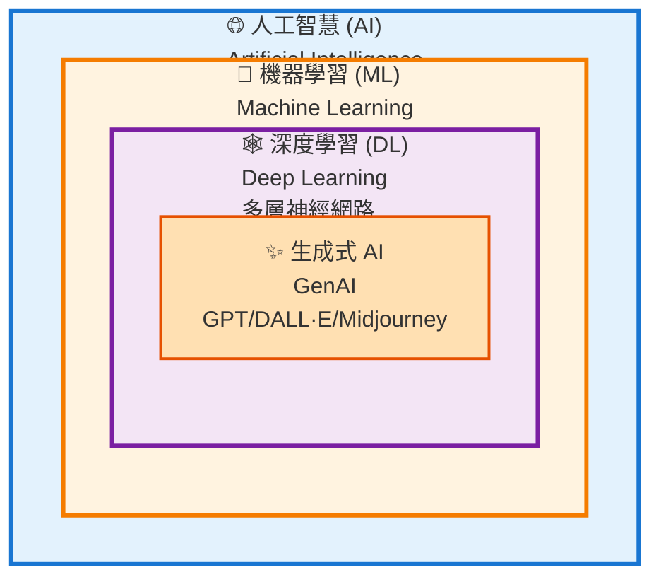

# V1 — AI ⊃ ML ⊃ DL 階層關係

```mermaid
flowchart TD
    subgraph AI["🌐 人工智慧 (AI)<br/>Artificial Intelligence<br/>最大的範圍"]
        subgraph ML["🧠 機器學習 (ML)<br/>Machine Learning<br/>從資料學規則"]
            subgraph DL["🕸️ 深度學習 (DL)<br/>Deep Learning<br/>多層神經網路"]
                GAI["✨ 生成式 AI<br/>GenAI<br/>GPT/DALL·E/Midjourney"]
            end
        end
    end

    style AI fill:#e3f2fd,stroke:#1976d2,stroke-width:3px
    style ML fill:#fff3e0,stroke:#f57c00,stroke-width:3px
    style DL fill:#f3e5f5,stroke:#7b1fa2,stroke-width:3px
    style GAI fill:#ffe0b2,stroke:#e65100,stroke-width:2px
```

🔥 考點：**DL 是 ML 的子集合，不是並列關係**。GenAI 是 DL 的應用，寫作 AI ⊃ ML ⊃ DL ⊃ GenAI 的俄羅斯套娃關係。
