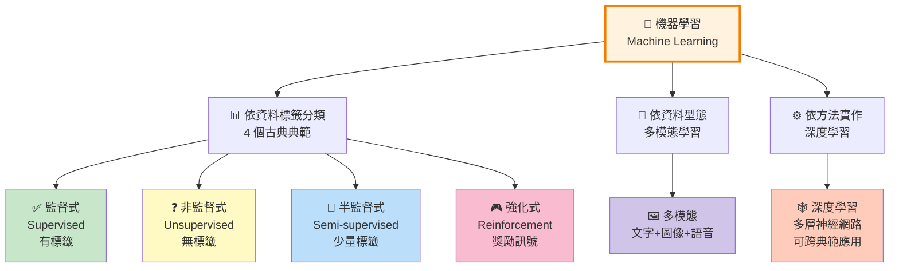

# V2 — 六大機器學習典範總覽

```mermaid
flowchart TD
    ML["🧠 機器學習<br/>Machine Learning"]

    ML --> L1["📊 依資料標籤分類<br/>4 個古典典範"]
    ML --> L2["🎨 依資料型態<br/>多模態學習"]
    ML --> L3["⚙️ 依方法實作<br/>深度學習"]

    L1 --> P1["✅ 監督式<br/>Supervised<br/>有標籤"]
    L1 --> P2["❓ 非監督式<br/>Unsupervised<br/>無標籤"]
    L1 --> P3["🔀 半監督式<br/>Semi-supervised<br/>少量標籤"]
    L1 --> P4["🎮 強化式<br/>Reinforcement<br/>獎勵訊號"]

    L2 --> P5["🖼️ 多模態<br/>文字+圖像+語音"]
    L3 --> P6["🕸️ 深度學習<br/>多層神經網路<br/>可跨典範應用"]

    style ML fill:#fff3e0,stroke:#f57c00,stroke-width:3px
    style P1 fill:#c8e6c9
    style P2 fill:#fff9c4
    style P3 fill:#bbdefb
    style P4 fill:#f8bbd0
    style P5 fill:#d1c4e9
    style P6 fill:#ffccbc
```

🔥 考點：前 4 個典範是**依資料標籤分類**；多模態是**依資料型態分類**；深度學習是**一種方法**，可以套在任何典範上（例如監督式深度學習、強化式深度學習）。
