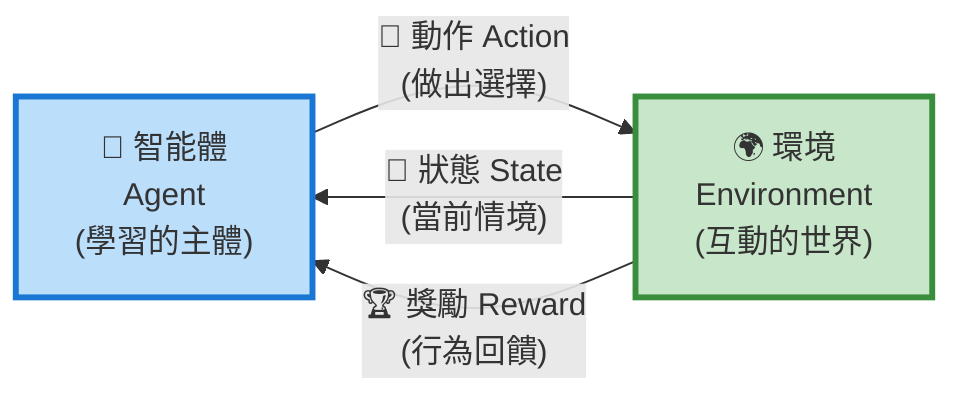

# V3 — 強化式學習 5 元素循環

```mermaid
flowchart LR
    A["🤖 智能體<br/>Agent<br/>(學習的主體)"]
    E["🌍 環境<br/>Environment<br/>(互動的世界)"]

    A -->|"🎯 動作 Action<br/>(做出選擇)"| E
    E -->|"📍 狀態 State<br/>(當前情境)"| A
    E -->|"🏆 獎勵 Reward<br/>(行為回饋)"| A

    style A fill:#bbdefb,stroke:#1976d2,stroke-width:3px
    style E fill:#c8e6c9,stroke:#388e3c,stroke-width:3px
```

🔥 考點：強化式學習的 5 元素 = 智能體、環境、狀態、動作、獎勵。記憶口訣「**智環狀動獎**」。AlphaGo 就是典型範例 — 智能體是 AI，環境是棋盤，狀態是當前局勢，動作是下一步棋，獎勵是贏/輸。
