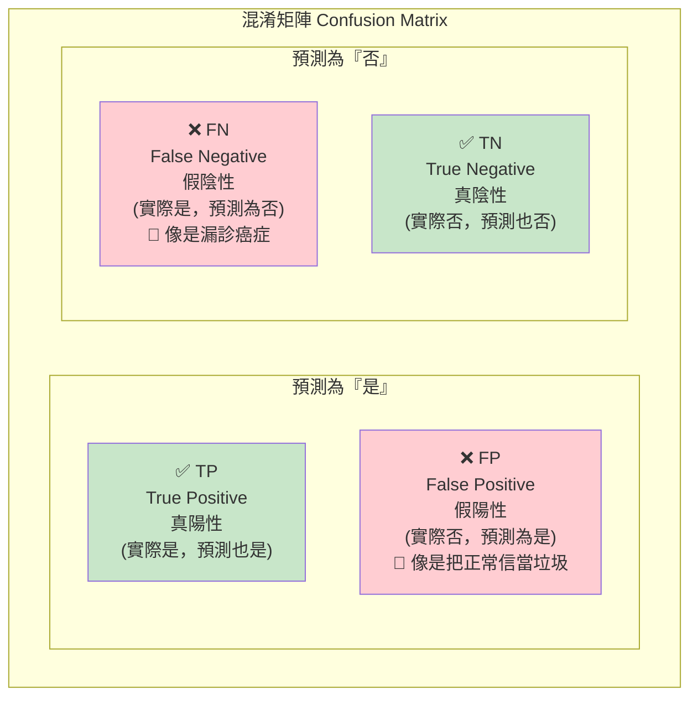

# V4 — 混淆矩陣 2x2 概念結構

```mermaid
flowchart TD
    subgraph CM["混淆矩陣 Confusion Matrix"]
        subgraph Row1["預測為『是』"]
            TP["✅ TP<br/>True Positive<br/>真陽性<br/>(實際是，預測也是)"]
            FP["❌ FP<br/>False Positive<br/>假陽性<br/>(實際否，預測為是)<br/>📮 像是把正常信當垃圾"]
        end
        subgraph Row2["預測為『否』"]
            FN["❌ FN<br/>False Negative<br/>假陰性<br/>(實際是，預測為否)<br/>🏥 像是漏診癌症"]
            TN["✅ TN<br/>True Negative<br/>真陰性<br/>(實際否，預測也否)"]
        end
    end

    style TP fill:#c8e6c9
    style TN fill:#c8e6c9
    style FP fill:#ffcdd2
    style FN fill:#ffcdd2
```

🔥 考點：混淆矩陣是概念結構（2×2 表格），不是公式。初級只要認得 TP/FP/FN/TN 的意義即可，**不用背任何計算**。精確率看「說是的時候多準」，召回率看「該抓的有沒有漏掉」。
