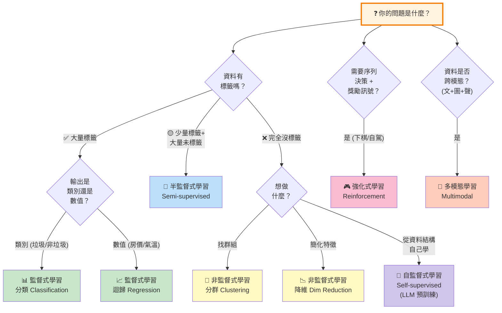

# V5 — 機器學習典範選擇決策樹

```mermaid
flowchart TD
    START["❓ 你的問題是什麼？"]

    START --> Q1{"資料有<br/>標籤嗎？"}

    Q1 -->|"✅ 大量標籤"| Q2{"輸出是<br/>類別還是<br/>數值？"}
    Q2 -->|"類別 (垃圾/非垃圾)"| S_CLS["📊 監督式學習<br/>分類 Classification"]
    Q2 -->|"數值 (房價/氣溫)"| S_REG["📈 監督式學習<br/>迴歸 Regression"]

    Q1 -->|"🟡 少量標籤+<br/>大量未標籤"| SEMI["🔀 半監督式學習<br/>Semi-supervised"]

    Q1 -->|"❌ 完全沒標籤"| Q3{"想做<br/>什麼？"}
    Q3 -->|"找群組"| U_CLU["🎯 非監督式學習<br/>分群 Clustering"]
    Q3 -->|"簡化特徵"| U_DIM["📉 非監督式學習<br/>降維 Dim Reduction"]
    Q3 -->|"從資料結構<br/>自己學"| SELF["🔄 自監督式學習<br/>Self-supervised<br/>(LLM 預訓練)"]

    START --> Q4{"需要序列<br/>決策 +<br/>獎勵訊號？"}
    Q4 -->|"是 (下棋/自駕)"| RL["🎮 強化式學習<br/>Reinforcement"]

    START --> Q5{"資料是否<br/>跨模態？<br/>(文+圖+聲)"}
    Q5 -->|"是"| MM["🎨 多模態學習<br/>Multimodal"]

    style START fill:#fff3e0,stroke:#f57c00,stroke-width:3px
    style S_CLS fill:#c8e6c9
    style S_REG fill:#c8e6c9
    style SEMI fill:#bbdefb
    style U_CLU fill:#fff9c4
    style U_DIM fill:#fff9c4
    style SELF fill:#d1c4e9
    style RL fill:#f8bbd0
    style MM fill:#ffccbc
```

🔥 考點：這張決策樹就是解題地圖。考試時看到情境題，先問自己「資料有標籤嗎？」→「輸出是類別還是數值？」→「需要序列決策嗎？」→ 答案就會浮現。
