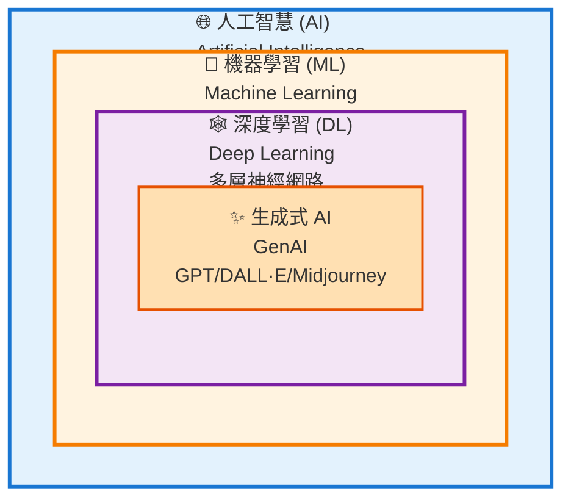
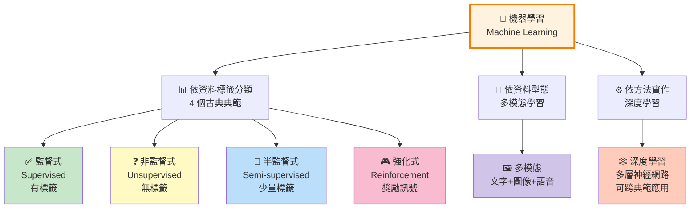
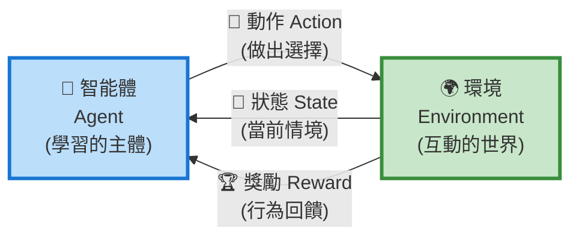
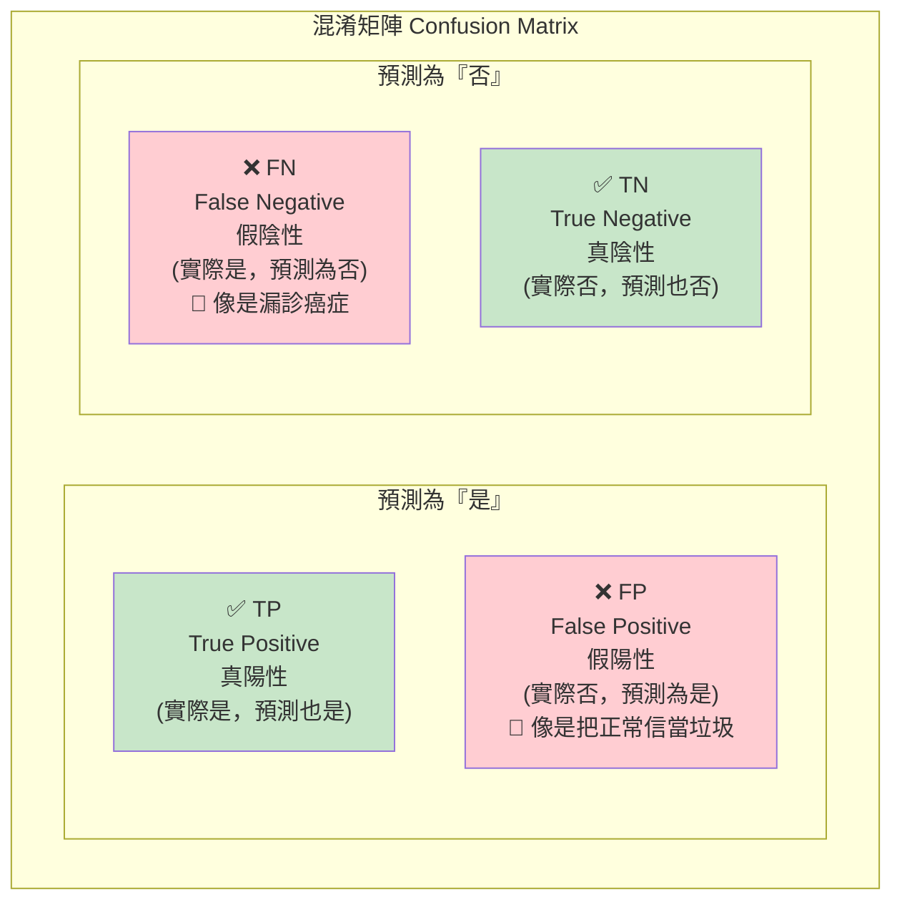
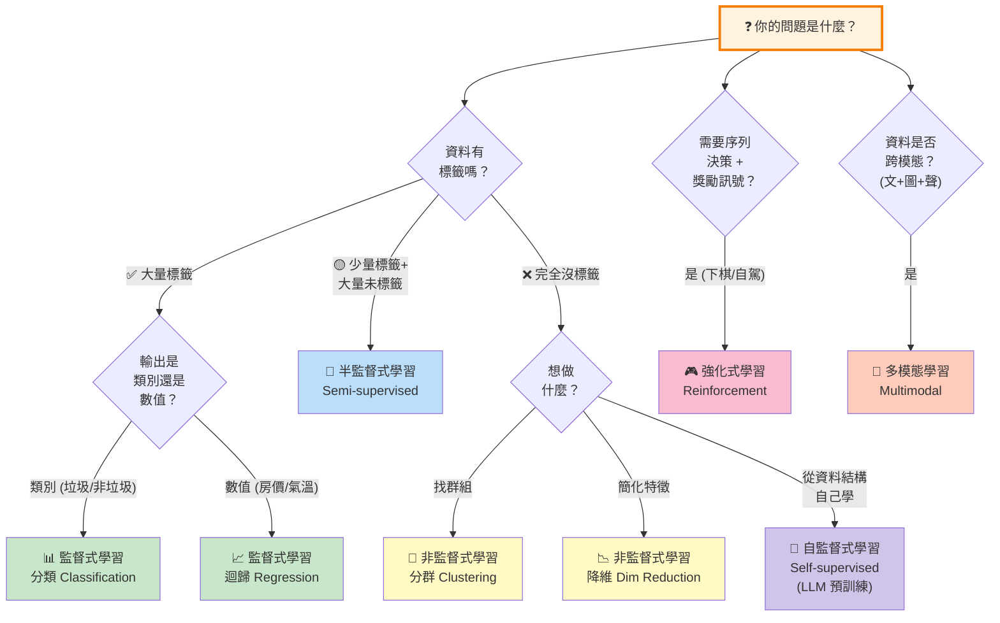

# L11302 常見的機器學習模型 — 讀書指南

---

## 1. 考試對應範圍

> 對應評鑑範圍：**L11302 常見的機器學習模型（Common Machine Learning Models）**
>
> 所屬主題：L113 機器學習概念 → L11302 常見的機器學習模型
>
> 關鍵字：監督式學習（Supervised Learning）、非監督式學習（Unsupervised Learning）、半監督式學習（Semi-supervised Learning）、強化式學習（Reinforcement Learning, RL）、多模態學習（Multimodal Learning）、深度學習（Deep Learning, DL）、自監督式學習（Self-supervised Learning）、分類（Classification）、迴歸（Regression）、分群（Clustering）、降維（Dimensionality Reduction）、智能體（Agent）、環境（Environment）、狀態（State）、動作（Action）、獎勵（Reward）、混淆矩陣（Confusion Matrix）、準確率（Accuracy）、精確率（Precision）、召回率（Recall）、F1 分數（F1 Score）、卷積神經網路（CNN）、循環神經網路（RNN）、Transformer
>
> 預估出題數：**8–12 題（L11 裡最重的一課）**
>
> 題型集中在三類：
> 1. **情境對應題（最主流）**：給一段商業／生活情境，問應該用哪一種學習典範
> 2. **演算法歸類題**：KNN 是哪一類？K-means 是哪一類？邏輯迴歸是分類還是迴歸？
> 3. **指標／概念辨析題**：醫療篩檢要看哪個指標？深度學習和機器學習什麼關係？

這一課是**整個 L11 最重的一課**，也是整份初級考試最常出情境題的地方。上一課 L11301 教你「機器學習是什麼、要怎麼訓練、過度擬合怎麼辦」；這一課教你**機器學習有哪幾種、什麼時候用哪一種**。請把它當成「給情境、選典範」的選擇題速查手冊——考試 70% 以上的題目都是這種格式。

---

## 2. 知識樹（Knowledge Tree）

```
L11302 常見的機器學習模型
|
+-- A. 家族關係（AI / ML / DL）
|   |
|   +-- AI ⊃ ML ⊃ DL（三層巢狀關係）
|   +-- 生成式 AI（GenAI）住在 DL 圈裡
|   +-- ML 和 DL 不是平行關係（DL 是 ML 的一種方法）
|
+-- B. 六大學習典範（本課核心）
|   |
|   +-- 1. 監督式學習（Supervised Learning）
|   |   +-- 分類（Classification）──離散輸出
|   |   +-- 迴歸（Regression）──連續輸出
|   |   +-- 典型演算法：決策樹 / 隨機森林 / SVM / KNN / 線性迴歸 /
|   |                    邏輯迴歸 / 單純貝氏 / 神經網路
|   |
|   +-- 2. 非監督式學習（Unsupervised Learning）
|   |   +-- 分群（Clustering）
|   |   +-- 降維（Dimensionality Reduction）
|   |   +-- 典型演算法：K-means / 階層式分群 / DBSCAN / PCA / 自動編碼器
|   |
|   +-- 3. 半監督式學習（Semi-supervised Learning）
|   |   +-- 少量有標籤 + 大量無標籤
|   |
|   +-- 4. 強化式學習（Reinforcement Learning, RL）
|   |   +-- 五元素：智能體 / 環境 / 狀態 / 動作 / 獎勵
|   |   +-- 典型演算法名：Q-learning / DQN
|   |
|   +-- 5. 多模態學習（Multimodal Learning）
|   |   +-- 文字 + 圖像 + 音訊 + 影片整合
|   |   +-- 代表：GPT-4V / Gemini / CLIP / DALL·E
|   |
|   +-- 6. 深度學習（Deep Learning, DL）── 是「方法」不是「典範」
|       +-- CNN（卷積神經網路）── 影像
|       +-- RNN / LSTM ── 序列、時間
|       +-- Transformer ── 現代 LLM 的基礎
|       +-- GAN / Autoencoder（認名即可）
|
+-- C. 陷阱專區（考試必出）
|   |
|   +-- 自監督式學習（Self-supervised）──和半監督式區分
|   +-- K-means vs KNN
|   +-- 分類 vs 分群
|   +-- 邏輯迴歸其實是分類
|   +-- 多模態 ≠ 多工
|
+-- D. 模型評估（Model Evaluation）
|   |
|   +-- 分類指標
|   |   +-- 混淆矩陣（2x2 結構：TP / FP / FN / TN）
|   |   +-- 準確率（Accuracy）
|   |   +-- 精確率（Precision）
|   |   +-- 召回率（Recall）
|   |   +-- F1 分數（F1 Score）
|   |   +-- 準確率陷阱（Accuracy Paradox）
|   |
|   +-- 迴歸指標（僅認名）
|       +-- MAE / RMSE / R²
|
+-- E. 典範選擇決策流程（情境題速判）
    |
    +-- 資料有標籤嗎？ → 監督 / 非監督 / 半監督
    +-- 需要試錯與獎勵？ → 強化式
    +-- 多種資料型態？ → 多模態
    +-- 大量非結構化資料？ → 考慮深度學習方法
```

---

## 3. 核心概念（Core Concepts）

### 3.1 AI、ML、DL 的家族關係

很多同學第一次學 AI 會把「人工智慧」「機器學習」「深度學習」當成三個並列的東西，好像它們是三個不同的技術門派。**這是錯的**。它們其實是**三層巢狀的關係**，像俄羅斯娃娃——大的娃娃裡面裝中的娃娃，中的娃娃裡面裝小的娃娃。

```
  +------------------------------------------------------+
  |                人工智慧 AI                             |
  |  (讓機器展現「智慧」行為：推理、學習、感知、理解語言)     |
  |                                                      |
  |    +----------------------------------------+        |
  |    |            機器學習 ML                   |        |
  |    |  (不寫死規則，從資料中學出規律)            |        |
  |    |                                        |        |
  |    |    +----------------------------+      |        |
  |    |    |       深度學習 DL           |      |        |
  |    |    |  (多層神經網路的 ML 方法)    |      |        |
  |    |    |                            |      |        |
  |    |    |   [生成式 AI 的核心就住在這] |      |        |
  |    |    +----------------------------+      |        |
  |    |                                        |        |
  |    +----------------------------------------+        |
  |                                                      |
  |  (規則式系統、專家系統等「不學習」的 AI 也住在最外層)   |
  +------------------------------------------------------+
```

- **人工智慧（Artificial Intelligence, AI）**：最外層、最廣義——讓機器展現智慧行為（推理、學習、感知、理解語言）。**包含** ML，也**包含**不會學習的規則式 AI（例：專家系統、早期下棋程式）。
- **機器學習（Machine Learning, ML）**：AI 的子領域——**不直接寫死規則，而是讓機器從資料中學出規律**。
- **深度學習（Deep Learning, DL）**：ML 的**一種方法**——使用多層神經網路（多個隱藏層）。**DL 是 ML 的子集，不是 ML 的平行兄弟。**
- **生成式 AI（Generative AI, GenAI）**：建立在 DL 之上，能「生成」新內容（文字、圖像、音訊、程式碼）。GenAI 住在最裡面那個 DL 圈圈裡。

🗣️ **白話說明：** 想成俄羅斯套娃。最大的套娃叫「人工智慧」，打開它裡面有一個叫「機器學習」，再打開裡面又有一個叫「深度學習」，最裡面那個裡面裝著「ChatGPT、Claude、Gemini」這類 GenAI。**它們不是三個分開的東西，而是一層包一層。**

🔥 **考試陷阱（必考）：** 「下列關於機器學習和深度學習的敘述何者正確？」如果選項出現「機器學習與深度學習是兩個獨立且不相關的 AI 技術」——一定錯。正解一定是「深度學習是機器學習的一種方法（子集合）」。**ML 和 DL 不是平行，DL 在 ML 裡面。**

📊 **圖示：AI ⊃ ML ⊃ DL 階層關係**



🔥 考點：**DL 是 ML 的子集合，不是並列關係**。GenAI 是 DL 的應用，寫作 AI ⊃ ML ⊃ DL ⊃ GenAI 的俄羅斯套娃關係。

---

### 3.2 機器學習有哪些分類方式？

初學者最容易混亂的一點：機器學習可以「**按資料有沒有標籤**」分，也可以「**按用什麼演算法（方法）**」分，這是**兩個完全不同的分類維度**。

本課講的「監督式／非監督式／半監督式／強化式」這套分類是**按資料標籤與回饋訊號**來切的，叫做「**學習典範（Learning Paradigm）**」。再加上「多模態學習」和「深度學習」，一共有六個學生最常聽到的名詞要分清楚：

| 名詞 | 分類依據 | 位置 |
|---|---|---|
| 監督式學習 | 資料有全標籤 | 典範 |
| 非監督式學習 | 資料沒標籤 | 典範 |
| 半監督式學習 | 少量標籤 + 大量無標籤 | 典範 |
| 強化式學習 | 用獎勵訊號學習 | 典範 |
| 多模態學習 | 輸入資料有多種型態 | **橫切面**（與典範正交） |
| 深度學習 | 用多層神經網路 | **方法**（可用在任何一個典範裡） |

⚠️ **重要觀念：** 多模態和深度學習是「**橫切面**」——它們不是和監督／非監督平行的第五、第六個典範，而是「可以加在任何一個典範上」的屬性。例：一個深度學習模型可以是監督式（像 CNN 做影像分類）、也可以是非監督式（像 Autoencoder）、也可以是強化式（像 DQN）。

接下來 3.3–3.8 會把這六個一個一個拆開講，然後 3.9 補上陷阱常出的「自監督式學習」，3.10 講模型評估，3.11 收斂成情境判斷流程。

📊 **圖示：六大機器學習典範總覽**



🔥 考點：前 4 個典範是**依資料標籤分類**；多模態是**依資料型態分類**；深度學習是**一種方法**，可以套在任何典範上（例如監督式深度學習、強化式深度學習）。

---

### 3.3 監督式學習（Supervised Learning）

**定義：** 使用**全部有標籤（labeled）**的訓練資料，讓模型學習「**輸入 → 正確輸出**」的對應關係。

🗣️ **白話說明：** 像有「答案本」的學習。老師給你一堆題目，每題旁邊都寫好正確答案——你的工作就是看完這些例子之後，學會「看到新題目也能推出答案」。垃圾郵件分類就是這樣：給你十萬封信，每封都標好「垃圾」或「非垃圾」，讓模型自己學會怎麼判斷。

**兩大子任務：**

| 子任務 | 輸出型態 | 白話 | 台灣例子 |
|---|---|---|---|
| **分類（Classification）** | 離散類別 | 「這是 A 還是 B 還是 C？」 | 垃圾郵件 / 非垃圾；貓 / 狗 / 鳥；良性 / 惡性腫瘤 |
| **迴歸（Regression）** | 連續數值 | 「這個值是多少？」 | 房價預測、氣溫預測、銷售額預測 |

**一句鐵則：離散→分類，連續→迴歸。**

**常見演算法（只要認名字，不用懂內部機制）：**

- 線性迴歸（Linear Regression）
- **邏輯迴歸（Logistic Regression）** ← 🔥 名字有「迴歸」，但其實是**分類**演算法
- 決策樹（Decision Tree）
- 隨機森林（Random Forest）
- 支援向量機（Support Vector Machine, SVM）
- K近鄰（K-Nearest Neighbors, KNN）
- 單純貝氏（Naive Bayes）
- 神經網路（Neural Network）

**Taiwan 相關情境：**

- **垃圾郵件偵測**（Gmail 把信件分成「垃圾／非垃圾」——二元分類）
- **信用卡詐騙偵測**（交易是否為詐騙——二元分類）
- **房價預測**（用坪數、地段、屋齡預測成交價——迴歸）
- **醫療影像診斷**（X 光片分良性／惡性——分類）
- **銷售預測**（預測下一季業績——迴歸）
- **客戶流失預測**（會／不會流失——分類）

🔥 **考試陷阱：邏輯迴歸其實是分類！** 「邏輯迴歸（Logistic Regression）」這個名字有「迴歸」兩個字，很多人第一直覺會以為它是迴歸任務。**錯！它是分類演算法**，典型用途是二元分類（是／否）。名字會騙人——要特別記住。

---

### 3.4 非監督式學習（Unsupervised Learning）

**定義：** 訓練資料**完全沒有標籤**，模型要自己從資料中找出隱藏的結構、規律、或群組。

🗣️ **白話說明：** 像沒有老師、沒有答案的學習。你走進一間教室，桌上放了一千張照片，沒有任何標籤——你的任務是「把長得像的放一堆」。你不知道「正確分法」是什麼，只能自己摸索出有意義的分組。顧客分群就是這樣：電商平台有一百萬個顧客，沒人告訴你「哪個顧客屬於哪群」，模型要自己把行為相似的歸到同一群。

**兩大子任務：**

| 子任務 | 在做什麼 | 台灣例子 |
|---|---|---|
| **分群（Clustering）** | 把相似的資料點歸到同一群 | 顧客分群、新聞主題分類 |
| **降維（Dimensionality Reduction）** | 把高維資料壓縮到低維，保留主要資訊 | 資料視覺化、去除雜訊、特徵壓縮 |

**常見演算法（認名即可）：**

- 分群類：K-means、階層式分群（Hierarchical Clustering）、DBSCAN
- 降維類：主成分分析（Principal Component Analysis, PCA）、自動編碼器（Autoencoder）

💡 自動編碼器也常用深度神經網路實作，屬於**非監督式的深度學習**應用 — 見 §3.8 深度學習。

**Taiwan 相關情境：**

- **顧客分群**（把電商顧客依購買行為分成「高價值」/「潛在」/「流失中」）
- **購物籃分析**（買了 A 的人也常買 B——超市、電商常用）
- **異常偵測**（銀行抓可疑交易、工廠抓異常設備——不知道「異常」長什麼樣，但知道「正常」長什麼樣）
- **新聞／客訴自動分群**（把一大堆文章自動分出主題）

🔥 **考試陷阱 A：分群 ≠ 分類。**
- **分類（Classification）** = **監督式**、類別**已知**、把新資料歸到已知類別
- **分群（Clustering）** = **非監督式**、類別**未知**、模型自己把相似的歸在一起
- 中文字面只差一個字，非常容易搞混。

🔥 **考試陷阱 B：K-means ≠ KNN。**（本課最愛出題陷阱！）
- **K-means**：**非監督式、分群**。K 代表「要分成幾群」。
- **K近鄰（KNN, K-Nearest Neighbors）**：**監督式、分類**（也可做迴歸）。K 代表「看最近的幾個鄰居」。
- 兩個演算法都叫做「K 什麼」，但意思完全不一樣。考試超愛直接問：「下列何者為非監督式學習？A. KNN B. K-means C. 線性迴歸 D. 決策樹」——正解 B。

---

### 3.5 半監督式學習（Semi-supervised Learning）

**定義：** **少量有標籤資料 + 大量無標籤資料**一起訓練。介於監督和非監督之間的混合模式。

**為什麼需要？** 因為實務上**標記資料非常貴**——通常需要專家（醫生、律師、翻譯者）花時間人工標註。而未標記資料則到處都是、近乎免費。半監督式學習的精神是「**用一小撮標籤點燃一大堆無標籤資料**」。

🗣️ **白話說明：** 想像老師只給你幾題範例答案，然後丟一大堆沒答案的練習題要你自己摸索。你得先看那幾題範例找感覺，再用這些感覺去推敲剩下那一大堆——這就是半監督式。

**典型 Taiwan 相關情境：**

- **醫療影像診斷**：醫院有海量 X 光片，但只有少部分被醫師仔細標註過。請醫生標十萬張 X 光片不可能，但請他們標一千張是可行的。
- **語音識別**：少量人工轉錄的語音檔 + 大量未轉錄的音訊
- **法律文件分類**：少量由律師分類過的文件 + 大量未分類文件

🔥 **考試線索：「一部分有標籤、一部分沒有」——看到這種描述就是半監督式。** 如果是「全部有」就是監督式；「全部沒有」就是非監督式。

---

### 3.6 強化式學習（Reinforcement Learning, RL）

**定義：** 沒有事先準備好的「正確答案」資料，而是讓一個**智能體（Agent）** 在**環境（Environment）** 中嘗試各種**動作（Action）**，根據結果拿到**獎勵（Reward）** 或懲罰，慢慢學出一套能讓長期累積獎勵最大化的「策略」。

🗣️ **白話說明：** 像是**訓練寵物**。小狗做對動作你給牠零食（正獎勵），做錯你就不給（或輕微懲罰）。狗一開始亂試，時間久了就學會「坐下就有零食、亂跳就沒有」。**強化式學習就是「試錯（trial and error）+ 獎勵訊號」這套流程**。

**🔥 五元素（Five Elements of RL）—— 必考！**

| 英文 | 中文 | 白話 |
|---|---|---|
| Agent | **智能體**（代理人）| 做決策的那個「玩家」（ex: AlphaGo、自駕車電腦、小狗）|
| Environment | **環境** | Agent 所處的世界（ex: 棋盤、馬路、訓練場地）|
| State | **狀態** | Agent 當下看到的情境（ex: 棋盤上的局面、車前的路況）|
| Action | **動作** | Agent 決定做的事（ex: 下一步棋、轉方向盤、坐下）|
| Reward | **獎勵** | 做完動作後環境給的回饋，可正可負（ex: 贏一步 +1、撞車 -100、零食 +1）|

```
  +------------------------------------------------------+
  |                                                      |
  |        +-----------+      動作 (Action)               |
  |        |  智能體    |  --------------->               |
  |        |  Agent    |                                  |
  |        +-----------+        +------------+            |
  |             ^               |   環境      |            |
  |             |               | Environment|            |
  |             |               +------------+            |
  |             |                   |                     |
  |             |                   | 狀態 (State)        |
  |             +-------------------+ 獎勵 (Reward)       |
  |                                                      |
  |   Agent 在 Environment 看到 State，做出 Action，       |
  |   然後拿到 Reward，如此循環學習最好的策略。              |
  |                                                      |
  +------------------------------------------------------+
```

一句話記：「**Agent 在 Environment 看到 State、做出 Action、拿到 Reward**。」

📊 **圖示：強化式學習 5 元素循環**



🔥 考點：強化式學習的 5 元素 = 智能體、環境、狀態、動作、獎勵。記憶口訣「**智環狀動獎**」。AlphaGo 就是典型範例 — 智能體是 AI，環境是棋盤，狀態是當前局勢，動作是下一步棋，獎勵是贏/輸。

**演算法名稱（只認名，不懂內部機制）：**

- Q-learning
- 深度 Q 網路（Deep Q-Network, DQN）
- 其他常見演算法（僅需認名）：策略梯度 (Policy Gradient)、演員-評論家 (Actor-Critic)、近端策略優化 (PPO, Proximal Policy Optimization)

**經典 Taiwan 考試會提到的例子：**

- **AlphaGo**（Google DeepMind 的圍棋 AI，2016 年擊敗李世乭——強化式學習的里程碑）
- **自駕車**（環境 = 馬路；動作 = 加速／煞車／轉向；獎勵 = 安全到達）
- **遊戲 AI**（StarCraft、Dota、Atari 遊戲）
- **機器人學走路 / 抓取物體**
- **大型語言模型的人類回饋強化學習（RLHF）**（ChatGPT 訓練後期用到）

🔥 **考試線索：看到「試錯」「Agent」「環境」「長期獎勵」「下棋」「自駕車」「機器人學走路」——都是強化式學習。**

---

### 3.7 多模態學習（Multimodal Learning）

**定義：** 能同時處理**多種不同型態（模態）的資料**——文字、圖像、音訊、影片——並把它們整合成一個共同的理解。

**為什麼重要？** 現代所有主流生成式 AI（GPT-4V、Gemini、Claude 3+）都是多模態的。這是「圖文並茂 AI 時代」的核心技術。

**代表模型：**

| 模型 | 組織 | 特色 |
|---|---|---|
| GPT-4V / GPT-4o | OpenAI | 同時處理文字、圖像、音訊 |
| Gemini | Google | 從一開始就設計為原生多模態 |
| Claude 3+ | Anthropic | 支援圖文輸入 |
| DALL·E / Midjourney / Stable Diffusion | 各家 | 文字 → 圖像生成 |
| CLIP | OpenAI | 把圖像和文字投到同一語意空間 |

🔥 **考試陷阱：多模態 ≠ 多工（Multitask）！**
- **多模態（Multimodal）** = **輸入**有多種**資料型態**（文字 + 圖 + 聲）
- **多工（Multitask）** = 同一個模型同時學會**做多個任務**（例：同一個模型同時做翻譯和摘要）
- 一個模型可以「同時是多模態 + 多工」，但這是兩個不同維度的概念。

⚠️ **重要觀念：多模態和典範分類是正交的。** 多模態模型可以是監督式、自監督式、甚至強化式——「多模態」只描述「輸入資料的型態有多少種」，不描述「怎麼學」。

---

### 3.8 深度學習（Deep Learning, DL）

**定義：** 使用**多層神經網路（Deep Neural Network）**的機器學習方法。「深（Deep）」指的是神經網路**有很多層**（多個隱藏層）。

🗣️ **白話說明：** 神經網路可以想成「一層一層的過濾器」——淺層的學「邊線、顏色」這種低階特徵，深層的把低階特徵組合成「眼睛、鼻子」，更深層的組合成「整張臉」。層數越深，學到的抽象概念越高階。DL 之所以威力強大，就是因為它能**自動從原始資料學出階層式的特徵**，不用人類一個一個手動設計。

**🔥 DL 和 ML 的關係（最重要的一點）：**

- **DL 是 ML 的一種方法，不是 ML 的平行兄弟**
- **DL 可以用在任何一種學習典範裡**：監督式（CNN 分類）、非監督式（Autoencoder）、半監督式、強化式（DQN）都可以
- 所以「深度學習」和「監督式學習」不是平行選項——問題應該問成「這是深度學習方法嗎？」而不是「這是深度學習還是監督式學習？」

**主要架構（認名即可，不解釋內部機制）：**

| 架構 | 中文 | 擅長領域 |
|---|---|---|
| **CNN** | 卷積神經網路（Convolutional Neural Network）| 影像、視覺（人臉辨識、醫療影像、物體偵測）|
| **RNN** | 循環神經網路（Recurrent Neural Network）| 序列資料（文字、時間序列）|
| **LSTM** | 長短期記憶（Long Short-Term Memory）| RNN 進階版，處理長序列 |
| **Transformer** | （不翻譯）| 現代 LLM / GenAI 的基礎架構（ChatGPT、BERT、Gemini 都用它）|
| **GAN** | 生成對抗網路（Generative Adversarial Network）| 生成逼真圖像（早期 deepfake）|
| **Autoencoder** | 自動編碼器 | 降維、異常偵測、特徵學習 |

💡 Autoencoder 同時屬於非監督式學習典範（見 §3.4）— 是『深度學習作為方法』可跨典範的典型例子。

**DL vs 傳統 ML 的差異（概念層次）：**

| 項目 | 傳統 ML | 深度學習 |
|---|---|---|
| 資料量需求 | 少到中等 | **非常大量** |
| 運算資源 | CPU 就夠 | 通常需要 GPU/TPU |
| 特徵工程 | 通常要人工設計 | **能自動學出特徵** |
| 可解釋性 | 較高（尤其決策樹）| 較低（黑盒子）|
| 擅長的資料型態 | 結構化表格資料 | **非結構化**（影像、語音、文字）|

**DL 何時閃耀 vs 何時過頭：**

- ✅ **閃耀**：影像、語音、自然語言處理、超大規模資料、複雜模式
- ❌ **過頭**：小資料量、結構化表格資料、需要可解釋性（金融信用評分、醫療決策）

🔥 **考試陷阱：深度學習不一定比傳統 ML 好。** 小資料、問題簡單、需要解釋模型決策時，傳統 ML（決策樹、邏輯迴歸）往往更合適。把「深度學習」神化是初學者常見錯誤。

🔥 **考試陷阱：Transformer 不只用於 LLM。** Transformer 是一種**架構**，不是只有大語言模型在用——影像（Vision Transformer, ViT）、語音、甚至強化學習都有用它的系統。看到題目說「Transformer 只用於文字」就一定是錯的。

---

### 3.9 自監督式學習（Self-supervised Learning）——陷阱釐清

這一小節只為了**釐清一個考試陷阱**：很多人把「**半監督式**」和「**自監督式**」搞混，事實上它們差非常多。

**定義：** 自監督式學習是「**從資料本身的結構自動產生假標籤**」來訓練的方法——完全不需要任何人工標註。

**經典做法（只要理解直覺，不用懂細節）：**

- 文字：把句子中的某個字遮掉，讓模型猜被遮掉的是什麼
- 文字：給前面的字，讓模型猜下一個字
- 影像：把圖片切塊打亂，讓模型重組

**為什麼重要？**

> **所有現代大型語言模型（LLM）的預訓練階段都是自監督式學習。**
>
> ChatGPT、Claude、Gemini 的基礎能力都是從這一步來的——用網路上幾兆字的文字，讓模型一路玩「猜下一個字」的遊戲，不需要任何人工標註。

🔥 **半監督 vs 自監督（本課最刁鑽的陷阱）：**

| 項目 | 半監督式 | 自監督式 |
|---|---|---|
| 有人工標籤嗎？ | **有，但很少** | **完全沒有** |
| 標籤從哪來？ | 人工標註 | **從資料本身自動生成** |
| 代表應用 | 醫療影像分類、語音轉錄 | **LLM 預訓練（GPT、BERT）** |

一句口訣：「**半監督『有少量人給的標籤』；自監督『完全不用人給，資料自己變出標籤』**。」

🔥 **考試題範例：「ChatGPT 預訓練使用的是哪種學習方式？」正解：自監督式學習（不是半監督式）。** 這是最近幾梯次考試新出現的熱門題型。

---

### 3.10 模型評估（Model Evaluation）

**為什麼要評估？** 訓練完模型後，必須用「**模型沒看過的資料**」（callback 到 L11301 的測試集）來檢查它**真的學到東西、能泛化**，還是只是**背答案、過度擬合**。不同類型的問題要用不同的指標。

#### 分類指標（Classification Metrics）

**混淆矩陣（Confusion Matrix）** 是二元分類最基本的評估結構——一個 2×2 的表格：

```
                       實際為正(Positive)       實際為負(Negative)
                      +------------------+--------------------+
    預測為正          |    TP            |      FP            |
    (Predict +)      |   真陽性          |     假陽性          |
                     | (True Positive)  |  (False Positive)  |
                      +------------------+--------------------+
    預測為負          |    FN            |      TN            |
    (Predict -)      |   假陰性          |     真陰性          |
                     | (False Negative) |  (True Negative)   |
                      +------------------+--------------------+
```

- **TP（真陽性）**：模型說「是」，實際也是——**答對**
- **TN（真陰性）**：模型說「否」，實際也是——**答對**
- **FP（假陽性）**：模型說「是」，實際是「否」——**誤報**（狼來了）
- **FN（假陰性）**：模型說「否」，實際是「是」——**漏報**（漏網之魚）

從混淆矩陣衍生出四個核心指標（**只要知道直覺意義、不需要公式**）：

| 指標 | 中文 | 白話意義 |
|---|---|---|
| **Accuracy** | 準確率 | 在所有預測中，模型答對幾成（**整體命中率**）|
| **Precision** | 精確率 | 模型說「是」的時候有多準（**誤報有多嚴重**）|
| **Recall** | 召回率 | 該抓到的有沒有漏掉（**漏報有多嚴重**）|
| **F1 Score** | F1 分數 | 精確率和召回率的**平衡**——兩個都好 F1 才會高 |

⚠️ **初級不考公式**：不要去背精確率、召回率、F1 的除法公式 — 那是中級範圍。初級只需要理解每個指標的直覺意義（說「是」時多準/該抓到的有沒有漏掉/兩者平衡）即可。

📊 **圖示：混淆矩陣 2x2 概念結構**



🔥 考點：混淆矩陣是概念結構（2×2 表格），不是公式。初級只要認得 TP/FP/FN/TN 的意義即可，**不用背任何計算**。精確率看「說是的時候多準」，召回率看「該抓的有沒有漏掉」。

#### 🔥 準確率陷阱（Accuracy Paradox）

**問題：** 當資料**類別極度不平衡**時，準確率會騙人。

**經典例子：**

- **信用卡詐騙**：99% 是正常交易、1% 是詐騙。一個什麼都不做、**永遠預測「正常」**的模型可以拿到 **99% 準確率**——但它實際上**一筆詐騙都沒抓到**，完全沒用。
- **癌症篩檢**：絕大多數人沒癌，**永遠預測「沒癌」**的模型有很高準確率——但漏掉所有真病患。
- **垃圾郵件**：如果只有 2% 是垃圾，永遠預測「非垃圾」就有 98% 準確率。

**所以：類別不平衡時，應該看 Precision、Recall、F1，而不是 Accuracy。** 這是考試最愛的情境題之一。

#### 🔥 Precision vs Recall 的取捨（情境題重點）

**何時 Recall 比較重要？（漏掉代價很大）**

- **癌症篩檢 / 醫療診斷**：漏診真病患 = 人命關天。寧可虛驚一場叫他再檢查，也不能放走真病人。→ **Recall 優先**
- **詐騙偵測**：漏掉一筆詐騙 = 實際損失。→ **Recall 優先**
- **災難預警**：漏掉真實災難 = 人命財產損失。→ **Recall 優先**

**何時 Precision 比較重要？（誤報代價很大）**

- **垃圾郵件過濾**：把重要郵件誤判為垃圾 = 使用者錯過重要訊息、對服務失去信任。寧可放過幾封垃圾，也不能誤殺正常信。→ **Precision 優先**
- **推薦系統**：推薦一堆爛內容 = 使用者流失。→ **Precision 優先**

一句口訣：「**醫療抓病人用 Recall；垃圾信過濾用 Precision**。」

#### 迴歸指標（Regression Metrics）——認名即可

迴歸任務（預測連續數值）要用另一組指標。初級**只要認得名字 + 直覺意義**，**不用背公式**。

| 指標 | 中文 | 直覺意義 |
|---|---|---|
| **MAE** | 平均絕對誤差（Mean Absolute Error）| 平均來說，預測跟實際差多少（越小越好）|
| **RMSE** | 均方根誤差（Root Mean Squared Error）| 類似 MAE，但對「大誤差」懲罰更重（越小越好）|
| **R²** | 決定係數（Coefficient of Determination）| 模型解釋了資料變異的幾成（0 到 1，越接近 1 越好；可想成「迴歸版的準確率概念」）|

⚠️ 初級不需要背任何公式，只要知道「這三個用在迴歸任務」「都是衡量預測和實際值差多少的指標」「越小（前兩個）或越大（R²）越好」即可。

---

### 3.11 典範選擇決策流程（情境題速判）

考試情境題的核心就是「**給你一段情境，問要用哪一種學習典範**」。下面這張決策流程是你考場上的速查工具：

📊 **圖示：機器學習典範選擇決策樹**



🔥 考點：這張決策樹就是解題地圖。考試時看到情境題，先問自己「資料有標籤嗎？」→「輸出是類別還是數值？」→「需要序列決策嗎？」→ 答案就會浮現。

```
    題目給的情境
         │
         ├─ 資料有標籤嗎？
         │     │
         │     ├─ 全部都有 ──► 監督式學習
         │     │                    ├─ 要預測類別 → 分類
         │     │                    └─ 要預測數值 → 迴歸
         │     │
         │     ├─ 少量有 + 大量沒有 ──► 半監督式學習
         │     │
         │     └─ 完全沒有 ──► 非監督式學習
         │                        ├─ 把相似的歸一群 → 分群
         │                        └─ 把高維壓成低維 → 降維
         │
         ├─ 不是從現成資料預測，而是「在環境中試錯、
         │   追求長期獎勵」？ ──► 強化式學習
         │
         ├─ 輸入有多種資料型態（文字+圖+聲）？ ──► 多模態學習
         │
         └─ 大量非結構化資料（影像/語音/文字）且追求高效能？
             ──► 考慮用深度學習方法（CNN/RNN/Transformer）
```

**選擇速查規則：**

| 情境特徵 | 選擇 |
|---|---|
| 有大量已標記資料 + 預測類別／數值 | 監督式學習 |
| 沒有標籤 + 找群組或簡化維度 | 非監督式學習 |
| 少量標籤 + 大量未標籤 | 半監督式學習 |
| 需要序列決策 + 有獎勵訊號 | 強化式學習 |
| 多種資料型態整合（圖+文+聲） | 多模態學習 |
| 影像／語音／NLP + 大量資料 | 考慮深度學習方法 |
| LLM 預訓練（從文字自生標籤） | 自監督式學習 |

---

## 4. 比較表（Comparison Tables）

### 表一：六大學習典範總覽

| 典範 | 資料型態 | 目標 | 典型演算法 | Taiwan 情境例子 |
|---|---|---|---|---|
| **監督式** | 全部有標籤 | 學輸入→輸出的對應 | 決策樹、SVM、KNN、線性迴歸、邏輯迴歸、單純貝氏 | 垃圾信過濾、房價預測、詐騙偵測 |
| **非監督式** | 全部無標籤 | 找出隱藏結構 | K-means、階層式分群、DBSCAN、PCA、自動編碼器 (Autoencoder) | 顧客分群、購物籃分析、異常偵測 |
| **半監督式** | 少量標籤 + 大量無標籤 | 用少量標籤點燃大量無標籤 | (結合監督/非監督方法) | 醫療影像、語音轉錄 |
| **強化式** | 沒有標籤，有獎勵訊號 | 學出最大化長期獎勵的策略 | Q-learning、DQN | AlphaGo、自駕車、遊戲 AI |
| **多模態** | 多種型態（文+圖+聲） | 整合多種資料做理解與生成 | (以 Transformer 為骨幹) | GPT-4V、Gemini、DALL·E |
| **深度學習**（方法）| 通常是非結構化 | 用多層神經網路自動學特徵 | CNN、RNN、LSTM、Transformer | 人臉辨識、機器翻譯、GenAI |

⚠️ 多模態和深度學習是「橫切面」——可以和前四個典範組合。

---

### 表二：分類 vs 迴歸

| 比較面向 | 分類（Classification）| 迴歸（Regression）|
|---|---|---|
| 輸出型態 | **離散類別** | **連續數值** |
| 問的問題 | 「這是哪一類？」 | 「這個值是多少？」 |
| 例子 | 垃圾信 / 非垃圾；貓 / 狗；良性 / 惡性 | 房價、銷售額、氣溫 |
| 常見演算法 | 決策樹、SVM、KNN、邏輯迴歸、單純貝氏 | 線性迴歸、迴歸樹 |

🔥 **陷阱：邏輯迴歸雖然叫迴歸，但是分類演算法。**

---

### 表三：監督式 vs 非監督式 vs 半監督式

| 比較面向 | 監督式 | 非監督式 | 半監督式 |
|---|---|---|---|
| 資料標籤需求 | 全部都要有 | 完全不用 | 少量有 + 大量沒有 |
| 目標 | 學輸入→輸出對應 | 找出隱藏結構 | 用少量標籤點燃大量無標籤 |
| 典型任務 | 分類、迴歸 | 分群、降維、異常偵測 | 分類（但標記資料不夠多時）|
| 例子 | 垃圾信過濾、房價預測 | 顧客分群、購物籃分析 | 醫療影像、語音轉錄 |

---

### 表四：分群 vs 分類（字面只差一個字！）

| 比較面向 | 分群（Clustering）| 分類（Classification）|
|---|---|---|
| 有無標籤 | **沒有** | **有** |
| 所屬典範 | **非監督式** | **監督式** |
| 類別是否事先知道 | **不知道**（模型自己分）| **知道**（把新資料歸到已知類別）|
| 典型演算法 | K-means、階層式分群、DBSCAN | 決策樹、SVM、KNN、邏輯迴歸 |
| 關鍵差異 | **類別未知，自己找** | **類別已知，對號入座** |

---

### 表五：K-means vs KNN（最高頻陷阱！）

| 比較面向 | K-means | KNN（K-Nearest Neighbors）|
|---|---|---|
| 所屬典範 | **非監督式** | **監督式** |
| 任務類型 | **分群** | **分類**（也可做迴歸）|
| 資料需要標籤嗎 | **不需要** | **需要** |
| K 代表的意義 | 「要分成幾**群**」 | 「看最近的幾個**鄰居**」 |
| 一句話記 | 沒答案，自己分堆 | 有答案，抄隔壁鄰居的 |

🔥 **考試最愛：「KNN 屬於哪一類學習方式？」正解：監督式學習。「K-means 屬於哪一類？」正解：非監督式學習（分群）。**

---

### 表六：傳統 ML vs 深度學習

| 比較面向 | 傳統 ML | 深度學習（DL）|
|---|---|---|
| 資料量需求 | 少到中等 | **非常大量** |
| 運算資源 | CPU 通常就夠 | 通常需要 GPU/TPU |
| 特徵工程 | 通常要**人工設計**特徵 | **能自動學特徵** |
| 可解釋性 | 較高（決策樹可讀）| 較低（黑盒子）|
| 小資料表現 | 相對穩定 | 容易過度擬合 |
| 擅長資料型態 | 結構化表格 | **非結構化**（影像、語音、文字）|
| 適合情境 | 規則／表格、追求可解釋性 | 影像／語音／NLP、追求最強效能 |

---

### 表七：多模態 vs 多工（容易搞混！）

| 比較面向 | 多模態（Multimodal）| 多工（Multitask）|
|---|---|---|
| 定義 | 輸入有**多種資料型態** | 模型同時**做多個任務** |
| 重點維度 | 輸入端（資料型態）| 輸出端（任務數量）|
| 例子 | GPT-4V（文字+圖像）、Gemini、CLIP | 同一個模型同時做翻譯和摘要 |
| 能不能同時是兩個 | 可以——多模態 + 多工的模型很多 | — |

---

### 表八：半監督 vs 自監督（最刁鑽陷阱！）

| 比較面向 | 半監督式（Semi-supervised）| 自監督式（Self-supervised）|
|---|---|---|
| 有人工標籤嗎 | **有，但很少** | **完全沒有** |
| 標籤從哪來 | 人工標註 | **從資料本身自動生成** |
| 代表應用 | 醫療影像分類、語音轉錄 | **LLM 預訓練（GPT、BERT、Claude）** |
| 口訣 | 「少量人給的標籤」 | 「完全不用人給，資料自己變出標籤」 |

🔥 **超重要：ChatGPT 預訓練是自監督式學習，不是半監督式學習！**

---

### 表九：分類指標比較

| 指標 | 中文 | 在測量什麼 | 何時特別重要 |
|---|---|---|---|
| **Accuracy** | 準確率 | 整體答對的比例 | 類別平衡時 |
| **Precision** | 精確率 | 模型說「是」的時候有多準 | 誤報成本高（垃圾信過濾、推薦）|
| **Recall** | 召回率 | 該抓到的抓到多少 | 漏報成本高（癌症篩檢、詐騙）|
| **F1 Score** | F1 分數 | 精確率和召回率的平衡 | 兩者都重要時 |

🔥 **類別不平衡時，不要只看 Accuracy！**

---

## 5. 記憶口訣（Mnemonics）

### 四大典範 — 「監非半強」

```
  監 = 監督式   (Supervised)       — 有老師改答案
  非 = 非監督式 (Unsupervised)     — 沒老師，自己分堆
  半 = 半監督式 (Semi-supervised)  — 一半有一半沒有
  強 = 強化式   (Reinforcement)    — 靠試錯跟獎勵
```

聯想句：「**監督全答、非監無答、半監半答、強化試錯**。」四大典範，四種資料標籤狀態。

---

### 強化學習五元素 — 「智環狀動獎」

```
  智 = 智能體 (Agent)       — 做決策的玩家
  環 = 環境   (Environment) — 玩家所處的世界
  狀 = 狀態   (State)       — 當下看到的情境
  動 = 動作   (Action)      — 玩家做的決定
  獎 = 獎勵   (Reward)      — 行為的回饋
```

聯想句：「**智能體在環境看狀況、做動作、拿獎勵**。」（智→環→狀→動→獎）

---

### 分類四指標 — 「準精召 F」

```
  準 = 準確率 (Accuracy)  — 整體答對率
  精 = 精確率 (Precision) — 說「是」的時候有多準
  召 = 召回率 (Recall)    — 該抓到的有沒有漏
  F  = F1 分數            — 精確率 × 召回率的平衡
```

口訣：「**準精召 F**」——四個分類指標的順序速記。

---

### AI / ML / DL 三層關係 — 「俄羅斯套娃」

```
  最外層：AI（人工智慧）
   ↓ 裡面裝
  中間層：ML（機器學習）
   ↓ 裡面裝
  最內層：DL（深度學習） → GenAI 住在這裡
```

一句話記：「**AI 大、ML 中、DL 小；大裝中、中裝小、小裡面住著 ChatGPT**。」絕對不是「AI、ML、DL 是三個平行兄弟」——是三層巢狀。

---

### Precision vs Recall — 「醫召垃精」

```
  醫療 → Recall 優先（不能漏掉真病人）
  垃圾信 → Precision 優先（不能誤殺正常信）

  口訣：醫召垃精
```

聯想句：「**醫**療抓病人要靠**召**回（不怕虛驚一場）；**垃**圾信過濾要靠**精**確（不能誤殺）。」

---

### K-means vs KNN — 「均群鄰類」

```
  K-means: K「均」值 → 用在「分群」
  KNN:     K「鄰」近 → 用在「分類」
```

一句話記：「**均群、鄰類**——K-means 分群，KNN 分類。」

---

## 6. 考試陷阱（Exam Traps）

### 陷阱 1：ML 和 DL 是並列關係

❌ 常見錯誤：「機器學習與深度學習是兩個獨立、互不相干的 AI 分支，各自處理不同問題。」

✅ 正確觀念：**深度學習是機器學習的一種方法（DL ⊂ ML）**。它們不是平行兄弟，而是「DL 住在 ML 裡面」的包含關係。DL 可以用在任何一個學習典範（監督、非監督、強化）中，只要用的是多層神經網路就叫 DL。

---

### 陷阱 2：邏輯迴歸是迴歸問題

❌ 常見錯誤：「邏輯迴歸（Logistic Regression）的名字有『迴歸』，所以它是迴歸任務。」

✅ 正確觀念：**邏輯迴歸其實是分類演算法**，典型用途是二元分類（是／否、陽／陰）。名字雖有「迴歸」但任務是分類——這是演算法史上的命名遺憾。考試直接問「下列何者屬於分類演算法？」邏輯迴歸一定是正解之一。

---

### 陷阱 3：K-means 和 KNN 是同類

❌ 常見錯誤：「K-means 和 KNN 都叫 K 什麼，應該是同一類吧？」

✅ 正確觀念：**兩者完全不同！**
- **K-means**：**非監督式、分群**，K = 要分成幾群
- **KNN**：**監督式、分類**（或迴歸），K = 看最近的幾個鄰居

兩個演算法的 K 代表完全不同的意思。這是本課最高頻考題。

---

### 陷阱 4：分群 = 分類

❌ 常見錯誤：「分群和分類只是中文翻譯不同，意思一樣。」

✅ 正確觀念：**差一個字，差很多！**
- **分群（Clustering）** = **非監督式**、類別事先**不知道**、模型自己把相似的放一堆
- **分類（Classification）** = **監督式**、類別事先**已知**、模型把新資料對號入座

中文字面只差「群 vs 類」一個字，但背後是「有沒有標籤」這個根本差別。

---

### 陷阱 5：多模態 = 多工學習

❌ 常見錯誤：「多模態學習就是多工學習，反正都是『多』嘛。」

✅ 正確觀念：**兩者是不同維度的概念。**
- **多模態（Multimodal）**：輸入有**多種資料型態**（文字 + 圖 + 聲）
- **多工（Multitask）**：同一個模型同時**做多個任務**（翻譯 + 摘要 + 問答）

一個模型可以同時是「多模態 + 多工」，但它們不是同義詞。多模態講的是「輸入端的資料型態」，多工講的是「輸出端的任務數量」。

---

### 陷阱 6：半監督式 = 自監督式

❌ 常見錯誤：「半監督和自監督聽起來就是同一件事——都是『沒有完整人工標籤』的學習。」

✅ 正確觀念：**兩者標籤來源完全不同。**
- **半監督式**：有**一部分人工標籤** + 大量無標籤資料
- **自監督式**：**完全沒有人工標籤**，從資料本身的結構自動產生標籤

🔥 **最重要的應用差別：ChatGPT、Claude、Gemini 等大型語言模型的預訓練是「自監督式學習」，不是半監督式。** 這是近年新出現的高頻考題，務必記清楚。

---

### 陷阱 7：準確率高 = 模型好

❌ 常見錯誤：「準確率 99%，這模型超強！直接上線！」

✅ 正確觀念：**類別不平衡時，準確率會騙人（Accuracy Paradox）。** 如果 99% 交易是正常、1% 是詐騙，一個「永遠預測正常」的垃圾模型也有 99% 準確率——但它一筆詐騙都沒抓到。類別不平衡時要看 **Precision、Recall、F1**，不是只看 Accuracy。

---

### 陷阱 8：強化式學習就是「即時學習」（online learning）

❌ 常見錯誤：「強化式學習就是一邊用一邊學，邊上線邊更新的那種即時學習。」

✅ 正確觀念：**強化式學習的定義是「透過獎勵訊號學習」**，**不代表一定是即時的**。很多 RL 模型（例：AlphaGo）是**離線**用大量模擬對局訓練好才上線，並不是邊下棋邊學。「即時學習（online learning）」是另一個獨立概念，和 RL 沒有等號關係。

---

### 陷阱 9：Transformer 只用於 LLM

❌ 常見錯誤：「Transformer 是大語言模型專用的架構，只能處理文字。」

✅ 正確觀念：**Transformer 是一種通用的序列處理架構**，雖然因為 ChatGPT 而爆紅，但**它也廣泛用於影像（Vision Transformer, ViT）、語音、生物序列、甚至強化學習**。看到題目說「Transformer 只能用於文字／LLM」就是錯的。

---

### 陷阱 10：深度學習一定比傳統 ML 好

❌ 常見錯誤：「深度學習這麼強，所有問題都應該用深度學習。」

✅ 正確觀念：**深度學習不是萬靈丹**。在下列情境中，傳統 ML 反而更合適：
- 資料量小
- 問題簡單、規則相對清楚
- 需要模型可解釋性（金融信用評分、醫療決策）
- 結構化表格資料

深度學習是「在大量非結構化資料上追求最強效能」時才閃耀。**工具要選對情境，不是越新越好。**

---

## 7. 情境判斷快查（Scenario Quick-Judge）

這是本課考試的**主戰場**——考題 70% 以上會是這種「給情境、選典範」的格式。考前把這張表反覆掃過，上考場就是反射動作。

| 題目情境 | 答案 | 關鍵線索 |
|---|---|---|
| 1. 根據坪數、地段、屋齡預測成交價 | **監督式學習（迴歸）** | 有歷史標籤、輸出是連續數值 |
| 2. 把收到的新郵件分成「垃圾 / 非垃圾」 | **監督式學習（分類）** | 有人工標記的過去郵件 |
| 3. 把電商 10 萬顧客分成若干群 | **非監督式學習（分群）** | 沒有「正確分群」的標籤 |
| 4. 把高維基因資料壓到 2D 畫散佈圖 | **非監督式學習（降維）** | 目的是簡化維度 |
| 5. 少量醫師標註的 X 光片 + 海量未標註影像 | **半監督式學習** | 少量標籤 + 大量無標籤 |
| 6. 訓練 AI 下圍棋擊敗世界冠軍（AlphaGo）| **強化式學習** | Agent + 環境 + 試錯 + 長期獎勵 |
| 7. 自駕車學會在真實道路上開車 | **強化式學習** | Agent 在環境中試錯 |
| 8. GPT-4V 同時理解圖片內容和文字說明 | **多模態學習** | 輸入有多種資料型態 |
| 9. ChatGPT 的預訓練（從網路文字學語言）| **自監督式學習** | 從資料本身產生標籤，無人工標註 |
| 10. 用 CNN 辨識工廠生產線上的瑕疵品 | **深度學習（監督式）** | 大量影像 + 有標籤 |
| 11. 機器翻譯（中譯英）| **深度學習（Transformer）** | 序列到序列、大量資料 |
| 12. 分析超市購物籃找「買 A 也會買 B」| **非監督式學習（關聯規則）** | 找共現關係，沒有「正確答案」 |
| 13. 癌症篩檢模型該看哪個指標？ | **召回率（Recall）** | 漏掉真病人代價極高 |
| 14. 垃圾郵件過濾器該看哪個指標？ | **精確率（Precision）** | 誤殺正常信代價高 |
| 15. 根據歷史銷售資料預測下一季業績 | **監督式學習（迴歸）** | 連續數值輸出 |
| 16. 銀行偵測「不知道長怎樣」的異常交易 | **非監督式學習（異常偵測）** | 不知道異常樣態，只知道正常 |
| 17. 訓練遊戲 AI 學會打 StarCraft | **強化式學習** | 試錯 + 獎勵訊號 |
| 18. 資料 99% 正常、1% 詐騙，準確率 99% | **不能只看準確率**（Accuracy Paradox） | 類別極度不平衡 |
| 19. 訓練集準確率 98%、測試集 55% | **過度擬合**（L11301 callback） | 高低落差大 |
| 20. 根據病歷判斷屬於哪種疾病 | **監督式學習（分類）** | 已知疾病類別 + 病歷標籤 |
| 21. 有大量無標籤圖片想找出相似群 | **非監督式學習（分群）** | 沒標籤、找群組 |
| 22. 預測明天氣溫（攝氏幾度）| **監督式學習（迴歸）** | 連續數值 |
| 23. 訓練 AI 把照片寫成詩（文字風格轉換）| **多模態學習（Multimodal）** | 輸入是圖像，輸出是文字 — 跨模態 = 多模態任務 |
| 24. 從影像自動生成一段文字描述（Image Captioning）| **多模態學習** | 輸入圖 + 輸出文 |
| 25. 機器人學會自己走路 | **強化式學習** | Agent 試錯學策略 |
| 26. 把一萬篇新聞自動分成若干主題 | **非監督式學習（分群）** | 沒有事先定義的主題類別 |
| 27. 客戶流失預測（會 / 不會流失）| **監督式學習（分類）** | 二元分類、有歷史標籤 |
| 28. 手寫數字辨識（MNIST）| **監督式學習（分類）**（深度學習 CNN 常用）| 有標籤、輸出類別 |
| 29. 大量圖文配對資料訓練圖文共通語意空間（CLIP）| **多模態 + 自監督式**（部分文獻也稱為弱監督式 Weakly-supervised Learning — 使用圖文配對但非嚴格人工標籤） | 多種模態 + 從資料結構自生標籤 |
| 30. 灌入大量廣告給使用者、依點擊獎勵優化推薦 | **強化式學習** | Agent + 環境 + 獎勵訊號 |
| 31. KNN 屬於哪一類？ | **監督式學習（分類）** | 有標籤，找最近鄰居 |
| 32. K-means 屬於哪一類？ | **非監督式學習（分群）** | 沒標籤，自己分群 |
| 33. 邏輯迴歸屬於分類還是迴歸？ | **分類**（名字誤導）| 典型二元分類演算法 |
| 34. 判斷文章是正面還是負面情緒（情感分析）| **監督式學習（分類）** | 有標籤情緒資料 |
| 35. 推薦系統該優先看哪個指標？ | **精確率（Precision）** | 推薦爛內容會流失使用者 |

---

*讀書指南到此結束。L11302 是 L11 最重的一課，預估 8–12 題。請特別把下列三個區塊背到反射動作：*

1. **六大典範的判別（3.3–3.8 + 第 7 節情境表）**——情境題主戰場
2. **K-means vs KNN / 分群 vs 分類 / 半監督 vs 自監督 / 邏輯迴歸是分類**——四大陷阱
3. **Precision vs Recall 情境配對**——「醫療用召回、垃圾信用精確」

*下一課 L11303 會把「機器學習」整體如何運作做最後收斂與案例複盤，內容相對輕——只要你把 L11301（基本原理）和 L11302（這一課，常見模型）吸收得好，L11303 就是複習。加油！*
