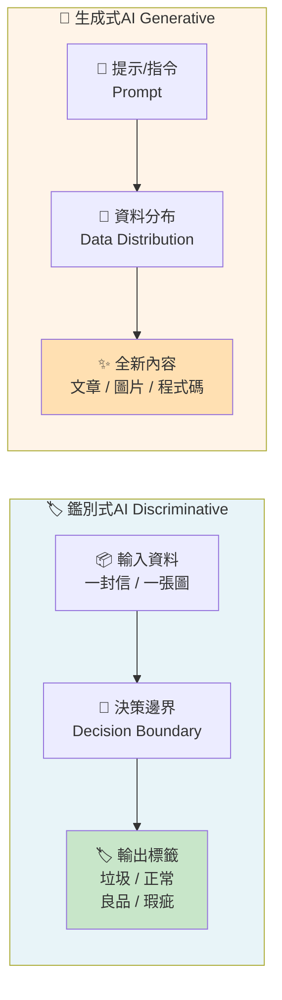

# V1 — 鑑別式AI vs 生成式AI 核心差異

```mermaid
flowchart LR
    subgraph D["🏷️ 鑑別式AI Discriminative"]
        D1["📦 輸入資料\n一封信 / 一張圖"] --> D2["🧠 決策邊界\nDecision Boundary"]
        D2 --> D3["🏷️ 輸出標籤\n垃圾 / 正常\n良品 / 瑕疵"]
    end

    subgraph G["🎨 生成式AI Generative"]
        G1["💬 提示/指令\nPrompt"] --> G2["🧠 資料分布\nData Distribution"]
        G2 --> G3["✨ 全新內容\n文章 / 圖片 / 程式碼"]
    end

    style D fill:#e8f4f8
    style G fill:#fff4e8
    style D3 fill:#c8e6c9
    style G3 fill:#ffe0b2
```

🔥 考點：鑑別式 =「這是什麼？」（分類/預測），生成式 =「幫我創造！」（生成新內容）。口訣：**鑑分生創**。
