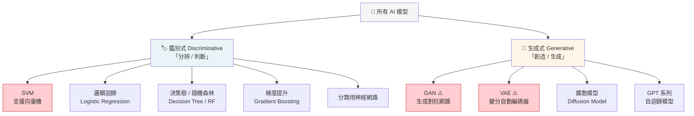

# V2 — 模型名稱歸類速查圖

```mermaid
flowchart TB
    ROOT["🤖 所有 AI 模型"]

    ROOT --> DISC["🏷️ 鑑別式 Discriminative\n「分辨 / 判斷」"]
    ROOT --> GEN["🎨 生成式 Generative\n「創造 / 生成」"]

    DISC --> SVM["SVM\n支援向量機"]
    DISC --> LR["邏輯迴歸\nLogistic Regression"]
    DISC --> DT["決策樹 / 隨機森林\nDecision Tree / RF"]
    DISC --> GB["梯度提升\nGradient Boosting"]
    DISC --> NN["分類用神經網路"]

    GEN --> GAN["GAN ⚠️\n生成對抗網路"]
    GEN --> VAE["VAE ⚠️\n變分自動編碼器"]
    GEN --> DIFF["擴散模型\nDiffusion Model"]
    GEN --> GPT["GPT 系列\n自迴歸模型"]

    style ROOT fill:#f5f5f5
    style DISC fill:#e8f4f8
    style GEN fill:#fff4e8
    style SVM fill:#ffcdd2,stroke:#d32f2f
    style GAN fill:#ffcdd2,stroke:#d32f2f
    style VAE fill:#ffcdd2,stroke:#d32f2f
```

🔥 考點：紅色標記 = 高頻陷阱。SVM 常被誤認為生成式，GAN/VAE 常被誤認為鑑別式。口訣：**S決邏隨 = 鑑別四天王**，**GVDP = 生四寶**。
