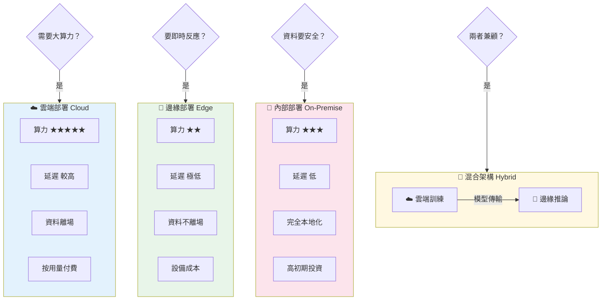

# V3 — 四種模型部署方式

```mermaid
flowchart TB
    subgraph CLOUD["☁️ 雲端部署 Cloud"]
        C1["算力 ★★★★★"]
        C2["延遲 較高"]
        C3["資料離場"]
        C4["按用量付費"]
    end

    subgraph EDGE["📱 邊緣部署 Edge"]
        E1["算力 ★★"]
        E2["延遲 極低"]
        E3["資料不離場"]
        E4["設備成本"]
    end

    subgraph ONPREM["🏢 內部部署 On-Premise"]
        O1["算力 ★★★"]
        O2["延遲 低"]
        O3["完全本地化"]
        O4["高初期投資"]
    end

    subgraph HYBRID["🔀 混合架構 Hybrid"]
        direction LR
        H1["☁️ 雲端訓練"] -->|"模型傳輸"| H2["📱 邊緣推論"]
    end

    Q1{"需要大算力？"} -->|是| CLOUD
    Q2{"要即時反應？"} -->|是| EDGE
    Q3{"資料要安全？"} -->|是| ONPREM
    Q4{"兩者兼顧？"} -->|是| HYBRID

    style CLOUD fill:#e3f2fd
    style EDGE fill:#e8f5e9
    style ONPREM fill:#fce4ec
    style HYBRID fill:#fff8e1
```

🔥 考點：口訣「**算快安**」— 算力不夠→雲端、要很快→邊緣、要安全→內部。混合架構最常考的模式是「雲端訓練 + 邊緣推論」。
