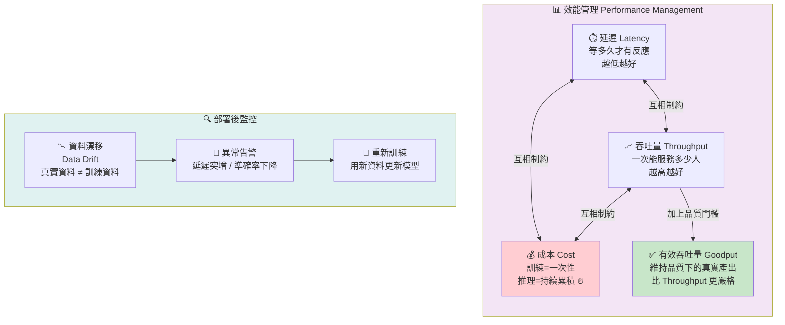

# V4 — 效能管理三角 + Goodput

```mermaid
flowchart TB
    subgraph PERF["📊 效能管理 Performance Management"]
        direction TB
        LAT["⏱️ 延遲 Latency\n等多久才有反應\n越低越好"]
        THR["📈 吞吐量 Throughput\n一次能服務多少人\n越高越好"]
        COST["💰 成本 Cost\n訓練=一次性\n推理=持續累積 🔥"]
        GOOD["✅ 有效吞吐量 Goodput\n維持品質下的真實產出\n比 Throughput 更嚴格"]

        LAT <-->|"互相制約"| THR
        THR <-->|"互相制約"| COST
        COST <-->|"互相制約"| LAT
        THR -->|"加上品質門檻"| GOOD
    end

    subgraph MONITOR["🔍 部署後監控"]
        DRIFT["📉 資料漂移\nData Drift\n真實資料 ≠ 訓練資料"]
        ALERT["🚨 異常告警\n延遲突增 / 準確率下降"]
        RETRAIN["🔄 重新訓練\n用新資料更新模型"]

        DRIFT --> ALERT --> RETRAIN
    end

    style PERF fill:#f3e5f5
    style MONITOR fill:#e0f2f1
    style COST fill:#ffcdd2
    style GOOD fill:#c8e6c9
```

🔥 考點：口訣「**延吞成**」— 延遲看等多久、吞吐看做多少、成本看花多少。推理成本是持續累積的（不要以為訓練完就不花錢）。Goodput = 有品質保證的吞吐量。部署後要監控資料漂移！
