# V1 — 三大應用領域總覽

> 鑑別式AI與生成式AI在電腦視覺、語音與音訊、文字與NLP三大領域的應用對照圖

```mermaid
flowchart TB
    ROOT["🌐 三大應用領域"]

    ROOT --> CV["🖼️ 電腦視覺\nComputer Vision"]
    ROOT --> SA["🎙️ 語音與音訊\nSpeech & Audio"]
    ROOT --> NLP["📝 文字與NLP\nText & NLP"]

    subgraph CV_SUB["電腦視覺"]
        direction LR
        CV_D["🏷️ 鑑別式應用"]
        CV_G["🎨 生成式應用"]
    end
    CV --> CV_SUB

    CV_D --> CVD1["影像分類"]
    CV_D --> CVD2["物件偵測"]
    CV_D --> CVD3["人臉辨識"]
    CV_D --> CVD4["瑕疵檢測"]

    CV_G --> CVG1["影像生成"]
    CV_G --> CVG2["風格轉換"]
    CV_G --> CVG3["超解析度"]
    CV_G --> CVG4["影像修復"]

    subgraph SA_SUB["語音與音訊"]
        direction LR
        SA_D["🏷️ 鑑別式應用"]
        SA_G["🎨 生成式應用"]
    end
    SA --> SA_SUB

    SA_D --> SAD1["語音辨識 ASR"]
    SA_D --> SAD2["聲紋辨識"]
    SA_D --> SAD3["語音情緒分析"]

    SA_G --> SAG1["語音合成 TTS"]
    SA_G --> SAG2["聲音複製"]
    SA_G --> SAG3["音樂生成"]

    subgraph NLP_SUB["文字與NLP"]
        direction LR
        NLP_D["🏷️ 鑑別式應用"]
        NLP_G["🎨 生成式應用"]
    end
    NLP --> NLP_SUB

    NLP_D --> NLPD1["情感分析"]
    NLP_D --> NLPD2["垃圾郵件過濾"]
    NLP_D --> NLPD3["命名實體辨識 NER"]

    NLP_G --> NLPG1["ChatGPT 文字生成"]
    NLP_G --> NLPG2["自動摘要"]
    NLP_G --> NLPG3["程式碼生成"]

    style CV fill:#e3f2fd
    style SA fill:#f3e5f5
    style NLP fill:#e8f5e9
    style CV_D fill:#bbdefb
    style CV_G fill:#ffe0b2
    style SA_D fill:#bbdefb
    style SA_G fill:#ffe0b2
    style NLP_D fill:#bbdefb
    style NLP_G fill:#ffe0b2
```

🔥 考點：三大領域各自都有鑑別式與生成式應用，考試常考「某個應用屬於哪一類」。口訣：**視覺辨生、語音聽說、文字分創**。

## Gemini Image Prompt

Create a clean, professional infographic in dark mode (dark navy background #0f172a, white text). Title: "三大應用領域總覽 — 鑑別式 vs 生成式 AI". Layout: three vertical columns, each representing a domain — Computer Vision (blue icon), Speech & Audio (purple icon), Text & NLP (green icon). Each column is split into two halves: left side labeled "鑑別式" with a blue accent (#60a5fa), right side labeled "生成式" with an orange accent (#fb923c). List 3-4 application examples under each half using clean bullet points with small icons. Style: modern SaaS dashboard aesthetic, rounded cards, subtle gradients, no 3D effects. Resolution 1920x1080. Traditional Chinese text only.
