# V2 — 五大整合模式

> 鑑別式AI與生成式AI的五種整合模式，每種模式用小型流程圖呈現資料與控制流

```mermaid
flowchart TB
    TITLE["🔗 五大整合模式"]

    TITLE --> P1
    TITLE --> P2
    TITLE --> P3
    TITLE --> P4
    TITLE --> P5

    subgraph P1["模式1：生—鑑—監 閉環"]
        direction LR
        P1A["🎨 生成\n產出內容"] --> P1B["🏷️ 鑑別\n品質檢查"]
        P1B --> P1C["👁️ 監控\n人工審核"]
        P1C -->|"回饋修正"| P1A
    end

    subgraph P2["模式2：GAN 協作"]
        direction LR
        P2A["🎨 生成器\nGenerator"] -->|"生成假樣本"| P2B["🏷️ 鑑別器\nDiscriminator"]
        P2B -->|"真/假回饋"| P2A
    end

    subgraph P3["模式3：合成數據增強"]
        direction LR
        P3A["🎨 生成模型\n產出合成數據"] --> P3B["📦 擴充訓練集\n真實+合成"]
        P3B --> P3C["🏷️ 鑑別模型\n用擴充數據訓練"]
    end

    subgraph P4["模式4：管線串接 Pipeline"]
        direction LR
        P4A["🎙️ ASR\n語音→文字"] --> P4B["🧠 NLP\n意圖分類"]
        P4B --> P4C["💬 TTS\n文字→語音"]
    end

    subgraph P5["模式5：RAG 檢索增強生成"]
        direction LR
        P5A["❓ 使用者提問"] --> P5B["🔍 檢索器\n鑑別式：找相關文件"]
        P5B --> P5C["🎨 生成器\n根據文件生成回答"]
    end

    style P1 fill:#e8f4f8
    style P2 fill:#fff4e8
    style P3 fill:#e8f5e9
    style P4 fill:#f3e5f5
    style P5 fill:#fce4ec
    style P1A fill:#ffe0b2
    style P1B fill:#bbdefb
    style P1C fill:#c8e6c9
    style P2A fill:#ffe0b2
    style P2B fill:#bbdefb
    style P3A fill:#ffe0b2
    style P3C fill:#bbdefb
    style P4A fill:#bbdefb
    style P4B fill:#bbdefb
    style P4C fill:#ffe0b2
    style P5B fill:#bbdefb
    style P5C fill:#ffe0b2
```

🔥 考點：
- **GAN** 本身就是整合（生成器+鑑別器對抗學習），考試愛問「GAN屬於鑑別式還是生成式？」答：**兩者都有**
- **RAG** 不是純生成，包含鑑別式的**檢索**環節——這是高頻陷阱
- **管線串接**常見於智慧客服場景（ASR → NLP → TTS）

## Gemini Image Prompt

Create a professional infographic in dark mode (dark navy #0f172a, white text). Title: "五大整合模式 — 鑑別式 × 生成式 AI". Layout: 5 horizontal rows, each containing a small flowchart for one integration pattern. Pattern names on the left in bold: (1) 生鑑監閉環, (2) GAN協作, (3) 合成數據增強, (4) 管線串接, (5) RAG檢索增強生成. Each flowchart uses rounded boxes with arrows. Discriminative steps use blue (#60a5fa), generative steps use orange (#fb923c), hybrid/monitor steps use green (#4ade80). Arrows show data flow direction with small labels. Style: clean technical diagram, no clutter, monospace labels for English terms. Resolution 1920x1080. Traditional Chinese text only.
