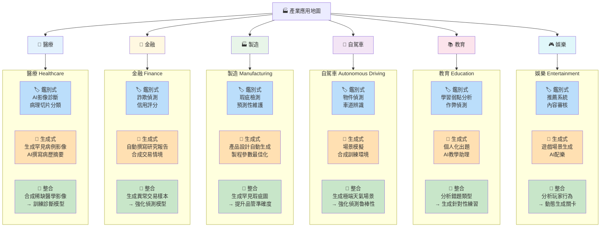

# V3 — 產業應用地圖

> 六大產業中鑑別式AI、生成式AI、整合應用的具體場景對照

🔥 考點：考試常見題型——「某銀行導入AI偵測異常交易，屬於哪一類AI？」答：**鑑別式**（分類任務）。「若該銀行同時用AI生成模擬交易來訓練偵測模型？」答：**整合應用**（合成數據增強模式）。

## Gemini Image Prompt

Create a professional infographic in dark mode (dark navy #0f172a, white text). Title: "產業應用地圖 — 鑑別式 × 生成式 × 整合". Layout: 6 industry cards in a 3x2 grid. Each card has an industry icon and name at the top (醫療, 金融, 製造, 自駕車, 教育, 娛樂), with three rows below: blue row for 鑑別式 applications, orange row for 生成式 applications, green row for 整合 applications. Each row contains 1-2 concrete examples in small text. Card backgrounds are slightly different dark shades to distinguish industries. Style: clean dashboard cards with subtle borders, modern SaaS aesthetic. Resolution 1920x1080. Traditional Chinese text only.
