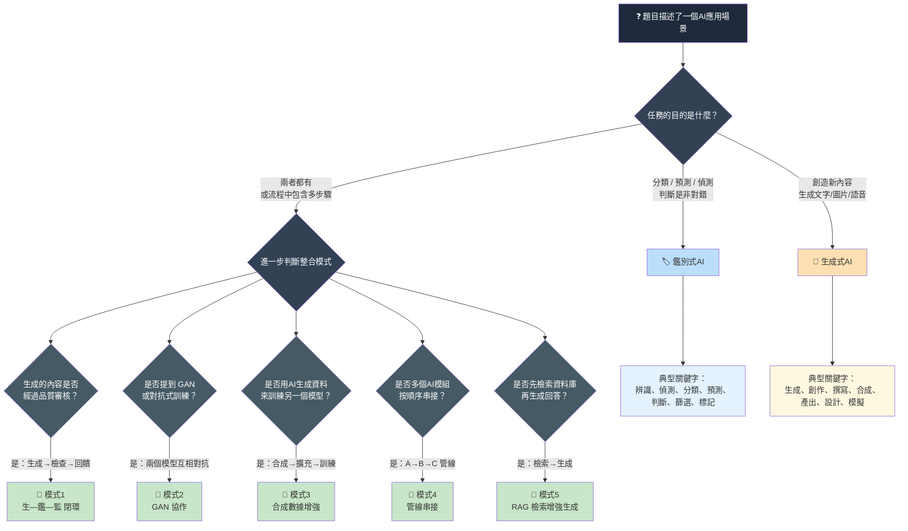

# V4 — 情境判斷決策樹

> 考試解題用：看到情境題，按此決策樹快速判斷屬於鑑別式、生成式、還是整合應用

🔥 考試速解口訣：
1. **先看目的**：分辨→鑑別，創造→生成，兩者都有→整合
2. **再看模式**：閉環（有回饋）、GAN（對抗）、合成數據（生成訓練用）、管線（串接）、RAG（檢索+生成）
3. **抓關鍵字**：「偵測」「分類」→鑑別；「生成」「創作」→生成；「先...再...」「結合」→整合

## Gemini Image Prompt

Create a professional decision tree infographic in dark mode (dark navy #0f172a, white text). Title: "情境判斷決策樹 — 鑑別式 vs 生成式 vs 整合". Layout: top-down flowchart starting from a question "題目描述了一個AI應用場景" at the top. First decision diamond asks about the task purpose, branching into three paths: left branch (blue #60a5fa) for discriminative, right branch (orange #fb923c) for generative, center branch (green #4ade80) for integration. The integration branch further splits into 5 sub-decisions for the 5 integration patterns. Each leaf node shows the pattern name and a one-line description. Include keyword hints at the bottom of discriminative and generative branches. Style: clean flowchart with rounded nodes, clear arrows with labels, no clutter. Resolution 1920x1080. Traditional Chinese text only.
