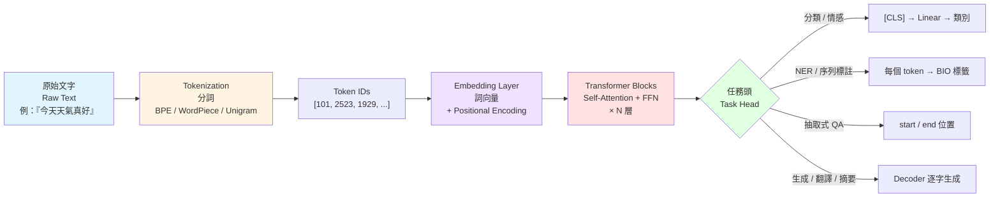

# NLP 處理流程總覽 (Tokenization → Embedding → Transformer → Task Head)

## 備註

- **Tokenizer** 是 NLP 流程第一步，決定詞彙表大小與 OOV 處理方式
- **Embedding** 把離散 token ID 映射到連續向量空間；BERT 之前多用靜態詞向量（word2vec/GloVe），之後改用 contextualized embedding
- **Transformer** 是核心架構，2017 年提出，取代 RNN/LSTM
- **Task Head** 依任務類型加在 Transformer 之上，決定最終輸出形式
