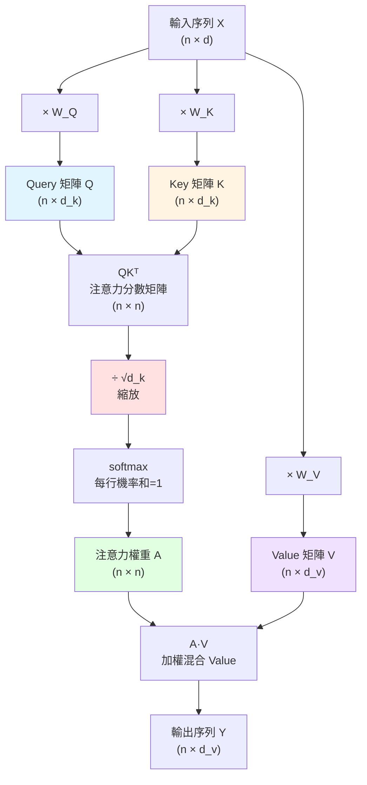

# Self-Attention Q/K/V 運算流程

## 🗣️ 白話口訣

**Q 是問題、K 是標籤、V 是內容。**
每個 token 拿自己的 Q 去跟所有 token 的 K 比對（算相似度），得到一組權重，再用這組權重把所有 V **混合**成新向量（像調酒師按比例混合基酒）—— 所以 self-attention 是 **soft attention**（所有 token 都參與），不是 hard attention（只挑一個）。

## 為什麼要除以 √d_k？

- d_k 是 key 向量維度
- 點積 Q·K 的數值隨 d_k 增大而變大 → softmax 會變得極度 peaked → 梯度消失
- 除以 √d_k 是為了把點積方差縮回 ~1，讓 softmax 保持合理分布（Vaswani et al. 2017 §3.2.1）

## Multi-Head = 多組 Q/K/V 平行運算

把 d 維切成 h 個 d/h 維子空間，各做一次 attention，再拼接回去 —— 讓不同 head 學到不同類型的關聯（語法、語意、長距、短距）。
