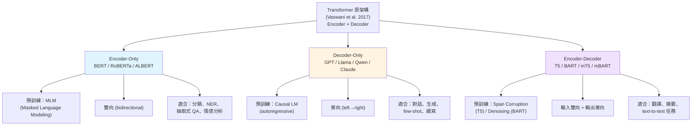

# Transformer 三大架構家族比較

## 🗣️ 白話記憶法

| 家族 | 角色類比 | 口訣 |
|---|---|---|
| **Encoder-only (BERT)** | 閱讀理解考生 | 「讀懂就好，不用寫」 |
| **Decoder-only (GPT)** | 接龍寫作家 | 「一字一字往下寫」 |
| **Encoder-decoder (T5)** | 翻譯 / 改寫員 | 「讀進來，再寫出去」 |

## Tokenizer × 家族對應（考試必考）

| 模型 | Tokenizer | 演算法 |
|---|---|---|
| BERT / ALBERT | WordPiece | 最大化語言模型概率 |
| GPT / Llama | (byte-level) BPE | 合併高頻字元對 |
| T5 / mT5 / XLNet | SentencePiece (函式庫) | Unigram LM 演算法 |

> ⚠️ **陷阱：** SentencePiece 是 Google 的 tokenizer **函式庫**，內部演算法是 BPE 或 Unigram LM —— 不要把函式庫當成演算法。
