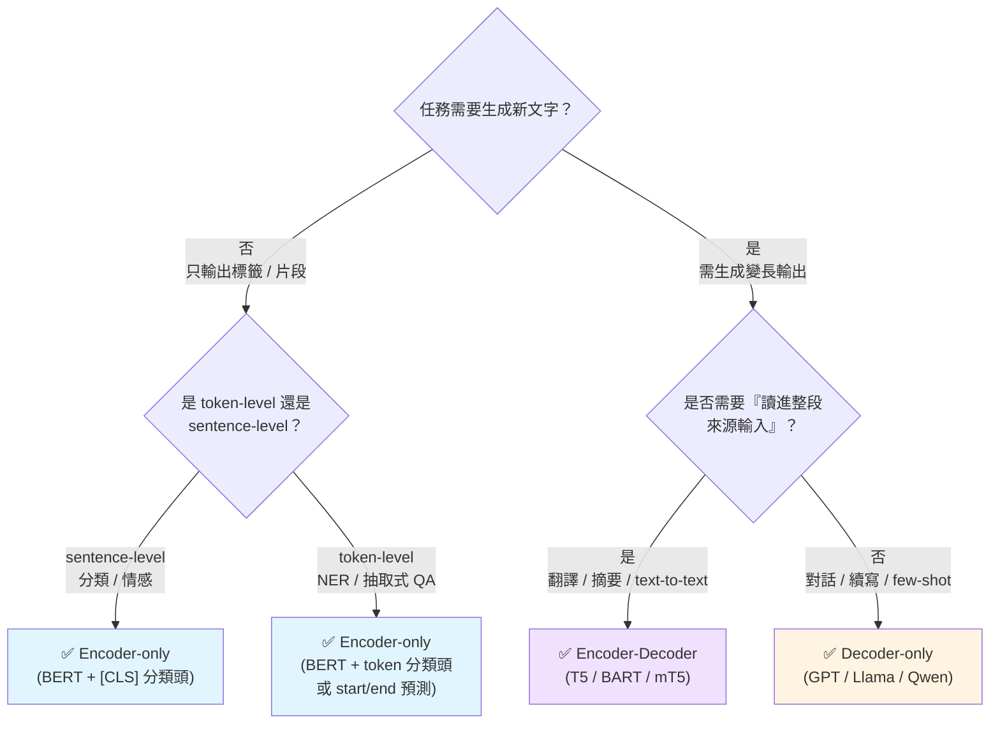

# 任務 → 架構選型 決策樹

## 情境 → 架構 速查表

| 情境 | 最佳架構 | 理由 |
|---|---|---|
| 商品評論正負面分類 | Encoder-only (BERT) | 雙向理解 + [CLS] 分類頭 |
| 新聞主題 4 分類 | Encoder-only (BERT) | 同上 |
| 人名 / 機構 / 地點 NER | Encoder-only (BERT) | token-level BIO 標籤 |
| 合約條款抽取式 QA | Encoder-only (BERT) | 預測 start/end 位置 |
| 法務文件生成式摘要 | Encoder-Decoder (BART/T5) | 長輸入 + 改寫輸出 |
| 中→英→日 多語翻譯 | Encoder-Decoder (mT5/mBART) | 多語 seq2seq |
| 客服多輪對話機器人 | Decoder-only (GPT/Llama) | causal LM + in-context learning |
| 程式碼自動補全 | Decoder-only (Codex/Llama) | 逐字生成 |
| RAG 檢索增強問答 | Decoder-only + 檢索器 | 生成 + 引用來源 |

## ⚠️ 常見陷阱

- **用 GPT 做分類** —— 可以但浪費：需要 prompt engineering + 字串解析，不如 BERT 直接接分類頭
- **用 BERT 做對話** —— BERT 不是生成模型，無法產出長回覆
- **用 word2vec 做一切** —— 靜態詞向量無法處理一詞多義（「蘋果」= 水果還是公司？）
