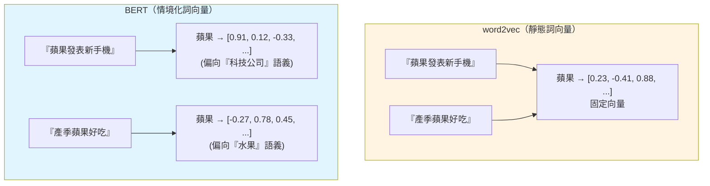
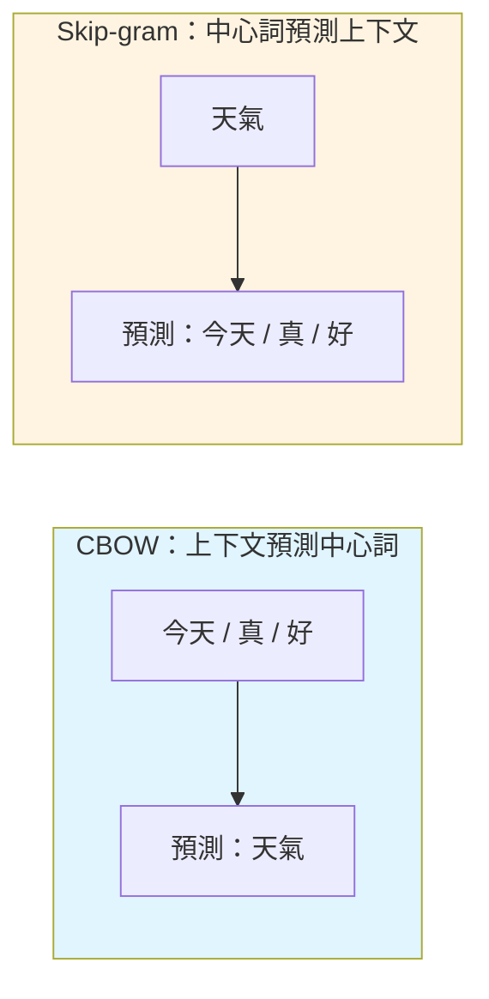

# 靜態 vs 情境化詞向量：word2vec vs BERT

## 關鍵差異

| 維度 | word2vec (2013) | BERT (2018) |
|---|---|---|
| **向量類型** | 靜態 (static) | 情境化 (contextualized) |
| **同一詞在不同句中** | 向量相同 | 向量不同 |
| **多義詞處理 (polysemy)** | ❌ 無法區分 | ✅ 能區分 |
| **訓練方式** | 淺層 NN（CBOW / Skip-gram） | 深層 Transformer encoder + MLM |
| **訓練資料規模** | 百億 token | 千億 token（BERT-Large） |
| **下游使用** | 取向量 → 接分類器 | Fine-tune 整個模型 |
| **年代** | 2013 | 2018 |

## 🗣️ 白話說明

- **word2vec 像字典：** 每個字只查得到一個固定解釋，不管上下文
- **BERT 像有讀句子的人：** 看過整句才決定這個字在這裡是什麼意思

## word2vec 內部：CBOW vs Skip-gram

- **CBOW** 訓練快、對高頻詞好
- **Skip-gram** 對低頻詞表現較佳

兩者都屬**預測型 (predictive)**；GloVe 則屬**共現統計型 (count-based)**，但三者最終都輸出靜態詞向量。
