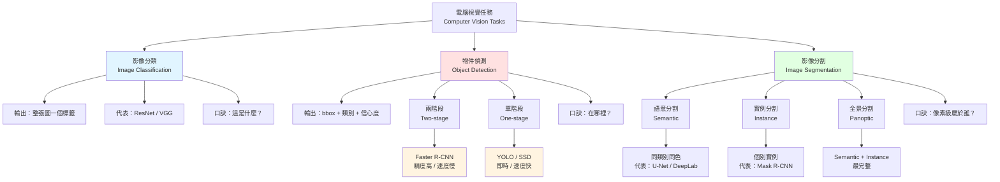

# 電腦視覺三大任務族群

## 記憶口訣

| 任務 | 問題 | 輸出單位 |
|---|---|---|
| Classification | 這是什麼？ | 整張圖 1 個 label |
| Detection | 在哪裡？ | N 個 bbox |
| Segmentation | 像素級屬於誰？ | H×W mask |

## 中級必背對照

- **YOLO vs Faster R-CNN** → 單階段 vs 兩階段；速度 vs 精度的經典取捨
- **Semantic vs Instance** → 會不會區分「同類別的不同個體」
- **Mask R-CNN** → 是實例分割，不是純偵測（常見陷阱）
