# CNN 前向傳播（以 32×32×3 輸入分 10 類為例）

```mermaid
flowchart LR
    A["輸入影像<br/>32×32×3<br/>(RGB)"] --> B["卷積層 1<br/>Conv3×3, 16 filters<br/>stride=1, pad=1"]
    B --> C["特徵圖<br/>32×32×16"]
    C --> D["ReLU 激勵<br/>max(0, x)"]
    D --> E["池化層 1<br/>MaxPool 2×2<br/>stride=2"]
    E --> F["特徵圖<br/>16×16×16"]
    F --> G["卷積層 2<br/>Conv3×3, 32 filters"]
    G --> H["特徵圖<br/>16×16×32"]
    H --> I["ReLU + MaxPool"]
    I --> J["特徵圖<br/>8×8×32"]
    J --> K["Flatten<br/>8×8×32 = 2048"]
    K --> L["全連接<br/>FC 2048→128"]
    L --> M["全連接<br/>FC 128→10"]
    M --> N["Softmax<br/>10 類機率"]

    style B fill:#ffe1e1
    style G fill:#ffe1e1
    style E fill:#e1f5ff
    style I fill:#e1f5ff
    style L fill:#fff4e1
    style M fill:#fff4e1
    style N fill:#e1ffe1
```



## 每一層在做什麼

| 層類型 | 負責 | 口訣 |
|---|---|---|
| **卷積（Conv）** | 擷取特徵（邊緣→紋理→形狀→物件） | 卷積**生**特徵 |
| **ReLU** | 引入非線性 | 負值一刀切 |
| **池化（Pool）** | 降取樣、保留顯著特徵、帶來平移不變性 | 池化**縮**空間 |
| **Flatten** | 把 3D 特徵圖攤平成 1D 向量 | 進入分類頭 |
| **全連接（FC）** | 做分類決策 | 最後判斷 |
| **Softmax** | 轉成機率分佈 | 加總為 1 |

## 輸出尺寸公式（務必記熟）

```
output_size = ⌊(W − F + 2P) / S⌋ + 1
```
- W = 輸入寬度
- F = 濾波器大小（kernel size）
- P = padding
- S = stride

**驗算上圖 Conv1：** `⌊(32 − 3 + 2×1)/1⌋ + 1 = ⌊31⌋ + 1 = 32` ✓ 保持尺寸
