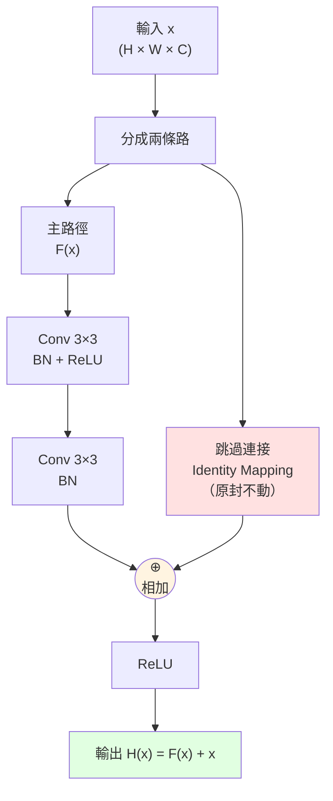

# ResNet 殘差塊（Residual Block）

## 結構圖



## 為什麼叫「殘差」

傳統網路要學的目標是 `H(x)`。ResNet 改讓網路學 **殘差** `F(x) = H(x) − x`：
- 如果這一層該做「什麼也不變」，網路只需把 `F(x)` 學成 0（很簡單）
- 加上 skip connection 後：`H(x) = F(x) + x`
- 梯度可以沿 skip 直接回傳，**解決梯度消失**

## ASCII 版（簡化）

```
         ┌─────────── x ───────────┐  ← skip connection（直通）
         │                         │
  x ─────┤                         ▼
         │                       ┌─┴─┐
         └──► Conv → BN → ReLU ──► ⊕ ├──► ReLU ──► 輸出 H(x)
              → Conv → BN ───────┘   │
                                   F(x)
```

## ResNet 家族深度對照

| 模型 | 層數 | ImageNet Top-1 | 備註 |
|---|---|---|---|
| ResNet-18 | 18 | ~70% | 輕量、邊緣設備友善 |
| ResNet-50 | 50 | ~76% | **產業標配 backbone** |
| ResNet-101 | 101 | ~77% | 精度略升，算力翻倍 |
| ResNet-152 | 152 | ~78% | 原論文集成版本曾達 ~96% top-5 |

> 💡 **考試陷阱提醒**：ResNet **不是**純粹「越深越好」—— skip connection 才是核心創新，沒有它，深網路會因梯度消失而退化。
