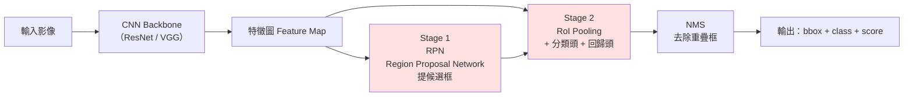
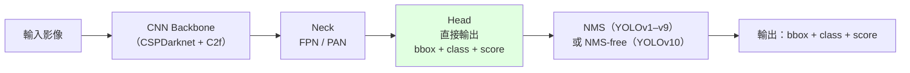

# 兩種偵測範式的流程對比

## Faster R-CNN（兩階段，Two-Stage）

**關鍵字：** 「先找在哪，再判是啥」— 精度高、速度慢（約 5–7 FPS）

---

## YOLO（單階段，One-Stage）

**關鍵字：** 「一眼看穿」— 速度快（30–160+ FPS）、精度略低、即時應用首選

---

## 速度 × 精度 × 應用場景對照

| 維度 | Faster R-CNN | YOLO |
|---|---|---|
| 階段 | 兩階段 | 單階段 |
| 速度（FPS, V100） | 5–7 | 30–160+ |
| 精度（mAP@0.5:0.95） | 稍高 | 稍低（v8 後差距縮小） |
| 適用 | 醫療影像、安防錄影回放 | 即時影像：Uber Eats 餐點追蹤、AOI 瑕疵檢測、自駕感知 |
| 訓練複雜度 | 較複雜（兩階段） | 較簡單（端到端） |

## 🗣️ 白話記憶

- **Faster R-CNN：** 像老師改考卷，先圈出可疑答案（RPN），再逐題判分（分類頭）——細但慢
- **YOLO：** 像閃卡記憶，整張圖掃一眼就同時說出「物件＋位置＋信心度」——快但粗

## 考試陷阱

❌ 「YOLO 因為是單階段，所以不用 NMS」  
✅ YOLOv1–v9 **都用 NMS**，只有 **YOLOv10** 改為 NMS-free。單階段 ≠ 不用 NMS。
