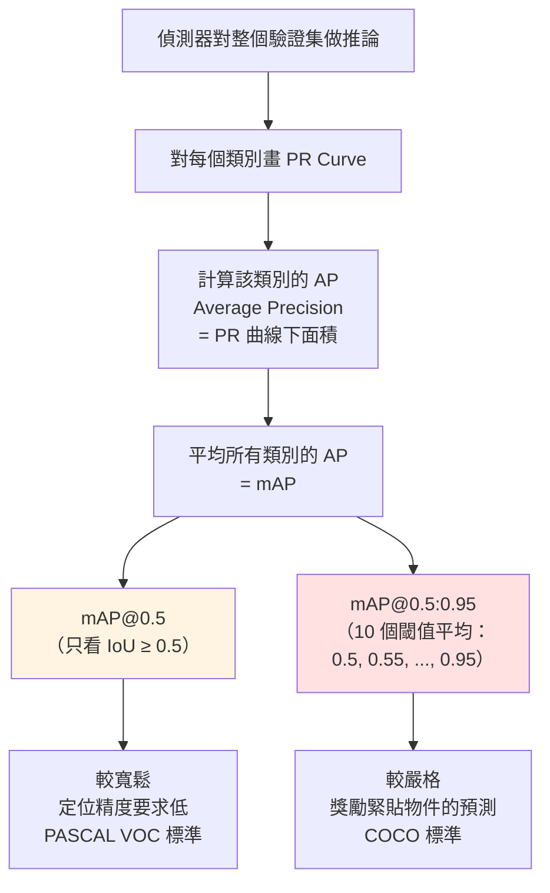

# IoU（Intersection over Union）

## 定義

```
                      Area of Overlap
         IoU  =  ───────────────────────
                      Area of Union
```

## ASCII 視覺化

```
        ┌─────────────┐               ┌─────────────┐
        │   Predicted │               │             │
        │   Box  A    │               │             │
        │    ┌────────┼──────┐        │    ┌────────┤
        │    │        │      │        │    │ Overlap│
        │    │ Overlap│      │   →    │    │   ∩    │
        │    │   ∩    │      │        │    └────────┤
        └────┤────────┘      │        └─────────────┘
             │   Ground      │             Union
             │   Truth  B    │               ∪
             └───────────────┘

                    IoU = |A ∩ B| / |A ∪ B|
```

## IoU 閾值決定判對判錯

| IoU 值 | 判定 | 品質 |
|---|---|---|
| 1.0 | 完美重合 | 💯 |
| ≥ 0.5 | 通常算 TP（True Positive） | ✅ 及格 |
| 0.5 ~ 0.75 | 合理但不夠精準 | 🆗 |
| < 0.5 | 通常算 FP（False Positive） | ❌ 不及格 |
| 0 | 完全不重疊 | 💀 |

---

# mAP（mean Average Precision）

## 兩種常見版本



## 重點對照

| 指標 | 閾值數 | 嚴格度 | 常見基準 |
|---|---|---|---|
| **mAP@0.5** | 1 個（IoU ≥ 0.5） | 寬鬆 | PASCAL VOC |
| **mAP@0.5:0.95** | 10 個（0.5→0.95，步距 0.05） | 嚴格 | **COCO**（中級主流） |

## 🗣️ 白話說明

- **mAP@0.5：** 只要框「大致對」就算分——像交作業只看有沒有寫
- **mAP@0.5:0.95：** 要求框「緊貼物件」，不同鬆緊都要打分再平均——像老師連排版都要看

## 考試陷阱

❌ 「mAP 值越高代表速度越快」  
✅ mAP 是**精度**指標，與速度（FPS）無關；論文通常會同時列 mAP 和 FPS 兩個數字。

❌ 「IoU 閾值設定越高，模型就越準」  
✅ IoU 閾值是**評估時**的門檻，不會改變模型本身；高閾值只會讓通過的 bbox 變少。
