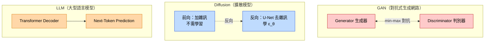

# GAN vs Diffusion vs LLM（三大生成模型架構比較）

中級高頻考點：給定情境，選擇最適合的生成模型。

## 比較矩陣

| 維度 | GAN | Diffusion | LLM |
|------|-----|-----------|-----|
| **核心機制** | Generator vs Discriminator 對抗 | 前向加雜訊 + 反向去雜訊 | Transformer + 自回歸預測下一詞 |
| **訓練穩定性** | ⚠️ 不穩定 易模式崩塌 | ✅ 穩定 MSE 損失 | ✅ 穩定 Cross-Entropy |
| **推論速度** | ✅ 一步生成（快） | ⚠️ T 步迭代（慢） | ⚠️ 逐 token 生成 |
| **生成品質（影像）** | 高但不穩定 | 極高（SOTA） | 不直接用 |
| **代表模型** | StyleGAN、CycleGAN | Stable Diffusion、DALL-E 2 | GPT-4、Claude、Gemini |
| **主要用途** | 影像合成、風格轉換 | 文生圖、影像編輯 | 對話、寫作、程式、推理 |
| **損失函數** | 對抗式（D 內部 BCE） | MSE（預測雜訊誤差） | Cross-Entropy |
| **架構基石** | CNN（早期）/Transformer（近期） | U-Net | Transformer Decoder |

## 情境選擇口訣

- 看到「**文字生圖、高品質、SOTA**」→ **Diffusion**
- 看到「**風格轉換、影像對影像、CycleGAN**」→ **GAN**
- 看到「**對話、摘要、翻譯、推理、程式**」→ **LLM**
- 看到「**訓練不穩、模式崩塌**」→ **GAN**
- 看到「**推論慢、T 步**」→ **Diffusion**
- 看到「**幻覺（hallucination）**」→ **LLM**
