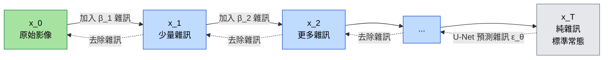

# Diffusion Process（擴散模型：前向與反向流程）

擴散模型分兩個方向：前向（固定加雜訊，不需學習）、反向（學習去雜訊，模型的任務）。

## 考點重點

- **前向過程（Forward / q）**：按固定 variance schedule `β_t` 加入高斯雜訊，不需學習。T 步之後接近純雜訊 `N(0, I)`。
- **反向過程（Reverse / p_θ）**：模型（通常是 U-Net）學習每一步去除多少雜訊 `ε_θ(x_t, t)`。**這才是需要訓練的部分。**
- **損失函數**：簡化版本是 MSE——預測的雜訊 vs 實際加入的雜訊。
- **生成新樣本**：從純雜訊 `x_T ~ N(0, I)` 開始，反覆套用反向步驟，T 次後得到新圖。
- **vs GAN**：Diffusion 訓練穩定（沒有 min-max），但推論慢（要跑 T 次）。Stable Diffusion 是代表作。
