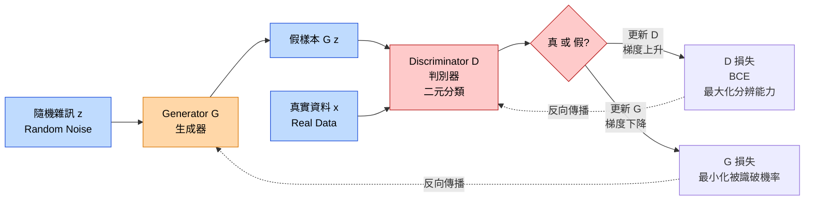

# GAN Training Loop（對抗式訓練循環）

Generator（生成器）與 Discriminator（判別器）的 min-max 對抗：G 想騙過 D，D 想分辨真假。

## 考點重點

- **Min-Max 對抗式損失**：`min_G max_D V(D,G) = E[log D(x)] + E[log(1 − D(G(z)))]`。D 想最大化，G 想最小化。
- **D 內部是 BCE（Binary Cross-Entropy）**：因為 D 做二元分類（真/假）。這是常見陷阱——整體 GAN 叫「對抗式損失」，但 D 的分類損失本質上是 BCE。
- **Nash 均衡**：理想終點是 G 生成的分佈完全等於真實分佈，D 輸出恆為 0.5（分不出來）。
- **常見問題**：模式崩塌（Mode Collapse）——G 只生成少數幾種輸出；訓練不穩定。
