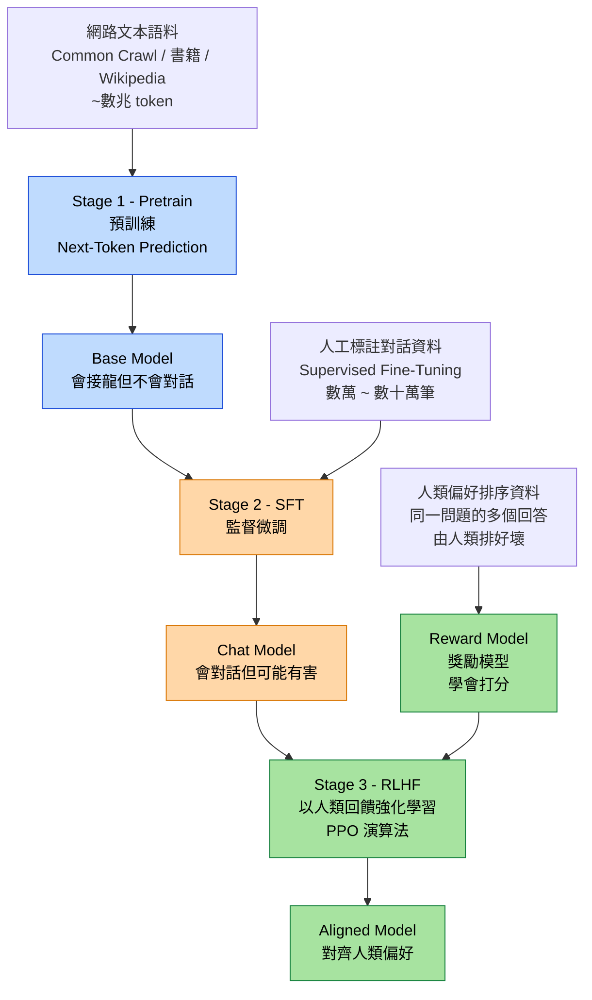

# LLM Training Pipeline（大型語言模型訓練三階段）

現代 LLM（ChatGPT、Claude、Gemini）的訓練通常分三階段：Pretrain → SFT → RLHF。

## 考點重點

- **Pretrain（預訓練）**：目標是 Next-Token Prediction（下一詞預測）。學會語言的統計規律，但還不會「對話」或「遵循指令」。
- **SFT（監督微調 / Supervised Fine-Tuning）**：用人工標註的高品質對話資料微調。讓模型學會「被問問題就要回答」的格式。
- **RLHF（以人類回饋強化學習 / Reinforcement Learning from Human Feedback）**：
  - 先訓練 Reward Model（獎勵模型），讓它學會預測人類偏好。
  - 再用 PPO（Proximal Policy Optimization）演算法，以 RM 的分數為獎勵，強化 LLM 產出人類偏好的回答。
- **常見陷阱**：
  - RLHF 不是直接拿人類打分來訓練 LLM——中間有 Reward Model。
  - Pretrain 階段不需要人工標註（Self-Supervised），成本大的是算力與電力。
- **替代方案**：DPO（Direct Preference Optimization）用單一損失函數取代 RM + PPO，是 RLHF 的簡化版。
