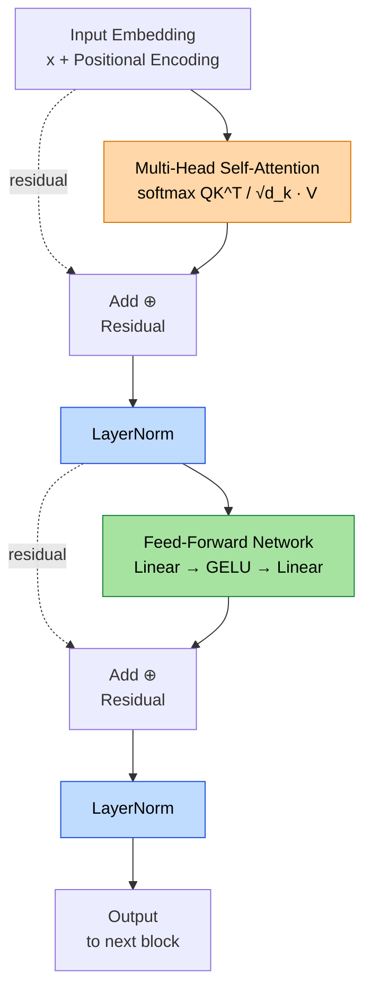

# Transformer Block Anatomy（Transformer 區塊解剖圖）

一個 Transformer 區塊（block）的資料流：輸入 → Self-Attention → Add & Norm → FFN → Add & Norm → 輸出。

## 考點重點

- **Self-Attention 是 Transformer 的核心**：公式 `softmax(QK^T / √d_k) · V`，讓每個 token 能「看見」序列中所有其他 token，不受 RNN 單向/固定距離限制。
- **Residual + LayerNorm 缺一不可**：Residual（殘差）防止深層網路梯度消失；LayerNorm 穩定訓練。缺任一個，深層堆疊會崩潰。
- **兩個子層**：Self-Attention（學 token 關係）+ FFN（Feed-Forward，學非線性變換），兩者交替。
- **BERT 使用 Encoder-only（雙向）**；**GPT 使用 Decoder-only（單向 / Masked Self-Attention）**。這是中級高頻考點。
