# Diagram 1 — 融合策略比較 (Fusion Strategies)

說明：對比早期融合、晚期融合、混合融合、交叉注意力融合四種主流多模態融合策略的資料流動差異。

```mermaid
flowchart TB
    subgraph Early["早期融合 (Early Fusion)"]
        E_T[文字 Raw] --> E_C[直接拼接<br/>Concatenate]
        E_I[影像 Raw] --> E_C
        E_C --> E_M[單一模型<br/>Joint Model]
        E_M --> E_O[輸出]
    end

    subgraph Late["晚期融合 (Late Fusion)"]
        L_T[文字 Raw] --> L_TM[文字模型]
        L_I[影像 Raw] --> L_IM[影像模型]
        L_TM --> L_F[決策層合併<br/>平均/投票]
        L_IM --> L_F
        L_F --> L_O[輸出]
    end

    subgraph Hybrid["混合融合 (Hybrid Fusion)"]
        H_T[文字 Raw] --> H_TE[文字 Encoder]
        H_I[影像 Raw] --> H_IE[影像 Encoder]
        H_TE --> H_MID[中層特徵融合]
        H_IE --> H_MID
        H_MID --> H_H[融合後繼續處理]
        H_H --> H_O[輸出]
    end

    subgraph Cross["交叉注意力融合 (Cross-Attention)"]
        C_T[文字 Raw] --> C_TE[Text Encoder<br/>產生 Q]
        C_I[影像 Raw] --> C_IE[Image Encoder<br/>產生 K,V]
        C_TE -->|Q| C_CA[Cross-Attention<br/>Q·Kᵀ → Softmax · V]
        C_IE -->|K,V| C_CA
        C_CA --> C_O[融合表徵<br/>輸出文字形狀]
    end

    style Early fill:#e3f2fd,stroke:#1976d2
    style Late fill:#fff3e0,stroke:#f57c00
    style Hybrid fill:#f3e5f5,stroke:#7b1fa2
    style Cross fill:#e8f5e9,stroke:#388e3c
```

**記憶重點：**
- **早期融合**：簡單但維度爆炸、對齊困難
- **晚期融合**：獨立訓練、決策層合併、失去跨模態互動
- **混合融合**：中層融合、保留各自表徵後互動
- **交叉注意力**：Q 決定輸出形狀（誰查詢、誰就是主角）

**常見考點：**
- CLIP 雖屬雙塔對比學習，若要歸類為融合策略則較接近 **晚期融合**（兩塔獨立 → 相似度比對）
- Flamingo / Stable Diffusion 的 U-Net / LLaVA 使用 **交叉注意力**
- Transformer 內部的 self-attention 不是 cross-attention（Q、K、V 來自同一序列）
