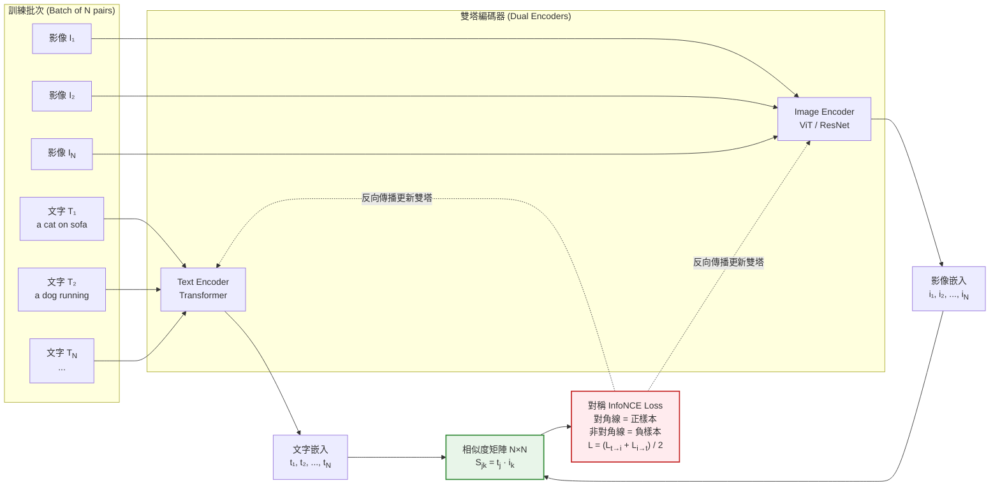

# Diagram 2 — CLIP 對比學習訓練迴圈 (Contrastive Training Loop)

說明：CLIP 使用對稱 InfoNCE loss，將 N 對 (影像, 文字) 嵌入到同一語義空間——對角線為正樣本（對應配對），非對角線為負樣本（批次內其他配對）。



**相似度矩陣視覺化：**

```
              i₁    i₂    i₃    i₄
        t₁ [ ✓    ·     ·     ·  ]   ← 對角線 = 正樣本 (對應配對)
        t₂ [ ·    ✓     ·     ·  ]   ← 非對角線 = 負樣本 (批次內其他組合)
        t₃ [ ·    ·     ✓     ·  ]
        t₄ [ ·    ·     ·     ✓  ]
```

**核心考點：**
- CLIP = **Contrastive Language-Image Pre-training**
- 損失函數：**對稱 InfoNCE**（文字→影像 + 影像→文字）
- 訓練資料：**4 億 (影像, 文字描述) 對**（網路爬取，弱監督）
- 推論能力：**zero-shot 分類**（不需再訓練即可分類新類別）
- 下游應用：Stable Diffusion 文字編碼器、圖文檢索、DALL-E 2 先驗階段
