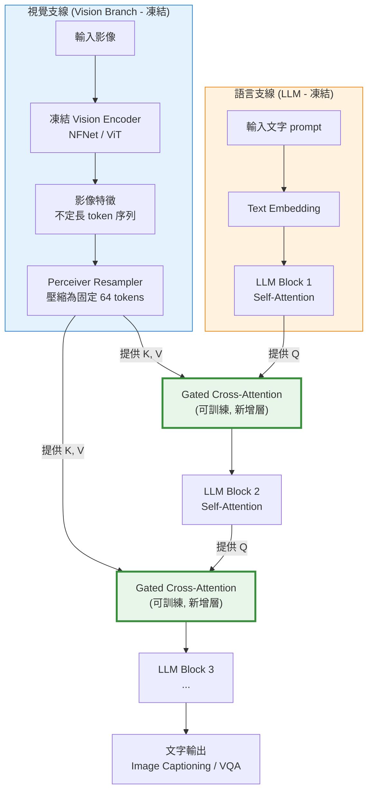

# Diagram 3 — 視覺-語言模型交叉注意力架構 (Cross-Attention Architecture)

說明：以 Flamingo 為代表的視覺-語言 (VLM) 架構，使用凍結的視覺編碼器與 LLM，透過 **Perceiver Resampler** 與 **Gated Cross-Attention** 將影像特徵注入語言模型。Q 來自文字端、K/V 來自影像端。



**Cross-Attention 公式：**

```
Q = W_q · X_text       ← Query 來自文字（主角）
K = W_k · X_image      ← Key 來自影像
V = W_v · X_image      ← Value 來自影像

Attention(Q,K,V) = softmax(Q·Kᵀ / √d_k) · V
                   └────────────────┘
                   權重：文字 token 對每個影像 token 的關注程度
```

**輸出形狀 = Q 的形狀 = 文字序列長度**（影像只是被「查詢」的記憶庫）

**核心考點：**
- **Flamingo (2022 DeepMind)** = 凍結視覺塔 + 凍結 LLM + 可訓練 gated cross-attention 層
- **Perceiver Resampler**：將不定長影像特徵壓縮為固定長度（64 tokens），解決「影像 patch 數量不一」問題
- **Gated** 機制：訓練初期門控為零 → 確保加入 cross-attention 不破壞已有 LLM 能力
- **對比 LLaVA**：LLaVA 用簡單 **linear / MLP projector**（專案器）取代 cross-attention，將影像特徵映射到 LLM 詞嵌入空間後直接拼接
- **對比 Stable Diffusion**：SD 的 cross-attention 在 U-Net 內部，Q 來自影像 latent、K/V 來自 CLIP 文字編碼 → 反向：文字指導影像生成
