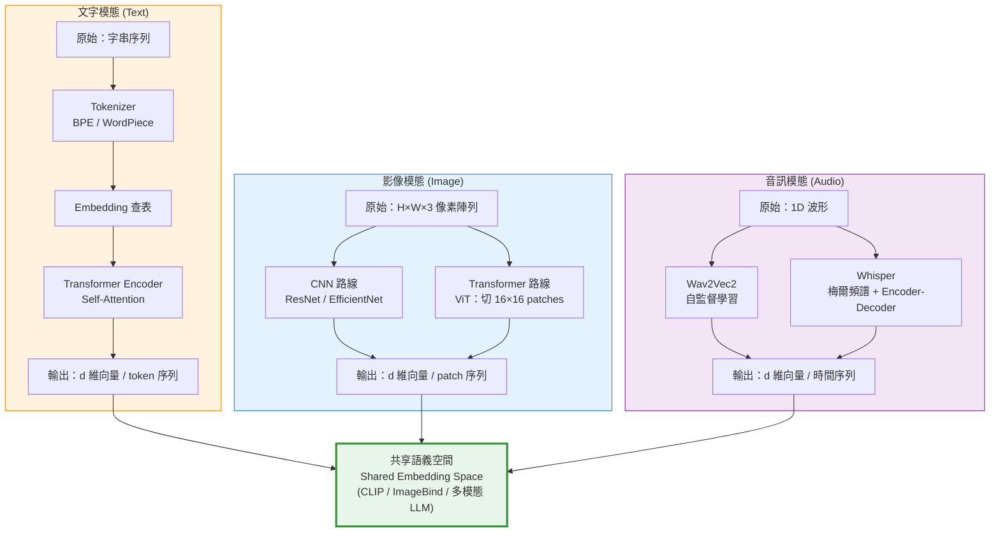

# Diagram 4 — 模態編碼器對照 (Modality Encoder Comparison)

說明：不同模態的原始資料特性差異極大，對應的編碼器設計原則也不同。本圖對比文字、影像、音訊三大模態的主流編碼器。

**比較表：**

| 特性 | 文字 | 影像 | 音訊 |
|---|---|---|---|
| 原始資料 | 字串序列 | 像素陣列 (H×W×3) | 1D 波形 |
| 離散 / 連續 | 離散 | 連續 | 連續 |
| 主流編碼器 | Transformer | CNN (ResNet) / **ViT** | Wav2Vec2 / **Whisper** |
| 對比學習代表 | BERT, RoBERTa | SimCLR, DINO | Wav2Vec2 |
| 多模態代表 | CLIP 文字塔 | CLIP 影像塔, ViT | AudioCLIP, ImageBind |
| 前處理 | Tokenize (BPE/WordPiece) | Resize + Normalize | 梅爾頻譜 (Whisper) |

**核心考點：**
- **各模態需要專用編碼器**：無法用同一個網路處理像素和文字（資料分布截然不同）
- **ViT vs CNN**：ViT 把影像切成 patch 後視為 token 序列 → 用 Transformer 處理（與文字統一範式）
- **Whisper (OpenAI 2022)**：多語 ASR 模型，**編碼器-解碼器 Transformer**，支援 99+ 語言，訓練資料 68 萬小時
- **Wav2Vec2**：Facebook 自監督音訊表徵模型，適合低資源語音任務
- **共享嵌入空間**：CLIP（圖+文）、ImageBind（六模態對齊到影像）是將不同模態投射到同一向量空間的代表
