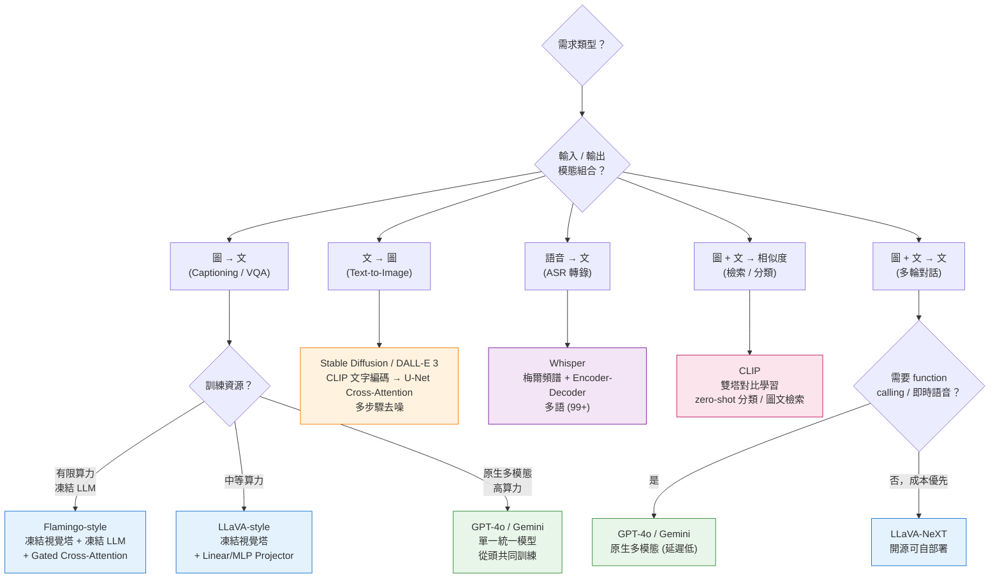

# Diagram 5 — 應用情境 → 架構選型決策樹

說明：面對多模態應用需求，如何根據輸入、輸出、訓練資源選擇合適架構。

**決策速查表：**

| 需求 | 首選架構 | 關鍵評估指標 |
|---|---|---|
| 商品搜尋、圖文檢索、zero-shot 分類 | **CLIP** 雙塔 | Recall@K, NDCG |
| 大量圖生文（描述、VQA、報告） | **LLaVA / Flamingo** | BLEU, CIDEr, VQA Accuracy |
| 文字生成高品質圖像 | **Stable Diffusion / DALL-E 3** | FID, CLIPScore |
| 多語語音轉錄、影片字幕 | **Whisper** | WER (詞錯率) |
| 即時語音對話、影像問答 | **GPT-4o (原生)** / **Gemini** | 延遲、一致性 |
| 敏感資料需地端部署 | **LLaVA-NeXT / Llama-3-Vision / TAIDE** | (內部準確率) |

**三層決策順序：**
1. **模態方向**：輸入是什麼、輸出要什麼 → 先框定架構族
2. **訓練資源**：算力、資料量、是否可微調 → 決定是 bolt-on (projector/cross-attention) 還是原生多模態
3. **部署限制**：即時性、隱私、成本 → 決定開源 vs 商業 API、是否需要蒸餾/量化

**核心考點：**
- **CLIP ≠ 生成模型**：僅學相似度，不會生成圖像（Stable Diffusion 借用它的文字編碼器）
- **Whisper = ASR，不是翻譯模型**：雖可多語轉錄，主要任務是「語音→同語言文字」
- **GPT-4V vs GPT-4o**：4V 是 vision bolt-on 到 GPT-4；4o 是原生多模態單一模型（語音延遲 320ms → 理論下限 200ms）
- **DALL-E 2 vs DALL-E 3**：DALL-E 2 = unCLIP 架構；DALL-E 3 整合 ChatGPT，prompt 自動改寫增強
