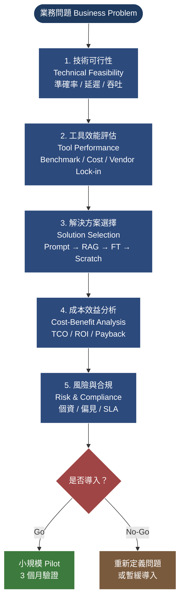

# Diagram 1 — AI 導入評估流程漏斗 (Evaluation Funnel)

**用途：** 對應 §3.1（評估總覽）。展示從業務問題到最終決策的 5 階段漏斗，幫助學員建立「先收斂後決策」的順序感。

**Render note:** Render to PNG via Gemini downstream. Source: Mermaid flowchart.

**閱讀重點：**
- 5 階段是**收斂順序**，不可顛倒（先過濾不可行的，再評分排序剩下的）。
- 第 5 階段的「風險與合規」是**否決票**：任何一個紅燈都可能讓前 4 階段的綠燈失效（例：個資外洩風險 → 不能用 managed API）。
- Pilot 是 Go 的最小驗證單位，不是「全公司一次到位」。
