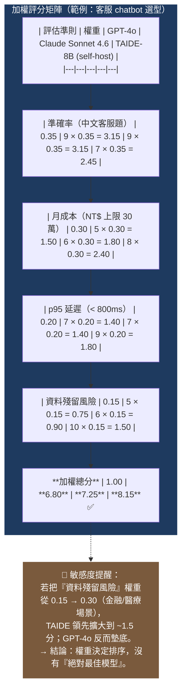

# Diagram 2 — 加權評分矩陣模板 (Weighted Scoring Matrix Template)

**用途：** 對應 §3.4（適用解決方案選擇）+ §3.7（雙約束篩選）。展示一個可直接套用的 4-criteria × 3-vendor 評分矩陣，含敏感度註解。

**Render note:** Render to PNG via Gemini downstream. Source: Mermaid table block (or render as static table image).

**閱讀重點：**
- **加權總分 = Σ(分數 × 權重)**，總權重必須 = 1.00。
- 分數採 1-10 標度（10 = 最佳），不要用百分比（會被「99.9% vs 99.99%」這種小差距誤導）。
- **敏感度分析（Sensitivity Analysis）** 是中級必考點：改一個權重 ±10%，看看排序是否翻盤；若翻盤 = 結論不穩固。
- 此矩陣**不取代**雙約束硬條件過濾（§3.7）— 應先過濾掉不滿足硬約束的選項，再對剩下的評分。
