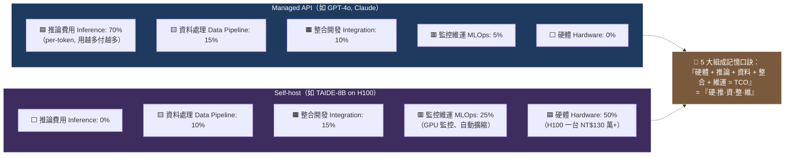

# Diagram 3 — TCO 成本拆解堆疊圖 (TCO Breakdown Stack)

**用途：** 對應 §3.5（成本效益分析）。展示 TCO 5 大組成的相對比例，並對比「Managed API」vs「Self-host」兩種部署的成本結構差異。

**Render note:** Render to PNG via Gemini downstream. Source: Mermaid pie/bar (or render as horizontal stacked bar chart image).

**閱讀重點：**
- **Managed API**：成本曲線是**用量驅動**的線性增長 — 用 100 萬 token 的成本是用 10 萬 token 的 10 倍。
- **Self-host**：成本曲線是**前期高、邊際低** — 一旦 H100 買了，多跑 10 倍 token 的硬體成本不變（只多耗電）。
- **臨界點（Break-even）公式：** `5 × X = 300 萬 + X → X ≈ 7.5 億 token / 月` 才划算自建（假設 managed = $5/M token, self-host 月固定成本 = NT$300 萬, 匯率 32）。
- 中小企業（< 1 億 token / 月）幾乎都該選 Managed API；除非有資料不能出境的硬約束。
