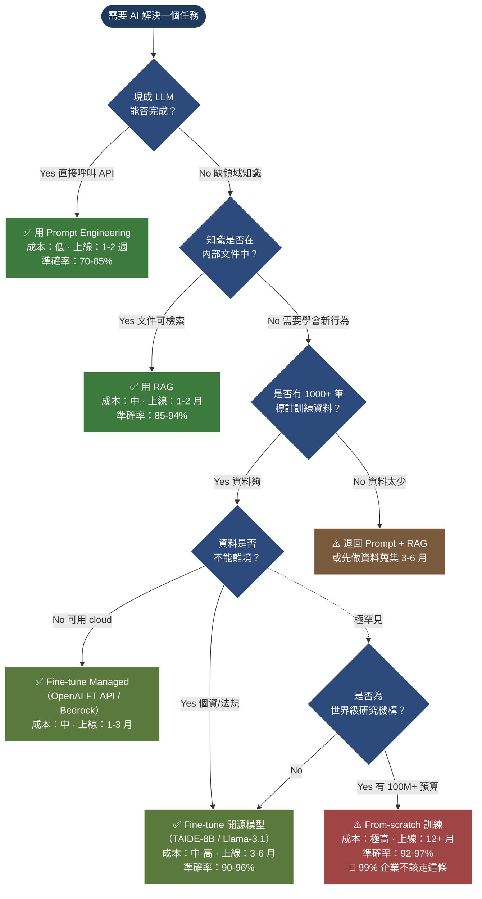

# Diagram 4 — 自建 vs 採購 決策樹 (Build vs Buy Decision Tree)

**用途：** 對應 §3.4（解決方案階梯）+ §3.5（成本拆解）。將「Prompt → RAG → Fine-tune → From-scratch」階梯轉化為一張決策樹，含 5 個分岔點。

**Render note:** Render to PNG via Gemini downstream. Source: Mermaid flowchart.

**閱讀重點：**
- **階梯規則：先試 Prompt → 不夠就 RAG → 還不夠才 Fine-tune → 極端少數才 From-scratch**。跳階梯（直接 fine-tune）通常是過度設計。
- **Q4「資料是否不能離境」** 是 Taiwan-specific 關鍵分岔：金融、醫療、政府案件常因個資法/金管會規定走 self-host fine-tune。
- **From-scratch 在中級考試屬於「概念知道即可」**，實務上 99% 企業不會做。學員看到題目選項出現「從零訓練」時，先問自己：**「這真的有必要嗎？」**
