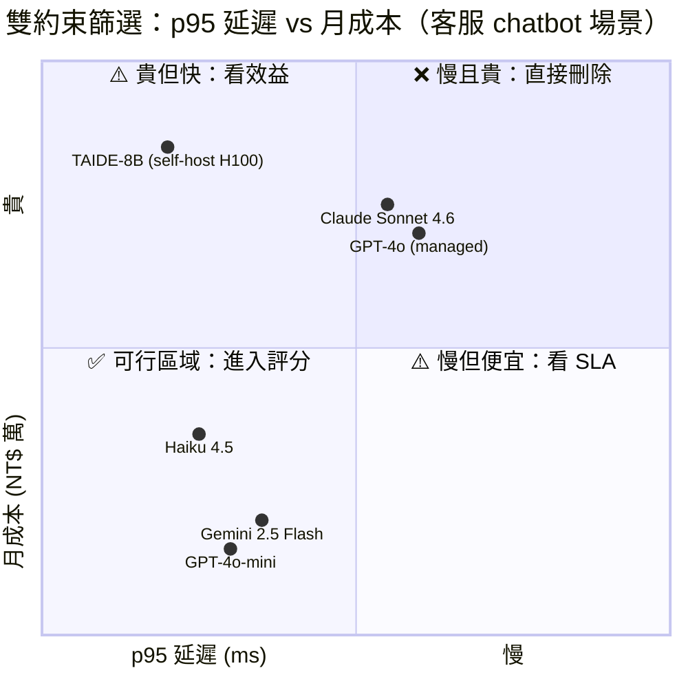

# Diagram 5 — 雙約束可行區域散點圖 (Dual-Constraint Feasible Region)

**用途：** 對應 §3.7（雙約束篩選工作流，p95 < 200ms AND cost < $X）。視覺化「先過濾、後排序」的核心思想。

**Render note:** Render to PNG via Gemini downstream. Source: Mermaid quadrant chart.

**閱讀重點：**
- **硬約束是「過濾線」**：例如圖中設 p95 < 800ms（x 軸 0.4 以下）且月成本 < 30 萬（y 軸 0.4 以下）。
- 落在**左下方「可行區域」（綠色 quadrant-3）**的選項才進入下一輪加權評分；落在其他象限的**直接刪除**，不論加權分有多高。
- 在這個範例中，**Haiku 4.5、GPT-4o-mini、Gemini 2.5 Flash** 進入評分；**GPT-4o、Sonnet 4.6、TAIDE-8B self-host** 被過濾掉。
- **常見錯誤：** 把 GPT-4o 加權分算到 9.5（因為準確率最高）就選它 — 但它不滿足成本約束 → 不該進入評分階段。
- **實務上「先過濾、後評分」是標準工作流** — 但若所有選項都被過濾掉（constraint deadlock），就要走 §3.7 的 4 種 fallback 之一（放寬約束、換解決方案類型、分階段導入、暫緩）。

📌 **考試陷阱：** 題目給你一張加權評分表，然後問「應該選哪個？」— 先檢查每個選項是否滿足硬約束，再看加權分。如果只看加權分，會掉入「準確率優先」的陷阱。
