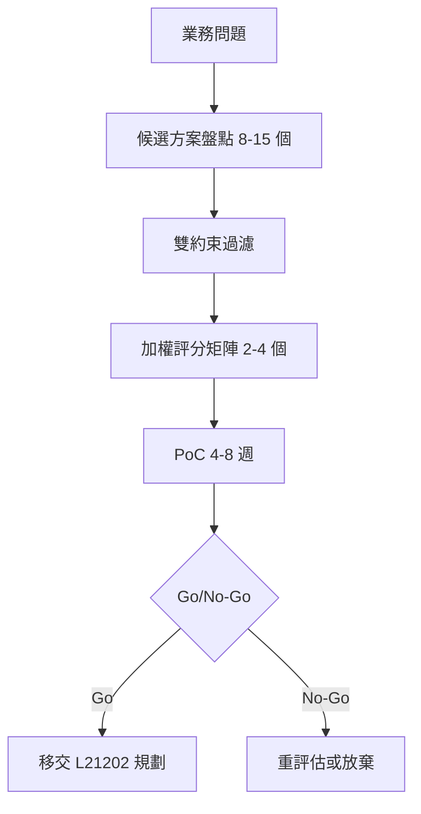

# L21201 AI導入評估 — 學習指南

> 對應評鑑範圍：**L212 AI導入評估規劃** > **L21201 AI導入評估**
>
> 關鍵字：技術效能評估（technical performance evaluation）、工具效能評估（tool/vendor evaluation）、適用解決方案選擇（solution selection）、成本效益分析（cost-benefit analysis, CBA）、加權評分矩陣（weighted scoring matrix）、雙約束過濾（dual-constraint filtering）、TCO、ROI、Payback Period、Break-even。

---

## Section 1 · 本課要你答對的事

到了 L21201，你已經學過 L211 的 AI 核心技術（Transformer、CNN、生成模型、多模態）。這一課**不再講「AI 是什麼」**，而是回答管理層最痛的一題：

> 「這麼多 AI 方案——GPT-4o、Claude、Gemini、TAIDE 自建、加上 RAG 還是直接微調——**到底選哪一個？怎麼算錢？怎麼向老闆證明這個決策不是拍腦袋？**」

### 對應評鑑範圍

> **L212 AI導入評估規劃** > **L21201 AI導入評估**
>
> 評鑑範圍要點（依 iPAS 115 簡章）：
> - 技術效能評估：accuracy、latency、throughput、scalability、reliability/SLA
> - 工具效能評估：managed API vs self-hosted、vendor lock-in、SLA、data residency
> - 適用解決方案選擇：prompt → RAG → fine-tune → from-scratch；build vs buy
> - 成本效益分析：TCO、ROI、payback、break-even、雙約束可行性

### 與相鄰單元的邊界（先記住，避免越界）

| 單元 | 在做什麼 | 與 L21201 的關係 |
|---|---|---|
| **初級 L12301**（生成式 AI 導入評估） | 非技術 PM 的「該不該用 ChatGPT」**檢核表** | L21201 升級為**實務級評分矩陣 + ROI/TCO 算術**，要能寫進採購提案 |
| **L21201**（本課） | 評估到「我們選方案 X」為止 | — |
| **L21202**（規劃） | 從「選好之後」開始：需求分析、RACI、五階段路線圖 | 不要在本課討論專案規劃 |
| **L21203**（風險管理） | EU AI Act 分級、NIST RMF、風險登記冊 | 本課**只把「供應商風險」「資料隱私」當成評分準則**，不教風險框架 |

🗣️ **白話說明**：你去 momo 比價買筆電，會看「規格 + 價格 + 保固 + 退換貨」。L21201 就是教你把這套日常比價方法，**升級成寫得進公司簽呈的版本**——多一個權重、加一張試算表、再加一句「為什麼選這台、不選那台」的理由。L21202 才是「買回來之後怎麼裝、誰負責教同事用」；L21203 才是「萬一電池燒掉誰賠」。本課只到「**買哪一台**」。

---

## Section 2 · 關鍵概念總覽圖（Knowledge Tree）

```
AI 導入評估 L21201
│
├─ 🎯 評估流程（5 步漏斗 Funnel）
│   ├─ 1. 釐清業務問題（Business problem framing）
│   ├─ 2. 候選方案盤點（Candidate longlist）
│   ├─ 3. 多準則加權評分（Weighted scoring）
│   ├─ 4. 雙約束過濾（Dual-constraint filtering）── 通常與 3 互換順序 🔥
│   └─ 5. 試辦/PoC → Go/No-Go → 移交 L21202
│       ⚠️ 標準工作流是先過濾、後評分：先用雙約束剔除不可行方案，剩下的再進加權評分 🔥🔥
│
├─ 🔧 技術效能評估 Technical Performance
│   ├─ Accuracy / Precision / Recall / F1 ── 引用 L21102，不重教
│   ├─ Latency 延遲
│   │   ├─ p50（中位數）｜p95（95 百分位）｜p99（尾延遲）
│   │   └─ TTFT（Time-to-First-Token, LLM 專用）
│   │       ⚠️ 對外 SLA 必看 p95/p99，看 avg 會被尾延遲打臉 🔥🔥
│   ├─ Throughput 吞吐量 ── QPS / RPS / tokens-per-second
│   ├─ Scalability ── 水平 vs 垂直、自動擴縮
│   └─ Reliability / SLA ── 99% / 99.9% / 99.99%（三 9、四 9）
│       ⚠️ 高 accuracy 但 p95 latency 超 SLA → 生產失敗 🔥🔥
│
├─ 🔧 工具/供應商評估 Vendor Evaluation
│   ├─ Managed API（OpenAI / Anthropic / Google） vs Self-hosted Open-weight
│   ├─ Vendor Lock-in 鎖定風險
│   │   ├─ API 變更 / 棄用（如 Anthropic 棄用 Claude 1）
│   │   ├─ 價格上調（Q4 漲價、無預警 deprecate）
│   │   └─ 服務終止（Google 已公告 Gemini 2.0 Flash 進入 sunset 排程，具體下線日期請以 ai.google.dev 官方公告為準）
│   ├─ Data Residency 資料主權 ── 為何 TAIDE / hicloud GenAI 在政府/金融仍有需求
│   ├─ SLA 等級、support tier、region availability
│   └─ ⚠️ 「現在最便宜」≠「總成本最低」，要看遷移成本 🔥
│
├─ ⚖️ 適用解決方案選擇 Solution Selection
│   ├─ 解決方案階梯（成本/複雜度由低到高）
│   │   ├─ Prompt Engineering（提示工程）  ── 70-85%* 準確率
│   │   ├─ RAG（檢索增強生成）              ── 85-94%*
│   │   ├─ Fine-tuning（微調）              ── 90-96%*
│   │   └─ From-scratch Pre-training       ── 92-97%*（極少組織需要）
│   │       * 典型範圍，依任務而定，請以實測為準
│   ├─ Build vs Buy vs Hybrid
│   │   ├─ Buy：通用任務、資料不敏感 → Managed API
│   │   ├─ Build：專業領域、資料敏感 → Open-weight self-host
│   │   └─ Hybrid：敏感資料地端、通用任務雲端（2025/2026 主流）
│   └─ ⚠️ 別跳過階梯：先試 prompt，不行再 RAG，最後才 fine-tune 🔥
│
├─ 💰 成本效益分析 Cost-Benefit Analysis
│   ├─ TCO 總擁有成本
│   │   ├─ 直接成本：API token / GPU compute / storage
│   │   ├─ 間接成本：MLOps 人力 / 整合工程 / 標註成本
│   │   └─ 機會成本：團隊精力被綁住、無法做其他事
│   ├─ CapEx（資本支出，買 GPU） vs OpEx（營運支出，按 token 計費）
│   ├─ ROI = (淨效益 − 投資) / 投資 × 100%
│   │   ⚠️ 分子是「淨效益」不是「營收成長」 🔥🔥
│   ├─ Payback Period = 投資 / 年度淨效益（單位：年）
│   ├─ Break-even（損益兩平）：固定成本 + 變動成本 → 找臨界量
│   └─ NPV / IRR ── 知道名字即可，中級不考公式
│
├─ 📊 加權評分矩陣 Weighted Scoring Matrix（核心方法）🔥🔥
│   ├─ Step 1：訂準則（4-6 個，過多會稀釋）
│   ├─ Step 2：訂權重（總和 = 100%，**先訂後評分**）
│   ├─ Step 3：各方案打分（1-10 或 1-5）
│   ├─ Step 4：加權加總 Σ wᵢ × scoreᵢ
│   ├─ Step 5：選最高分（並做敏感度測試）
│   └─ ⚠️ 看到分數再回頭調權重 = anchoring bias，禁止 🔥🔥
│
├─ 🎯 雙約束可行性過濾 Dual-Constraint（boundary 必含工作示例）🔥🔥
│   ├─ 範例：p95 latency < 200ms AND cost < NT$50/萬 input tokens
│   ├─ 先過濾、再評分（順序不能顛倒）
│   └─ 通過者才進入加權評分階段
│
└─ 🚀 PoC 與 Go/No-Go 決策（移交 L21202 的閘門）
    ├─ PoC 規模建議：4-8 週、樣本量、成功指標 pre-defined
    ├─ Go：滿足成功指標 → 進 L21202 規劃
    └─ No-Go：未達標 → 重評估或放棄
        ⚠️ 成功指標要在 PoC 開始前定義，不可事後修改 🔥
```

---

## Section 3 · 核心概念（Core Concepts）

### 3.1 AI 導入評估流程概觀（Evaluation Funnel）

整個 L21201 可以濃縮成一個「漏斗」——從寬到窄、從多選一。

```
┌──────────────────────────────────────────────────────────────┐
│  Step 1  釐清業務問題（Business problem framing）             │
│  「我們要解決什麼？KPI 是什麼？成功長什麼樣？」                  │
│  例：客服首回回應時間從 5 分鐘 → 30 秒                          │
└──────────────────────────────────────────────────────────────┘
                          ↓
┌──────────────────────────────────────────────────────────────┐
│  Step 2  候選方案盤點（Longlist 8-15 個方案）                  │
│  GPT-4o API / GPT-4o-mini API / Claude Sonnet / Claude Haiku │
│  Gemini 2.5 Pro / TAIDE 自建 / Llama-3 自建 / Qwen-VL ...    │
└──────────────────────────────────────────────────────────────┘
                          ↓
┌──────────────────────────────────────────────────────────────┐
│  Step 3  雙約束過濾（先砍掉不可行的）🔥🔥                       │
│  例：p95 latency < 200ms AND cost < NT$50/萬 tokens           │
│  → 通常砍掉 60-80% 候選方案                                    │
└──────────────────────────────────────────────────────────────┘
                          ↓
┌──────────────────────────────────────────────────────────────┐
│  Step 4  加權評分矩陣（剩下的 2-4 個方案精算）                  │
│  4-6 個準則 × 權重 × 1-10 分 → 加權加總                        │
└──────────────────────────────────────────────────────────────┘
                          ↓
┌──────────────────────────────────────────────────────────────┐
│  Step 5  PoC 試辦（4-8 週）→ Go/No-Go → 移交 L21202            │
└──────────────────────────────────────────────────────────────┘
```

🗣️ **白話說明**：像你在 Uber Eats 點宵夜——先輸入「滷味」（業務問題），跳出 30 家（候選），先勾「30 分鐘內到 + 預算 200 元」（雙約束），剩下 5 家；再看評分、菜色、距離（加權評分），最後選一家下單。**沒有人會把所有 30 家的菜單一張一張看完才決定**——L21201 的整個 funnel 就是教你做這件事。

> 🔥🔥 **標準工作流是先過濾、後評分**：先用雙約束剔除不可行方案，剩下的再進加權評分。若先打分再過濾，已淘汰方案的分數白算。

> 🖼️ **圖解：** 評估流程 5 階段漏斗（業務問題 → 技術 → 工具 → 方案 → 成本 → 風險 → Go/No-Go）見 [`diagrams/01-evaluation-funnel.md`](diagrams/01-evaluation-funnel.md)。

---

### 3.2 技術效能評估（Technical Performance Evaluation）🔥🔥

技術效能五件事：**準（accuracy）·延（latency）·量（throughput）·伸（scalability）·靠（reliability）**。

#### 3.2.1 Accuracy / Precision / Recall / F1（引用 L21102，不重教）

| 任務類型 | 主要指標 | 為什麼 |
|---|---|---|
| 二元分類（如垃圾郵件） | Precision、Recall、F1 | 類別不平衡時 accuracy 失真 |
| 多類別分類 | Accuracy、Macro-F1 | 看整體 + 各類別均衡 |
| 排序/檢索（RAG） | Recall@K、MRR、nDCG | 要看 top-K 命中 |
| 生成（LLM 摘要、翻譯） | BLEU、ROUGE、人評 | 多正解、需語意比對 |

> L21102 已詳述，本課**不重推導**。考題若問「為什麼 fraud detection 不能只看 accuracy」→ 答案是「資料極度不平衡（99% 正常）」，本質回到 L21102。

#### 3.2.2 延遲 Latency 🔥🔥

```
請求進來 → [處理時間] → 回應出去
              ↑
       這段就是 latency
```

**三個百分位數一定要分清楚**：

| 指標 | 意思 | 用在哪 |
|---|---|---|
| **p50（中位數）** | 一半請求比這快、一半比這慢 | 內部報告、行銷文案 |
| **p95** | 95% 請求都比這快（5% 比這慢） | **對外 SLA 通常用這個** 🔥 |
| **p99** | 99% 都比這快（1% 比這慢） | 高敏感系統（金融、即時通訊） |
| **TTFT（Time-to-First-Token）** | LLM 收到請求到吐出**第一個字**的時間 | **LLM 對話體驗的關鍵指標** 🔥 |

🗣️ **白話說明**：你叫 Uber，**平均**等車時間 5 分鐘聽起來不錯——但如果 5% 的人要等 30 分鐘，那 5% 的人會去 Google Map 一星評論。**對外承諾要看 p95，看平均會被尾延遲（tail latency）打臉**。LLM 也一樣：使用者點下「送出」後**1 秒內看到第一個字**遠比「總共 5 秒回完」重要——這就是 TTFT。

#### 3.2.3 Throughput 吞吐量

- **QPS / RPS**（Queries / Requests Per Second）：每秒能處理幾個請求。
- **Tokens-per-second**（LLM 專用）：每秒輸出幾個 token，影響長回答的等待感受。

#### 3.2.4 Scalability 可擴展性

| 類型 | 做法 | 適用 |
|---|---|---|
| **垂直擴展（Vertical / Scale-up）** | 換更強的單機（更大 GPU） | 短期、單體應用 |
| **水平擴展（Horizontal / Scale-out）** | 加機器、負載平衡 | 雲原生、流量起伏大 |
| **自動擴縮（Auto-scaling）** | 依流量自動加減容器/Pod | LINE 推播尖峰、雙 11 |

#### 3.2.5 Reliability / SLA 服務水準

| SLA | 年度可容忍停機 | 月度可容忍停機 | 場景 |
|---|---|---|---|
| 99.0%（兩個 9） | 約 87.6 小時 | 約 7.3 小時 | 內部工具 |
| 99.9%（三個 9） | 約 8.76 小時 | 約 43.2 分鐘（以 30 日為基準） | 一般 SaaS |
| 99.99%（四個 9） | 約 52.6 分鐘 | 約 4.32 分鐘（以 30 日為基準） | 金融、電信 |
| 99.999%（五個 9） | 約 5.26 分鐘 | 約 26 秒 | 電信核網（不太會在 LLM 看到） |

> 🔥🔥 **致命陷阱**：accuracy 95% 看起來很棒——但如果 p95 latency 是 8 秒、SLA 寫 99.9%，**生產上就是失敗的**。技術效能要看**全部五個指標**，accuracy 只是其中之一。



---

### 3.3 工具/供應商評估（Tool & Vendor Evaluation）🔥

選 LLM 不只是「哪家便宜哪家準」——還要看**鎖定風險、資料主權、SLA、地區可用性**。

#### 3.3.1 Managed API vs Self-hosted Open-weight 對照

| 維度 | Managed API（OpenAI/Anthropic/Google） | Self-hosted Open-weight（TAIDE/Llama/Qwen） |
|---|---|---|
| 初期成本（CapEx） | 近 0（信用卡刷下去就能用） | 高（買 GPU 或租 hicloud GPU 切片） |
| 變動成本（OpEx） | 高（每 token 計費） | 低（攤提後幾乎只剩電費） |
| 上線速度 | 數小時 | 數週至數月 |
| 客製深度 | 低（只能 prompt + 少量 fine-tune） | 高（可全參數微調） |
| 資料主權 | 資料離境（除非選 region + DPA） | 資料留台灣（hicloud 切片可選） |
| 維運負擔 | 廠商扛 | 自己扛（MLOps 工程師） |
| 鎖定風險 | 高（API 變更、棄用、漲價） | 低（權重在自己手上） |

#### 3.3.2 Vendor Lock-in 鎖定風險（Taiwan 視角）

供應商鎖定有三種樣態：

1. **API 介面鎖定**：你的 prompt template 寫死了 OpenAI 格式，要遷到 Claude 得重寫。
2. **棄用風險**：Anthropic 已棄用 Claude 1；Google 已公告 Gemini 2.0 Flash 進入 sunset 排程（具體下線日期請以 ai.google.dev 官方公告為準）——你今天用得正開心，半年後可能就得遷。
3. **價格上調**：commercial API 沒有「最低價保證」，廠商隨時可調。2025-Q4 牌價如下（USD per 1M tokens）：

| 模型 | Input | Output | 來源 |
|---|---|---|---|
| OpenAI GPT-4o | $2.50 | $10.00 | openai.com/api/pricing（2025-Q4）|
| OpenAI GPT-4o-mini | $0.15 | $0.60 | 同上 |
| Anthropic Claude Sonnet 4.6 | $3.00 | $15.00 | claude.com/pricing（2026-Q1）|
| Anthropic Claude Haiku 4.5 | $1.00 | $5.00 | 同上 |
| Google Gemini 2.5 Pro | $1.00 | $10.00 | ai.google.dev（2026-Q1）|

> 牌價會變，**寫進報告時要附 retrieval date**。

#### 3.3.3 Data Residency 資料主權

為什麼政府、金融、醫療還會考慮 TAIDE / 中華電信 hicloud GenAI？

- **個資法 / 金管會規範**：特定資料不可離境。
- **跨境傳輸合規成本**：DPA、SCC、跨境影響評估。
- **政策誘因**：經濟部產業競爭力輔導團、30 人以下中小企業數位轉型培力補助（最高 NT$10 萬）等鼓勵在地落地。

> **TAIDE**（國科會 Llama-3.1-8B 衍生）：開源、免費、可自建，繁中強。**限制**：8B 參數，回答品質與 frontier API 仍有差距。
>
> **中華電信 hicloud AI 算力雲**（2025-08 上線）：賣的是 GPU 算力（NVIDIA MIG 切片：1/4、1/2、1、2、4、8 GPU），不是 LLM API。等於提供「在地 GPU」讓你跑 TAIDE / Llama / Qwen。**不是 token 計費，是 GPU 小時計費**。
>
> （此屬 L21203 風險／合規範疇，本單元僅作為「資料主權」評分準則的背景；風險框架不展開）

🗣️ **白話說明**：選雲端 LLM 像跟外送平台簽合約——你今天用 Foodpanda 很順，但人家明天宣布「我們不送這區了」「我們改抽 35%」「我們把資料賣給銀行」，你得有 Plan B。**Vendor lock-in 評估就是評估「廠商擺爛時我多快能跑」**。

---

### 3.4 適用解決方案選擇（Solution Selection）🔥🔥

#### 3.4.1 解決方案階梯（Cost & Complexity Ladder）

```
複雜度／成本（低 → 高）
    │
    │   ┌─────────────────────────────┐
    │   │ From-scratch Pre-training   │  92-97%* 準確率｜數百萬 USD｜數月
    │   └─────────────────────────────┘   極少組織真的需要
    │   ┌─────────────────────────────┐
    │   │ Fine-tuning 微調              │  90-96%*｜數千–數萬 USD｜數天–數週
    │   └─────────────────────────────┘   行為塑形、領域用語
    │   ┌─────────────────────────────┐
    │   │ RAG 檢索增強生成             │  85-94%*｜中｜數天
    │   └─────────────────────────────┘   減幻覺、引用來源
    │   ┌─────────────────────────────┐
    │   │ Prompt Engineering           │  70-85%*｜近 0｜數小時
    │   └─────────────────────────────┘   先試這個！
    │
    * 典型範圍，依任務而定，請以實測為準
```

**鐵則：先爬最低階，KPI 不夠再往上。** 不要一上來就 fine-tune——成本是 prompt 的數百倍，但如果問題只是「prompt 沒寫好」就花這個錢，是浪費。

#### 3.4.2 Build vs Buy vs Hybrid 決策樹

```
                  ┌─ 任務通用性高？ ──┐
                  ↓                    ↓
                 是                    否
                  ↓                    ↓
         ┌── 資料敏感？──┐    ┌── 資料量大？──┐
         ↓                ↓    ↓                ↓
        否               是   否               是
         ↓                ↓    ↓                ↓
   Managed API      Hybrid     Open-weight   Fine-tune
   （Buy）          （地端+雲）  Self-host     on Open-weight
                                （Build）       （Build）
```

| 情境 | 建議 |
|---|---|
| 「客服問常見問題」 | Buy：GPT-4o-mini API + RAG |
| 「金融內部知識問答，資料不能出境」 | Hybrid：地端 TAIDE + 雲端 Gemini 處理一般問題 |
| 「醫療影像報告專業術語多、樣本獨特」 | Build：Open-weight + Fine-tune |
| 「公司只有 5 人想試試 AI」 | Buy：先用 ChatGPT Plus / Claude Pro 月費 |

#### 3.4.3 何時選哪一階？

| 觸發訊號 | 該爬到哪一階 |
|---|---|
| 通用任務、不要求專業詞彙 | Prompt |
| 模型答案會「掰」、需要引用內部文件 | RAG |
| 答案格式或語氣需要強烈一致（品牌口吻） | Fine-tune |
| 公司有獨特的訓練資料、需要與現有商業模型差異化 | Fine-tune |
| 國家戰略級需求（國防、主權 AI） | From-scratch（極少數） |

> 🔥 考題常以「該選 RAG 還是 Fine-tune？」出現。記住：**RAG 解決「事實正確 / 即時更新」；Fine-tune 解決「行為塑形 / 風格 / 格式」**。兩者可同時存在。

> 🖼️ **圖解：** 自建 vs 採購決策樹（5 個分岔點：能否用現成 LLM → 知識在內部嗎 → 有 1000+ 標註 → 資料能否離境 → 是否研究機構）見 [`diagrams/04-build-vs-buy-tree.md`](diagrams/04-build-vs-buy-tree.md)。

---

### 3.5 成本效益分析（Cost-Benefit Analysis） 🔥🔥

> 📖 **延伸閱讀**：完整 break-even 算術範例與 token 成本對照詳見 [`supplement-cost-arithmetic.md`](supplement-cost-arithmetic.md)（避免本節爆篇幅）。

#### 3.5.1 TCO（Total Cost of Ownership，總擁有成本）

口訣：**直·間·機**——直接、間接、機會。

| 類別 | 內容 | 範例 |
|---|---|---|
| **直接成本** | API token / GPU compute / storage / 頻寬 | 每月 NT$30,000 OpenAI 帳單 |
| **間接成本** | MLOps 人力 / 整合工程 / 標註資料 / 安全合規 | 一個 MLOps 工程師年薪 NT$150 萬 |
| **機會成本** | 團隊精力被綁住、無法做其他事 | 工程主管 30% 時間在維運 |

> **估算法**：機會成本 ≈ 受影響 FTE 月薪 × 投入比例 × 月數。例如 1 位資深工程師月薪 NT$120k、6 個月投入 50%，機會成本 = 120k × 0.5 × 6 = NT$36 萬，這要列入 TCO 的間接成本。

> 🔥🔥 **致命陷阱**：只算「API 帳單」就稱為 TCO，是錯的。間接成本與機會成本常常**比直接成本高**。

#### 3.5.2 CapEx vs OpEx（資本支出 vs 營運支出）

| 維度 | CapEx 資本支出 | OpEx 營運支出 |
|---|---|---|
| 範例 | 買 GPU 伺服器 | 用 OpenAI API 按 token 計費 |
| 會計處理 | 攤提 3-5 年 | 當期費用化 |
| 對財報影響 | 影響資產與折舊 | 直接打進當期損益 |
| 決策權 | 通常需董事會核准 | 部門預算內可決 |
| 適合情境 | 流量穩定、長期使用 | 流量起伏大、初期試水溫 |

🗣️ **白話說明**：CapEx 像是**買房**——一筆大錢出去，每月扛貸款；OpEx 像是**租房**——按月付，可隨時搬。新創通常先 OpEx（API），規模穩定再評估轉 CapEx（自建）。

#### 3.5.3 Token 成本算術（簡例）

> 假設客服場景每天處理 1,000 次對話，每次平均 input 800 tokens、output 400 tokens。

| 模型 | 月度 input cost | 月度 output cost | 月度總 cost（USD） |
|---|---|---|---|
| GPT-4o | 800×1000×30÷1M × $2.50 = $60 | 400×1000×30÷1M × $10 = $120 | **$180** |
| GPT-4o-mini | 800×1000×30÷1M × $0.15 = $3.6 | 400×1000×30÷1M × $0.60 = $7.2 | **$10.8** |

→ **同樣需求，GPT-4o-mini 便宜 ~17 倍**。題目若給「每天 N 次對話 + 平均 token 數」，直接套這個公式。

> 🔥 進階：**Batch API 通常 ~5 折**、**prompt caching 命中可省到 ~9 折**——成本控制工具，考題可能要你「列出兩個降低 LLM 推論成本的做法」。

#### 3.5.4 ROI（Return on Investment，投資報酬率）

```
ROI = (淨效益 ÷ 投資) × 100%
其中 淨效益 = 總效益 − 總成本
```

- **總效益**：營收成長 + 成本節省等所有正向貢獻
- **總成本**：所有因此導入產生的成本（含 TCO）
- **淨效益**：總效益 − 總成本（不是「營收成長」本身！）
- **投資**：所有 TCO 加總

**範例**：客服 AI 每年省下 NT$200 萬人力成本、額外帶來 NT$50 萬升級營收，總效益 NT$250 萬。建置 + 一年維運成本（總成本 / 投資）NT$100 萬。

→ 淨效益 = 250 − 100 = 150 萬
→ ROI = (150 ÷ 100) × 100% = **150%**

> 🔥🔥 **致命陷阱**：把「營收成長 NT$50 萬 ÷ 投資 NT$100 萬」算成 ROI = 50% 是錯的。**分子要算淨效益，不能只算營收**。也不能把成本省下的當成營收（那是「成本節省效益」，但口徑要與分母一致）。

#### 3.5.5 Payback Period（投資回收期）

```
Payback Period = 投資 / 年度淨效益（單位：年）
```

承上例：100 萬 / 250 萬 = **0.4 年**（約 5 個月）

| Payback | 解讀 |
|---|---|
| < 1 年 | 強力推進 |
| 1-2 年 | 通常可行 |
| 2-3 年 | 需董事會討論 |
| > 3 年 | 多半不會通過（科技週期變化太快） |

> 🔥 注意：Payback Period **不考慮時間價值**（NPV 才考慮）。短期決策夠用，跨多年大型投資要搭配 NPV/IRR。

#### 3.5.6 Break-even（損益兩平）：何時自建 GPU 划算？

> 詳完整算法請見 [`supplement-cost-arithmetic.md`](supplement-cost-arithmetic.md)。簡版如下：

**情境**：自建 GPU 每月固定成本 NT$80,000（含折舊+電費+運維分攤）；用 API 每萬請求 NT$1,500。

→ **損益兩平點**：80,000 / 1,500 = **約 53.3 萬請求/月**

```
成本（NT$/月）
    │
    │      自建（固定 NT$80,000）─────────────
    │     ／
    │    ／  ← 交叉點 ≈ 53 萬請求/月
    │   ／
    │  ／  API（NT$1,500/萬請求，變動）
    │ ／
    │／
    └──────────────────────────→ 月請求量
```

- **<53 萬請求/月**：用 API 划算
- **>53 萬請求/月**：自建划算

> 🔥 考題若給固定/變動成本兩個數字，要會算交叉點。基本公式：**固定成本 / (API 單價 − 自建單位變動成本)**。

#### 3.5.7 NPV / IRR（中級不考公式，知名即可）

- **NPV（Net Present Value，淨現值）**：把未來現金流折現回今天再加總，>0 代表創造價值。
- **IRR（Internal Rate of Return，內部報酬率）**：使 NPV = 0 的折現率，相當於「這投資的隱含年化報酬」。

> 中級**不要求**手算 NPV/IRR；考題若提到，認得名詞、知道「比 ROI/Payback 更精確、考慮時間價值」就夠。

> 🖼️ **圖解：** TCO 5 大組成堆疊圖（Managed API vs Self-host 成本結構對比）見 [`diagrams/03-tco-breakdown.md`](diagrams/03-tco-breakdown.md)。

---

### 3.6 加權評分矩陣（Weighted Scoring Matrix） — 核心方法 🔥🔥

#### 3.6.1 五步驟（口訣：**準·重·分·乘·選**）

1. **準**則（Criteria）：訂 4-6 個準則。**過多會被稀釋**——每個權重小到無法區分方案。
2. **重**（Weights）：每個準則的權重，**總和 = 100%**。
3. **分**（Scores）：每個方案在每個準則上打 1-10 分（或 1-5）。
4. **乘**（Weighted Sum）：weighted_score = Σ (wᵢ × scoreᵢ)。
5. **選**最高分（並做敏感度測試）。

> 🔥🔥 **鐵律**：**權重要先訂，再打分**。看到分數後再回頭調權重 = **anchoring bias（錨定偏誤）**——你已經偏愛某個方案，把權重調到讓它贏。考題會問「為何先訂權重」→ 答**避免錨定偏誤**。

#### 3.6.2 Worked Example：客服 chatbot 三方案選型

**情境**：某 SaaS 公司要導入客服 chatbot，候選 3 案，5 個準則。

| 準則 | 權重 |
|---|---|
| 技術效能（accuracy + latency 綜合） | 25% |
| 整合成本（與現有 CRM、Zendesk 串接） | 15% |
| TCO（一年總成本） | 30% |
| 資料主權（客戶 PII 不可外流疑慮） | 20% |
| 供應商風險（lock-in、棄用、漲價） | 10% |
| **合計** | **100%** |

**打分（1-10，10 最佳）**：

| 準則 | 權重 | A. GPT-4o-mini API | B. TAIDE 自建（hicloud） | C. Claude Haiku API |
|---|---|---|---|---|
| 技術效能 | 25% | 9 | 6 | 8 |
| 整合成本 | 15% | 9 | 4 | 8 |
| TCO | 30% | 9 | 5 | 7 |
| 資料主權 | 20% | 4 | 10 | 4 |
| 供應商風險 | 10% | 5 | 9 | 6 |

**加權計算**：

| 方案 | 計算 | 加權總分 |
|---|---|---|
| A. GPT-4o-mini | 0.25×9 + 0.15×9 + 0.30×9 + 0.20×4 + 0.10×5 = 2.25+1.35+2.70+0.80+0.50 | **7.60** |
| B. TAIDE 自建 | 0.25×6 + 0.15×4 + 0.30×5 + 0.20×10 + 0.10×9 = 1.50+0.60+1.50+2.00+0.90 | **6.50** |
| C. Claude Haiku | 0.25×8 + 0.15×8 + 0.30×7 + 0.20×4 + 0.10×6 = 2.00+1.20+2.10+0.80+0.60 | **6.70** |

**結論**：A. GPT-4o-mini API 勝出（7.60）。

> 💡 **政策契合度補充**：若導入屬於政府補助計畫（如經濟部 30 人以下中小企業 AI 導入補助），可加入第 6 個準則「政策契合度（Policy Alignment）」，權重 5-10%，避免事後才發現補助條件不符。

**敏感度測試**：如果這家公司其實有金融客戶、資料主權權重從 20% 拉到 40%（同時把 TCO 從 30% 降到 10%），結果會翻盤——B. TAIDE 自建會超過 A。**這就是為什麼權重要先訂、且要在團隊裡達成共識，不是事後調整**。

> 🔥 **進階提醒**：實務上會做 sensitivity analysis（敏感度分析）——刻意改 1-2 個權重看排序會不會翻盤，若會翻盤代表決策不穩、要更多資料。

📖 **延伸閱讀**：完整加權評分模板（含 sensitivity analysis 範例與空白表格）見 [`supplement-cost-arithmetic.md`](supplement-cost-arithmetic.md)。

> 🖼️ **圖解：** 4 準則 × 3 廠商加權評分矩陣模板（含 sensitivity 註解）見 [`diagrams/02-scoring-matrix-template.md`](diagrams/02-scoring-matrix-template.md)。

---

### 3.7 雙約束可行性過濾（Dual-Constraint Feasibility）— Boundary 必含工作示例 🔥🔥

#### 3.7.1 什麼是雙約束？

「**模型必須同時滿足 A 條件 AND B 條件**」——兩個都過才算可行。

最常見的雙約束組合：**latency + cost**（速度 + 成本），其次是 **accuracy + privacy**（品質 + 合規）。

#### 3.7.2 Worked Case（boundary 指定）

**需求**：「選擇模型滿足 **p95 latency < 200ms AND cost < NT$50/萬 input tokens**」

> 假設匯率 1 USD ≈ 31 NTD。NT$50/萬 input tokens ≈ NT$5/1k tokens ≈ USD $0.16/1k tokens ≈ USD $161/1M tokens（$0.005 × 1,000,000 ÷ 31 ≈ $161.29）——對 input 而言是相對寬鬆的價格上限，**真正卡住的是 200ms 延遲**。

| 候選方案 | p95 TTFT latency（2026-Q1 benchmark） | Input cost（USD/1M, 2025-Q4 牌價） | 通過 latency? | 通過 cost? | **結果** |
|---|---|---|---|---|---|
| OpenAI GPT-4o | ~1,200 ms | $2.50 | ❌ | ✅ | 淘汰 |
| OpenAI GPT-4o-mini | ~900 ms | $0.15 | ❌ | ✅ | 淘汰 |
| Anthropic Claude Sonnet 4.6 | ~900 ms | $3.00 | ❌ | ✅ | 淘汰 |
| Anthropic Claude Haiku 4.5 | ~600 ms（估計值，依 region 與負載可能 ±200ms，以實測為準） | $1.00 | ❌ | ✅ | 淘汰 |
| Google Gemini 2.5 Pro | ~1,800 ms | $1.00 | ❌ | ✅ | 淘汰 |
| **Groq（Llama 3.3 70B）** | **~280 ms** | ~$0.59 | ⚠️ 接近邊界 | ✅ | **保留** |
| **TAIDE 自建（hicloud GPU）** | 視部署，可調至 <200ms | ~電費攤提 | ✅ | ✅ | **保留** |

**ASCII 散點圖（latency vs cost 可行區域）**：

```
    cost (USD/1M)
       ↑
   $3  │  Claude Sonnet ●
       │
   $2  │     ● GPT-4o
       │
   $1  │           ● Gemini Pro      ● Claude Haiku
       │
  $0.6 │ ◎ Groq                                  
       │ ▒▒▒▒▒▒                                  
  $0.2 │ ▒可行 ▒          ● GPT-4o-mini
       │ ▒區域 ▒
   $0  │ ▒▒▒▒▒▒  
       │ ◎ TAIDE
       └────┼──────┼──────┼──────┼──────→  p95 latency (ms)
           200    600   1000   1500
            ↑
       latency 約束線
```

**結論**：在 200ms p95 約束下，**所有主流 frontier API 都被淘汰**。剩下的是 Groq（specialty inference）與 TAIDE 自建。**這時候才把這 2 案丟進加權評分矩陣繼續評**。

> 🔥🔥 **關鍵 insight**：雙約束過濾常常會給出**反直覺**的答案——你以為 GPT-4o 最強，但只要約束嚴格（200ms p95），它就過不了。考題若給「即時客服 < 200ms」，**自動排除主流 frontier API**。

> 🔥🔥 **順序鐵律**：雙約束過濾在加權評分**之前**做。先過濾不可行方案（節省團隊時間），剩下的才值得仔細評分。**反過來做就是浪費時間在不可能上線的方案上**。

#### 🔧 雙約束無解時怎麼辦？(Deadlock fallback)

當所有候選方案都被雙約束淘汰、評分矩陣根本沒人可進，先別急著放棄。考慮以下四個 fallback：

- **(1) 放寬約束 (Relax constraints)**：與業務確認 200ms 是硬需求還是 nice-to-have；若可接受 350ms，可重開門讓 Claude Haiku 4.5 / Gemini Flash 進場。
- **(2) 改變架構 (Change architecture)**：邊緣推論（edge inference）、預先快取常見回答、批次處理而非即時。
- **(3) 混合策略 (Hybrid)**：80% 流量走快但較不準的小模型，20% 高價值流量走慢但準的旗艦模型。
- **(4) 延後決策 (Defer)**：等待硬體/模型迭代（Groq 類專用推論晶片正在拉低門檻），或自建小模型微調。

🗣️ 白話：「卡住代表你問錯問題了，不是真的沒解。」

> 🖼️ **圖解：** 雙約束可行區域散點圖（p95 延遲 × 月成本，6 款模型分布）見 [`diagrams/05-dual-constraint-feasible-region.md`](diagrams/05-dual-constraint-feasible-region.md)。

---

### 3.8 試辦/PoC 與 Go/No-Go 決策

#### 3.8.1 PoC（Proof of Concept，概念驗證）建議

| 項目 | 建議值 | 為什麼 |
|---|---|---|
| 時程 | 4-8 週 | 太短驗不出問題、太長變成正式專案 |
| 樣本量 | 與生產 1-5% 流量等量 | 統計顯著、又不耗成本 |
| 成功指標 | **PoC 開始前** pre-defined（書面化） | 防止事後調指標 |
| 成本上限 | 通常 < 全案預算 10% | 失敗也不會傷筋動骨 |

#### 3.8.2 Go/No-Go Gate（移交 L21202 的閘門）

```
PoC 結束 → 與 pre-defined 成功指標比對
   ├─ 達標 → Go → 移交 L21202（規劃階段：需求分析、RACI、roadmap）
   └─ 未達 → No-Go → 重評估或放棄
```

> 🔥 **致命陷阱**：PoC 跑出不漂亮的數字後，回頭把成功指標改寬——這是 post-hoc rationalization（事後合理化），會讓整個專案失去評估意義。指標必須在 PoC 開始前白紙黑字寫下。

> 🔵 **L21201 到此結束**。「達標後怎麼規劃落地」是 L21202 的事，本課不展開。

---

## Section 4 · 易混淆概念對照表（Comparison Tables）

### 4.1 Managed API vs Self-Hosted Open-Weight

| 維度 | Managed API | Self-Hosted Open-Weight |
|---|---|---|
| 初期成本（CapEx） | 近 0 | 高（買 GPU 或租 hicloud 切片） |
| 變動成本（OpEx） | 高（每 token 計費） | 低（攤提後僅電費 + 維運） |
| 資料主權 | 資料離境（除非選 region + DPA） | 留台灣（hicloud 切片可達） |
| 客製深度 | 低（prompt + 少量 fine-tune） | 高（全參數微調、剪枝、量化） |
| 維運負擔 | 廠商扛 | 自己扛（MLOps team） |
| 上線速度 | 數小時 | 數週至數月 |
| 鎖定風險 | 高（API/價格/服務變更） | 低（權重在自己手上） |
| 適合情境 | 試水溫、流量起伏大、通用任務 | 流量穩定、敏感資料、長期 |

### 4.2 ROI vs TCO vs Payback Period vs NPV

| 指標 | 定義 | 單位 | 算什麼 | 何時用 |
|---|---|---|---|---|
| **TCO** | 總擁有成本（直 + 間 + 機） | 金額 | **總投入有多少** | 評估「這個方案要花多少錢」 |
| **ROI** | (淨效益 − 投資) / 投資 × 100% | 百分比 | **划不划算** | 提案/簽呈、決策摘要 |
| **Payback** | 投資 / 年度淨效益 | 年（或月） | **多久回本** | 短期決策、保守董事會 |
| **NPV** | 未來現金流折現後加總 | 金額 | **創造多少今值價值** | 多年大型投資、嚴謹 finance |

### 4.3 Prompt vs RAG vs Fine-tune vs From-scratch

| 維度 | Prompt Engineering | RAG | Fine-tune | From-scratch |
|---|---|---|---|---|
| 準確率帶* | 70-85% | 85-94% | 90-96% | 92-97% |
| 成本級距 | 近 0 | 中（向量庫 + token） | 數千–數萬 USD | 數百萬 USD |
| 開發週期 | 數小時 | 數天 | 數天–數週 | 數月 |
| 解決問題 | 任務說明、格式 | 事實正確、即時知識 | 行為塑形、風格一致 | 主權 AI、極度差異化 |
| 何時選 | **永遠先試這個** | 模型「掰」太多 | 行為/口吻需強烈一致 | 國家戰略級需求 |

*典型範圍，依任務而定，請以實測為準。

### 4.4 Latency p50 vs p95 vs p99 vs TTFT

| 指標 | 定義 | 為什麼存在 | 通常用在哪 |
|---|---|---|---|
| **p50（中位數）** | 50% 請求 ≤ 此值 | 描述「典型」體驗 | 行銷文案、內部 dashboard |
| **p95** | 95% 請求 ≤ 此值 | 防止被 5% 尾巴拖垮 | **對外 SLA 主流選擇** 🔥 |
| **p99** | 99% 請求 ≤ 此值 | 高敏感系統的尾延遲 | 金融、即時通訊 |
| **TTFT** | 收到請求到第一個 token | LLM 對話「感覺多快」的關鍵 | LLM 體驗、語音對話 |

### 4.5 CapEx vs OpEx

| 維度 | CapEx 資本支出 | OpEx 營運支出 |
|---|---|---|
| 範例 | 買 GPU 伺服器 | 用 OpenAI API |
| 會計處理 | 攤提 3-5 年 | 當期費用化 |
| 對財報 | 影響資產與折舊 | 直接打進當期 P&L |
| 決策權限 | 需董事會（金額大） | 部門預算內可決 |
| 適合 | 流量穩定、長期 | 流量起伏、初期試水 |

---

## Section 5 · 口訣（Mnemonics）

### 5.1 技術效能五指標：「**準·延·量·伸·靠**」
- **準**確率（Accuracy / F1）
- **延**遲（Latency p50/p95/p99 + TTFT）
- **量**（Throughput, QPS / tokens-per-sec）
- **伸**展性（Scalability：水平/垂直/auto）
- **靠**得住（Reliability / SLA：99% / 99.9% / 99.99%）

### 5.2 成本三類：「**直·間·機**」
- **直**接成本（API token / GPU / storage）
- **間**接成本（MLOps 人力 / 整合 / 標註）
- **機**會成本（團隊精力被綁住）

### 5.3 加權評分五步驟：「**準·重·分·乘·選**」
- **準**則（4-6 個）
- **重**（權重總和 = 100%，**先訂後評**）
- **分**（1-10 打分）
- **乘**（Σ wᵢ × scoreᵢ）
- **選**最高（並做敏感度）

### 5.4 評估順序鐵律：「**先過濾、再評分**」
- 雙約束過濾 **在**加權評分之前
- 顛倒就是浪費團隊時間在不可能方案上

### 5.5 解決方案階梯：「**提·檢·微·建**」
- **提**示（Prompt）→ **檢**索（RAG）→ **微**調（Fine-tune）→ **建**自己（From-scratch）
- 由低到高，**永遠先試最低階**

### 5.6 ROI 公式記憶：「**ROI = (淨效益 ÷ 投資) × 100%**」
- 其中 **淨效益 = 總效益 − 總成本**
- 不是「營收 ÷ 投資」（那是 revenue multiple 不是 ROI）
- 不是「毛利 ÷ 投資」（那是 GP margin 不是 ROI）
- **是「(淨效益 ÷ 投資) × 100%，淨效益 = 總效益 − 總成本」**

> 與 §3.5.4 一致：ROI = (淨效益 ÷ 投資) × 100%，淨效益 = 總效益 − 總成本。

---

## Section 6 · 考試陷阱（Exam Traps）

### 陷阱 1：accuracy-only fallacy（只看準確率）
- ❌ 「方案 A accuracy 95%，所以選 A。」
- ✅ accuracy 高、但 p95 latency 8 秒、SLA 寫 99.9% → 生產上**就是失敗**。技術效能要看**準·延·量·伸·靠**五指標的全部，不是只看一項。🔥🔥

### 陷阱 2：ROI 分子混淆（用毛利或營收當淨效益）
- ❌ ROI = 營收成長 / 投資 × 100%
- ✅ **ROI = (淨效益 − 投資) / 投資 × 100%**。淨效益要扣掉因此產生的所有成本。考題給你「營收 + 成本」兩數，要會自己算淨效益。🔥🔥

### 陷阱 3：TCO 漏算間接成本
- ❌ 「TCO 就是 API 帳單。」
- ✅ TCO = **直接 + 間接 + 機會**成本。MLOps 工程師、整合工程、標註資料、合規時間，**這些常比 API 帳單還大**。🔥🔥

### 陷阱 4：p95 vs avg latency 混用
- ❌ 「平均 latency 1 秒，所以對外 SLA 寫 < 1 秒沒問題。」
- ✅ avg 會被 5% 慢的尾巴打臉。**對外 SLA 寫 p95（或 p99），不是 avg**。🔥

### 陷阱 5：Vendor lock-in 表面評估
- ❌ 「這家 API 現在最便宜，所以鎖定風險最低。」
- ✅ 鎖定風險 ≠ 當下價格。要評估：**API 變更**（OpenAI 改 schema）、**棄用**（Google 已公告 Gemini 2.0 Flash 進入 sunset 排程，具體下線日期請以 ai.google.dev 官方公告為準）、**漲價**（無預警）、**遷移成本**（prompt template 全部要重寫）。🔥

### 陷阱 6：Anchoring bias（看到分數後回頭調權重）
- ❌ 「打完分發現我喜歡的方案輸了，把權重微調一下讓它贏。」
- ✅ **權重必須在打分前定案、書面化、團隊共識**。事後調權重 = 錨定偏誤，整個評分矩陣失去意義。🔥🔥

### 陷阱 7：雙約束順序顛倒
- ❌ 「先做加權評分選出 top 3，再用雙約束過濾。」
- ✅ **先過濾、再評分**。雙約束過濾在加權評分**之前**做，避免在不可行方案上浪費時間。🔥🔥

### 陷阱 8：Build-vs-buy 三選二迷思（忘了 hybrid）
- ❌ 「要不就全部買 API，要不就全部自建。」
- ✅ **Hybrid 是 2025/2026 主流**——敏感資料地端（TAIDE on hicloud）+ 通用任務雲端（GPT-4o-mini API）。考題若兩極選項都不對，**多半是 hybrid**。🔥

### 陷阱 9：PoC 成功指標 post-hoc 修改
- ❌ 「PoC 跑完發現 accuracy 只有 78%，把成功門檻從 85% 改成 75%。」
- ✅ 成功指標必須**在 PoC 開始前 pre-defined**且書面化。事後修改 = post-hoc rationalization，整個 Go/No-Go 決策失去意義。

### 陷阱 10：把 Payback 與 NPV 混用
- ❌ 「Payback Period 短就一定是好投資。」
- ✅ Payback **不考慮時間價值**，跨多年大型投資要搭配 NPV。短期決策夠用，但別把 Payback 當作唯一標準。

### 陷阱 11：CLIP / RAG / Fine-tune 跳階
- ❌ 「我們客服需要回答內部知識，直接 fine-tune。」
- ✅ **先試 RAG**（成本低 10-100 倍且可即時更新）。fine-tune 解決「行為塑形」，RAG 解決「事實正確 + 即時更新」。**不要跳階**。🔥

### 陷阱 12：把「資料主權」歸類成風險框架
- ❌ 「資料主權是 L21203 風險管理範疇。」
- ✅ L21201 把「資料主權 / 資料隱私」當成**評分準則**（matrix 的一個 row），但不教風險「框架」（NIST RMF、EU AI Act 分級——那是 L21203）。**評估與風險管理是兩回事**。

---

## Section 7 · 情境題快速判斷（Scenario Quick-Judge）

🔑 **看到關鍵字 → 答這個**

| 關鍵字 / 情境 | 答案 |
|---|---|
| 「即時客服 + 200ms 延遲」 | **雙約束過濾**，先排除高延遲 frontier API（GPT/Claude/Gemini 都 >800ms）；候選 = Groq、SambaNova、self-host |
| 「資料不能出境 / 留台灣」 | 自建/地端：**TAIDE 在 hicloud GPU 切片** 或 open-weight self-host |
| 「投資回收期」「多久回本」 | **Payback Period = 投資 / 年度淨效益** |
| 「淨效益 / 投資 × 100%」 | **ROI 公式** |
| 「總擁有成本 / TCO」 | **直接 + 間接 + 機會** 三類成本 |
| 「先訂權重再打分」 | 避免 **anchoring bias（錨定偏誤）** |
| 「方案太多選不出來」 | 先用**雙約束過濾**砍掉不可行，剩下的才做加權評分 |
| 「買 GPU 伺服器」 | **CapEx（資本支出）**，攤提 3-5 年 |
| 「按 token 計費 / 按 GPU 小時計費」 | **OpEx（營運支出）**，當期費用化 |
| 「Anthropic 棄用 Claude 1 / Gemini 2.0 Flash 進入 sunset 排程」 | **Vendor lock-in / 棄用風險** |
| 「客服回答常掰 / 要引用內部知識」 | **RAG（檢索增強生成）**，不要直接 fine-tune |
| 「品牌口吻要強烈一致 / 格式固定」 | **Fine-tune（微調）** |
| 「公司剛開始試 AI / 不確定流量」 | **OpEx（API 計費）**，先 buy 後 build |
| 「流量穩定 + 長期 + 量大」 | 評估 **break-even**，可能轉 CapEx 自建 |
| 「金融客戶 + 個資合規」 | **Hybrid**：敏感地端 + 一般雲端 |
| 「找出固定+變動成本的交叉點」 | **Break-even（損益兩平）**：固定成本 / (API 單價 − 自建單位變動成本) |
| 「PoC 跑完成功指標未達想改寬」 | ❌ 禁止 post-hoc 修改，**指標必須 pre-defined** |
| 「為什麼選 p95 不是 avg」 | 防止被 **尾延遲（tail latency）** 拖垮對外 SLA |
| 「LLM 體驗 / 第一個字多快出現」 | **TTFT（Time-to-First-Token）** |
| 「99.9% SLA 一年可容忍多久停機」 | 約 **8.76 小時** / 年（或月度約 43.8 分鐘） |
| 「中型企業 5-50 人想用 AI」 | 經濟部產發署輔導團 + 30 人以下中小企業數位轉型培力補助（NT$10 萬） |
| 「繁體中文 OCR / 中文 VQA + 留台灣」 | **Qwen-VL / Qwen2-VL** 自建（細部見 L21104） |
| 「考慮時間價值的投資評估」 | **NPV（淨現值）**，不是 ROI 也不是 Payback |
| 「Sensitivity / 敏感度測試」 | 改 1-2 個權重看排序會不會翻盤——若會，代表決策不穩 |

---

### 結尾小提醒

L21201 真正要你會的只有四件事：

1. **技術效能五指標**：準·延·量·伸·靠（不是只看 accuracy）
2. **TCO 三類成本 + ROI 公式 + Payback / Break-even** 算術（中級不考 NPV/IRR 公式）
3. **加權評分矩陣五步驟**：準·重·分·乘·選（**權重先訂、後打分**）
4. **雙約束過濾在加權評分之前**（boundary 必含的「p95 < 200ms AND cost < X」工作示例）

考試時的決策路徑：

```
看到題目 → Section 7 keyword 表 →（找不到再）Section 4 對照表 →（再找不到）Section 3 內文
```

L21201 沒講的、不要寫進答案：
- 「導入計畫的階段」「RACI」「roadmap」→ 那是 **L21202 規劃**
- 「EU AI Act / NIST RMF / 風險登記冊」→ 那是 **L21203 風險管理**
- 本課只到「**我們選方案 X**」為止。穩住這條線，分就拿得到。
